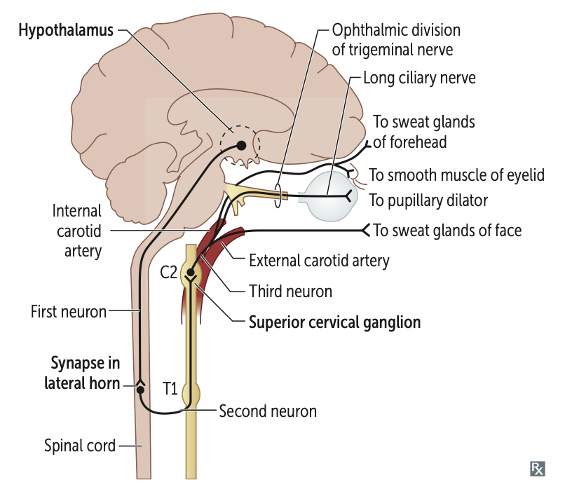

# Horner syndrome (永遠同側): sympathetic dysfunction ⇒ ptosis (眼睛小), miosis (瞳孔小), anhidrosis (無汗)

## 內文
1. pons, medulla, spinal cord damage
2. ganglion (tumor 壓迫)
3. paracarotid: carotid dissection (這個有汗)

