# Neurodevelopment：signaling 與 cell fate

## 內文

**正常狀態 → 改變條件 → 細胞命運、位置或構造的變化。** 每列對照 transcription factor（TF）／signaling cue 的正常機制與已知操作結果，並保留圖片。缺少操作結果的部分留待補。

### 發育過程總表

| 發育過程 | 正常狀態與機制 | 改變條件後／記憶圖 |
|---|---|---|
| **Forebrain induction** | Anterior visceral endoderm（AVE）提供 **FGFs**，參與指定 anterior neural ridge（ANR）；ANR 成為局部 signaling center，支持 forebrain 發育。 （待補 by codex：接續的 TF 與目標基因。） | （待補 by codex：阻斷 AVE 的 FGF 後，ANR 與 forebrain 的實驗結果及操作時期。） L4：23–24  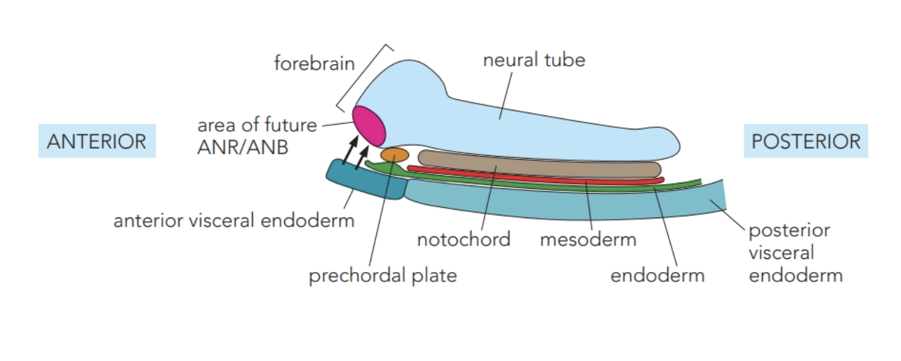 **沿左側箭頭看 AVE 對未來 ANR 的誘導位置。** |
| **Forebrain patterning** | **Cerberus／sFRP** 阻止 Wnt 接到 receptor complex，**Dkk** 作用於 LRP，使 anterior Wnt 受限。  **Six3 與 Irx3 互相限制**：Six3 偏 anterior、Irx3 偏 posterior，維持不同區域的 identity。  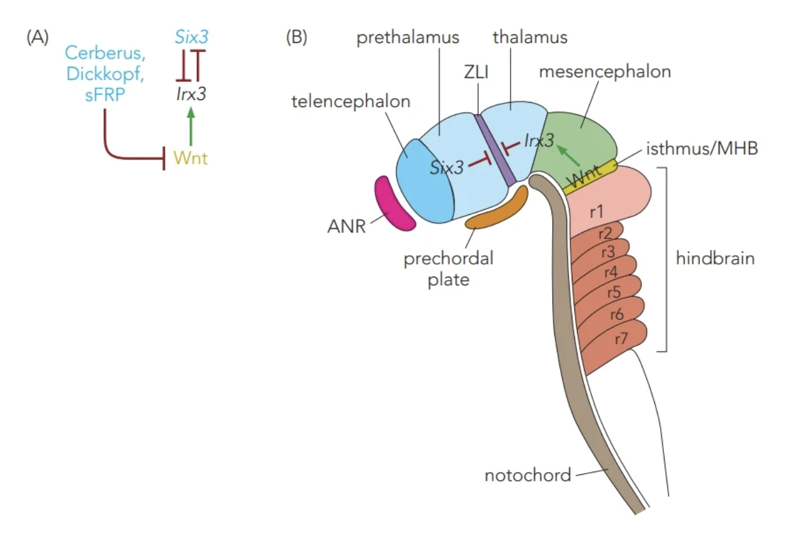 **Six3：anterior；Irx3：posterior。** MHB 的 Wnt 促進 Irx3，兩者互相限制。 | **Dkk 過量（Xenopus）**：內源 Wnt 受抑制 → **head／brain 區域變大，向原本的 midbrain 區延伸**。 L4：25–30  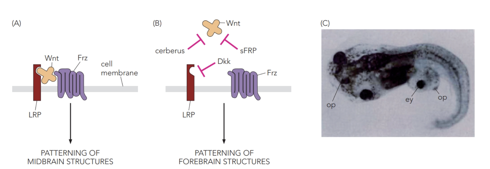 **C 圖：Dkk 過量後的 head／brain 區域。** |
| **MHB patterning** | Midbrain–hindbrain boundary（MHB）提供 **FGF8、Wnt**。FGF8 促進 Wnt、抑制 r1 的 Hox；Wnt 抑制 anterior Otx2 的作用、促進 posterior Gbx2。  兩側因而形成不同的 gene expression 與區域 identity。  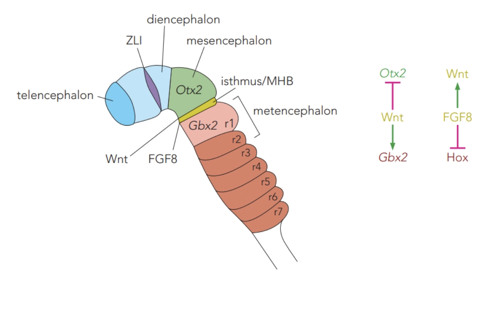 **黃色 MHB 位於 Otx2 與 Gbx2 區域交界。** | **在 posterior forebrain 放入 FGF8-coated bead**：局部新增 FGF8 訊號 → **出現額外的 midbrain 與 cerebellar-like tissue**；異位 midbrain 的方向也可與正常區域相反。 L4：31–32  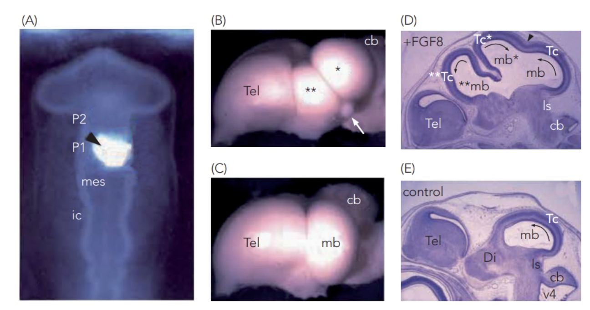 **比較 B／C、D／E；星號為額外的 midbrain。** |
| **Rhombomere segmentation** | **Krox20**（r3、r5）參與 EphA expression；相鄰細胞的 **EphA／ephrin** 排斥，限制節間混合。**Kreisler**（r5、r6）也參與 segmentation。  正常 rhombomeres 因此有分界。 | **Krox20 缺失**：原本 r3／r5 的分節消失，r2、r4、r6 接續，hindbrain 變短。  **Kreisler 缺失**：r5／r6 融合，後方分節也異常。 L4：37–38  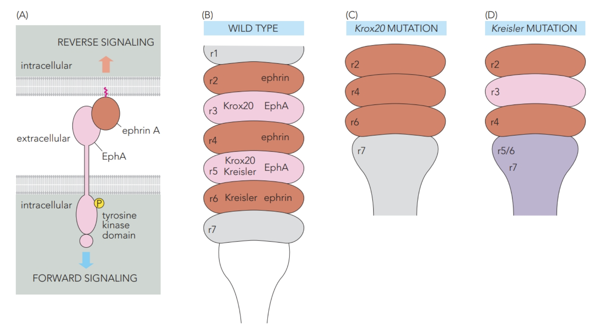 **比較 B、C、D：交替分區 → 缺失或融合。** |
| **Hox patterning** | Somites 的 **retinoic acid（RA）** 經 **RAR／RARE** 影響 Hox transcription；posterior 的 **FGF** 經 **Cdx** 調控較 posterior 的 Hox。RA 也抑制 hindbrain 的 Cdx。  不同位置取得不同 **Hox code**；圖示例子為 RA–Hoxb4、FGF／Cdx–Hoxb9。 | （待補 by codex：改變 RA／FGF 的劑量或位置後，Hox expression、domain boundaries 與 cell fate 的實驗結果。） L4：39–46  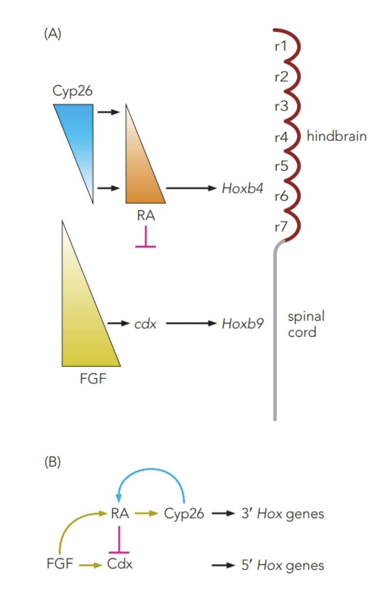 **上方 RA–Hoxb4；下方 FGF–Cdx–Hoxb9。** |
| **Ventral patterning** | Notochord、floor plate 提供 **Shh**。Shh 結合 PTC、解除對 SMO 的抑制，改變 **Gli** 活性；**Class I TFs 受抑制、Class II 被活化**，交互抑制使邊界明確。  p0、p1、p2、pMN、p3 分別產生 V0、V1、V2、motor neurons、V3。  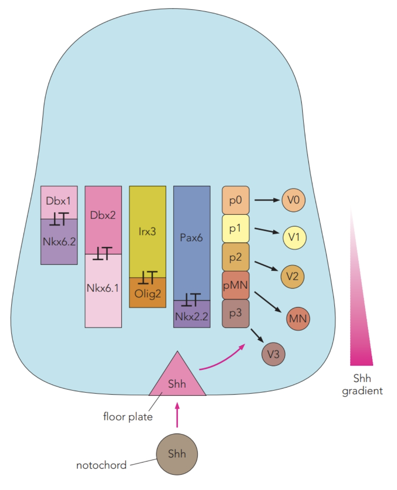 **Shh：ventral 高；Class I 受抑制、Class II 被活化。** 交互抑制配對：Dbx1／Nkx6.2、Dbx2／Nkx6.1、Irx3／Olig2、Pax6／Nkx2.2。 | **加入 anti-Shh antibody（explant 共培養）**：原本 Shh 可誘導的 **floor plate 與 motor neurons 都不形成**。  **把 notochord 移到 neural tube 側方**：該處出現 **異位 floor plate，兩旁形成 motor neurons**。  **提高 purmorphamine（Pur，Shh pathway agonist）100 nM → 1 μM（human iPSC 分化）**：**CHX10-positive 比例上升、LHX5-positive 比例下降**；本實驗分別用來讀取 V2a、V0-associated differentiation。 L5：8–16   **Pur 增加：CHX10 上升，LHX5 下降。** |
| **Dorsal patterning** | Epidermal **BMP4／BMP7** 啟動 roof plate，後者提供 BMPs、dorsalin-1、Activin、GDF7。BMP／GDF 接到 **SMAD1／5／8**，Activin 接到 **SMAD2／3**，再與 SMAD4 調控轉錄。  **Class A（dI1–dI3）依賴 roof plate**；Class B（dI4–dI6）較不依賴，與 RA 有關。 （待補 by codex：接到各 dorsal fate 的 TF。）  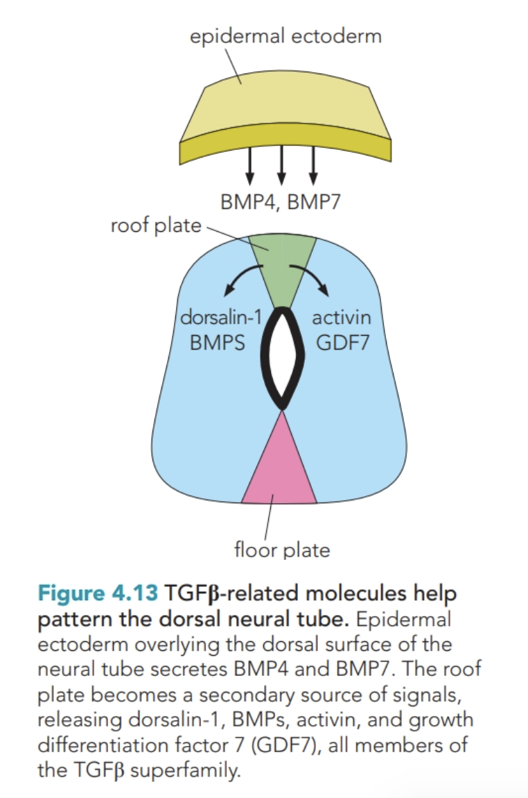 **由上往下：epidermal ectoderm → roof plate → dorsal neural tube。** | **使 roof plate 細胞退化（mouse）**：即使 epidermal BMP 仍在，**dI1–dI3 仍未生成；dI4 保留，並向原本 dI1–dI3 的 dorsal 區域擴張**。 這裡移除的是 roof plate 細胞，不能等同單獨去掉 GDF7 ligand。 L5：17–24   **A：正常；B：dI1–dI3 缺少，dI4 向 dorsal 擴張。** |
| **Lateral inhibition** | 分化傾向較高的細胞提供 **Delta**，刺激鄰細胞的 **Notch → NICD**，壓低其 proneural program／Delta。  Sending cell 因而較少受到反向抑制，繼續分化成 neuron；receiving cell 保留為 progenitor。 | （待補 by codex：增加或阻斷 Notch 後，progenitor／neuron 數量與分化時序的實驗結果。） L5：30–35   **B 圖由左往右：Delta／Notch 差異擴大，部分細胞分化。** |
| **Granule cell differentiation** | External granule layer（EGL）中，增殖細胞有較高 **Notch**；premigratory cells 的 **Atoh1／Math1** 誘導 **Zic1／Zic2**，之後往內遷移與成熟。  Cerebellum 的 FGF、Wnt、BMP、BDNF、Shh 也參與調控，具體接續仍待補。 | （待補 by codex：Atoh1／Math1 擾動後，Zic1／Zic2 expression、granule cell 數量與分化狀態的實驗結果。） （待補 by codex：各外來 cue 如何接到增殖、分化與遷移。） L5V2：51–54  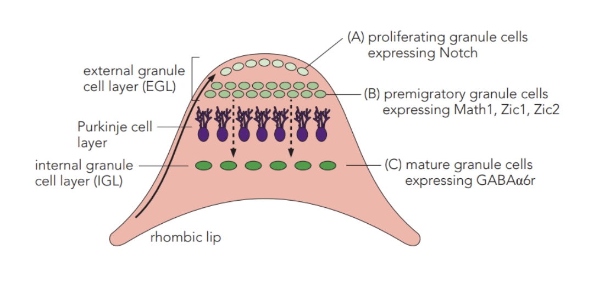 **A → B → C：增殖 → premigratory → 成熟。** |
| **Retinal cell differentiation** | Retinal progenitor cells 依發育時期與 TF expression 產生不同後代。**Math5** 與 retinal ganglion cell（RGC）fate 有關；**NeuroD／Math3** 與 amacrine fate 有關。  右欄比較分化後的兩類細胞比例。 | **Math5 knockout**：相較 wild type，**RGC 減少、amacrine 增加**。  **NeuroD／Math3 double knockout**：**amacrine 減少、RGC 增加**。 （待補 by codex：上游 cue 與個別 TF 的分工。） L6：28–31  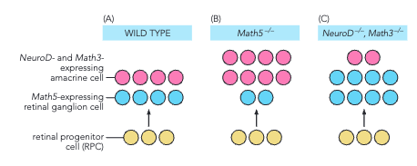 **粉色 amacrine、藍色 RGC；比較兩種 knockout。** |
| **Eye DV patterning** | Dorsal **BMP4 → Tbx5 → ephrin B1／B2**；ventral **Shh → Vax → Pax2、EphB2／B3**，Vax 也抑制 Pax6／Rx。  兩側形成不同的 TF 與 ligand／receptor expression patterns，並互相限制。 | **發育期抑制 Shh／SMO（cyclopamine）**：L7 的例子出現 **cyclopia**。 （待補 by codex：Shh／SMO 受抑制如何改變眼原基的分隔與形態，導致單眼；並補上操作時期。） （待補 by codex：DV boundary 的建立。） L7：3–7   **Ephrin 是 ligand；Eph 是 receptor。** 綠箭頭促進，紅色平頭線抑制。 |
| **分化成 hair cell／supporting cell** | 在 **Sox2-positive** prosensory cells，**Atoh1／Math1** 促進 hair cell program，並增加 **Dll1／Jag2**。鄰細胞接到 **Notch → NICD／Hes** 訊號後，Atoh1 受抑制，偏向 supporting cell。 | （待補 by codex：Atoh1 缺失或 Notch 擾動後，hair cell／supporting cell 數量的實驗結果及操作時期。） L6：17–18   **右側 hair cell 的 ligand → 左側 supporting cell 的 Notch：抑制發生在鄰細胞。** Id 也抑制 Atoh1。Atoh1／Math1 是同一因子，在 cerebellum 則參與 granule fate。 |
| **Gliogenesis** | Glioblast 之後可走向 **astrocyte／oligodendrocyte** 分支。圖中 astrocyte 分支標為 **Notch**，oligodendrocyte 分支標為 **Off**。 （待補 by codex：接續的 TF 與分化機制。） | （待補 by codex：增加或阻斷 Notch 後，astrocyte／oligodendrocyte 比例與分化時序的實驗結果。） L5：34–35  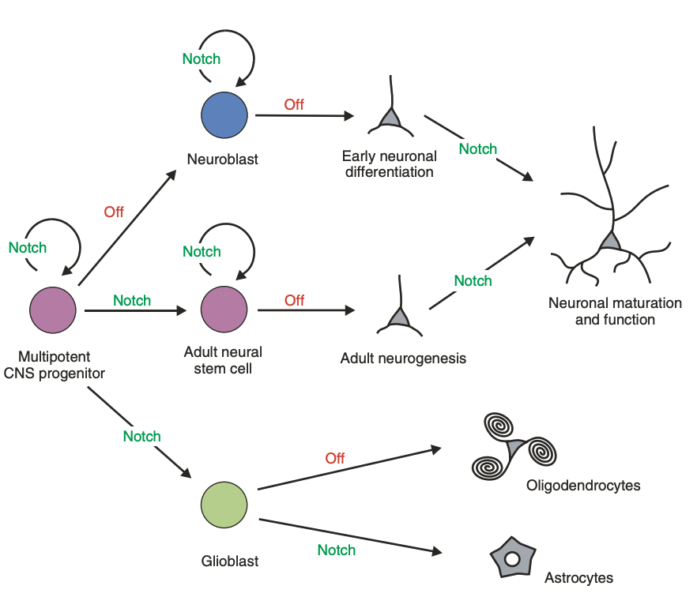 **看下方綠色 glioblast：Notch／Off 對應不同 glial fates。** |
| **Cortical layering** | Marginal zone 的 Cajal–Retzius cells 提供 **Reelin**，影響遷移中的 neurons 脫離 radial glial scaffold、落定。  正常層序為 **早生 neurons 較內、晚生 neurons 較外**。 （待補 by codex：receptor 與胞內接續。） | **Reelin 功能缺失（Reeler mutant）**：遷移後的定位異常 → **早生細胞偏外、晚生細胞偏內**；圖中 future layer II／VI 的位置與 wild type 相反。 L5：44–45   **上排 wild type、下排 Reeler；比較 layer II／VI 的位置。** |
| **Axon fasciculation** | Proximal motor axons 的 **L1、低 polysialic acid（PSA）的 NCAM** 促進 axon–axon 黏附，讓 axons 維持聚束，朝 limb bud 延伸。 | （待補 by codex：擾動 L1／NCAM／PSA 後，axon fasciculation 的實驗結果。） L6：38–39   **看 proximal 聚束段與右上 NCAM without PSA。** |
| **LMC axon guidance** | Ventral limb bud 的 **ephrin A5** 排斥帶有 **EphA receptor** 的 lateral motor column（LMC）axons，使 lateral LMC axons 避開 ventral、走向 dorsal。 | （待補 by codex：擾動 ephrin A5／EphA 後，LMC axon 投射路徑與比例的實驗結果。） L6：38–39   **看 B 圖的 ventral ephrin A5 與 EphA-positive axons 選路。** |
| **Axon branching** | 到 developing muscle 附近，**PSA 增加**、干擾 NCAM homophilic binding，axon–axon 黏附減弱；axons 因而解束，在 muscle 表面分枝。 | （待補 by codex：擾動 PSA 後，axon branching 數量、位置與時序的實驗結果。） L6：38–39   **看右側 muscle 表面的分枝段與右上 NCAM high PSA。** |
| **Midline guidance** | Drosophila 中線的 **Slit** 經 axon 的 **Robo1／Robo2** 提供排斥，限制再次跨越或靠向 midline。  正常 contralateral axon 跨一次後走向對側；ipsilateral axon 留在同側。 | **robo mutant（Drosophila）**：原本跨一次的路徑變成 **反覆跨 midline**。  **robo1／robo2 都缺少**：ipsilateral projections 靠向 midline 並 collapse（投影片圖說，未畫在此圖）。 （待補 by codex：第一次跨越前後如何改變 Slit 反應。） L6：40–41   **左側 robo mutant 反覆跨越；右側 wild type 路徑受限。** |

### 細節查詢

[[Spinal cord domain markers|標題|群組縮排]]

[[神經發育的共用訊號路徑|群組縮排]]

[[Neurodevelopment 分子查詢|群組縮排]]

### 來源

投影片位於 `本地/3_Lecture Slides/`，頁碼含隱藏頁。

- **L4**：4. AP and DV Patterning.pptx。
- **L5**：5. DV Patterning and Cell Fate.pptx。
- **L5V2**：5. DV Patterning and Cell Fate_V2.pptx。
- **L6**：6. Neurodevelopment_PNS and Axon Guidance.pptx。
- **L7**：7. Rapid Fire.pptx。
