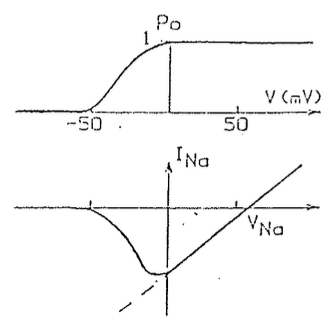
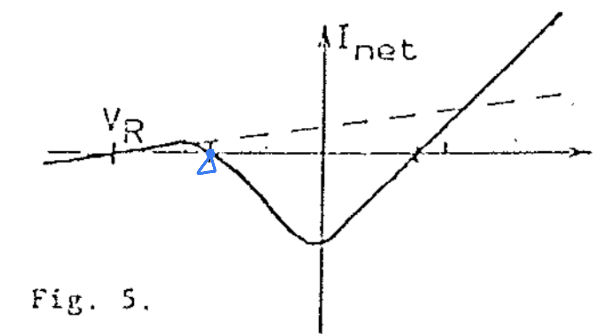
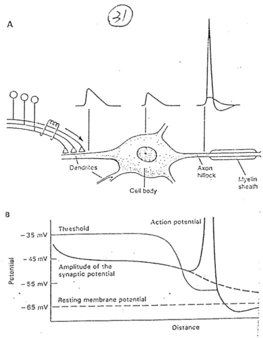
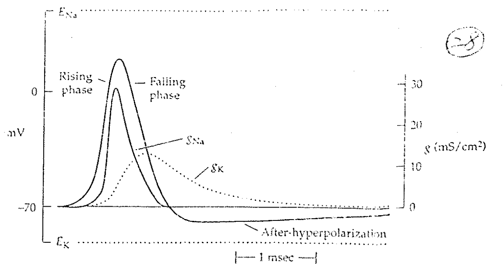

# Action potential

## 內文
1. 誰有 Action potential？
   ⇒ 有些細胞對於電位的反應不是 graded response（反應與刺激呈線性） ，而是 excitable，稱為 excitable cell
2. 下圖上方為 Na channel 打開的 probability（即 P(Open) ），下圖下方虛線是 Na channel 打開後的 conductance，實線是 conductance \* probability，即**真實的 Na conductance**
   
   - 見 <u>P(Open) 與 Conductance 的關係</u>
3. 下圖為 真實的 Na conductance 加上 leaky K channel （虛線）之後，整個細胞的 conductance （實線）
   
   當膜電位超過藍色點（point of no return）之後，細胞的淨電流會由往外變成往內，進入 positive feedback cycle，因此此點即稱為 Threshold
   ⇒ Threshold 與 $g_{Na}、g_K$ 均有關係
4. 什麼細胞是 excitable cell？
   ⇒ 有足夠多的 Na channel 的地方，即 $g_{Na}$ 夠大的地方（Ca channel 夠多的話也行 ex: smooth muscle，但 spike 上升慢）
   只要 channel 的分佈並非完全平均，則 Na channel 多的地方 (ex: axon hillock，見下圖)
   1. threshold 就會小
   2. postitive feedback 的速度就會快
   
5. dendrite 上面沒有 action potential ，因為需要加總每個小 input 的 weight
   - 如果沒有 action potential，從 synapse 流進來的 current 如何在 dendrite 裡面繼續流？
     ⇒ 還是有 local activation，以達成 amplifier 的功能
6. 如果膜上有 T type Ca channel & Na channel ⇒ 就有可能有兩個 threshold
7. 下圖為一次 Action potential 中各離子的 conductance 變化，可以發現 Afterhyperpolarization (AHP) 是由 $g_K$ 形成的
   
   - 有兩種 AHP (fast and slow) ，見 <u>Calcium-dependent K channel</u>
