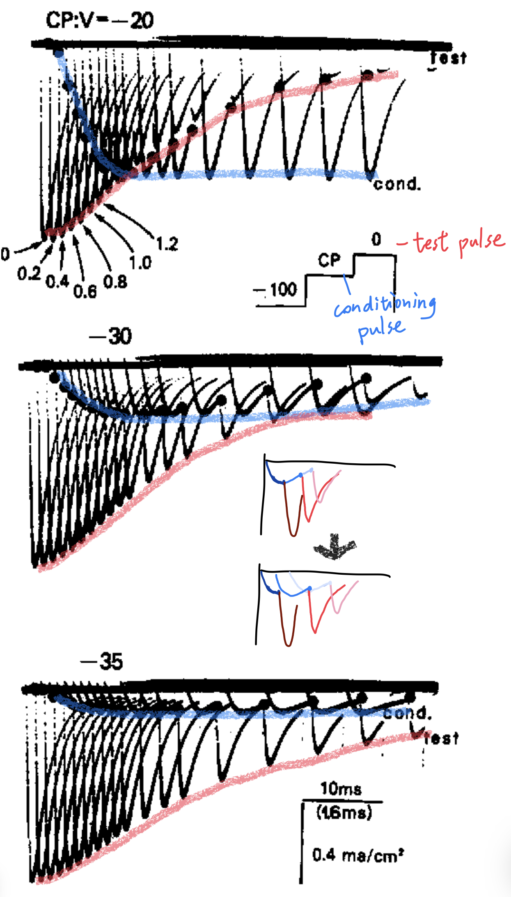
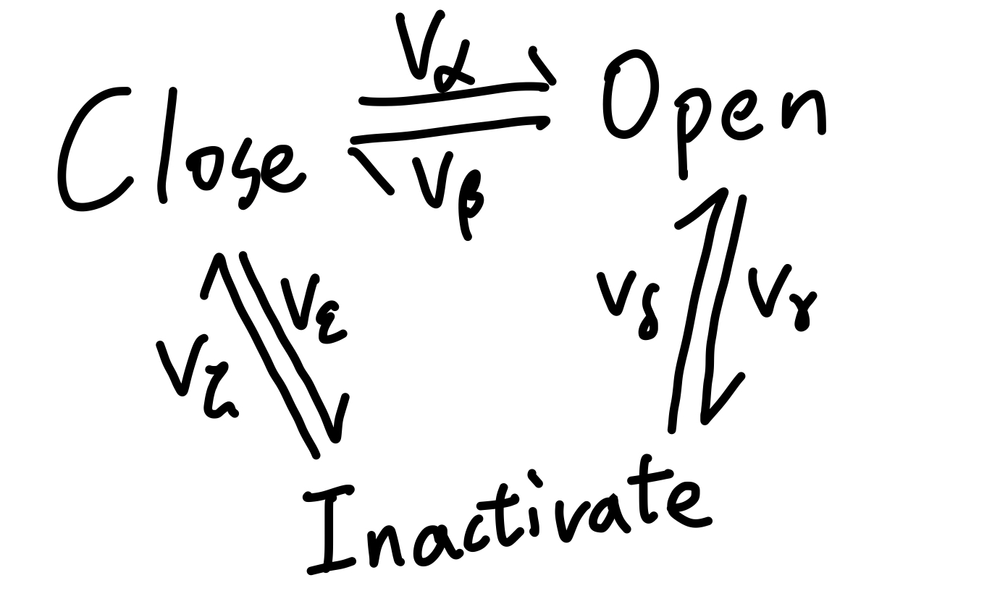
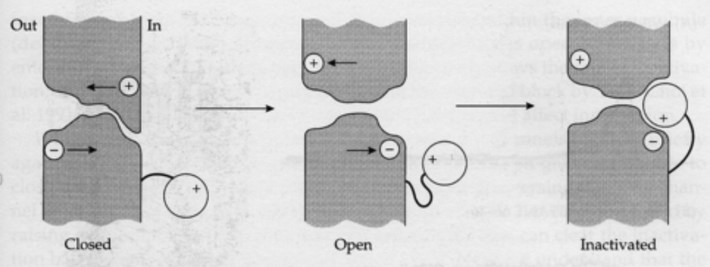
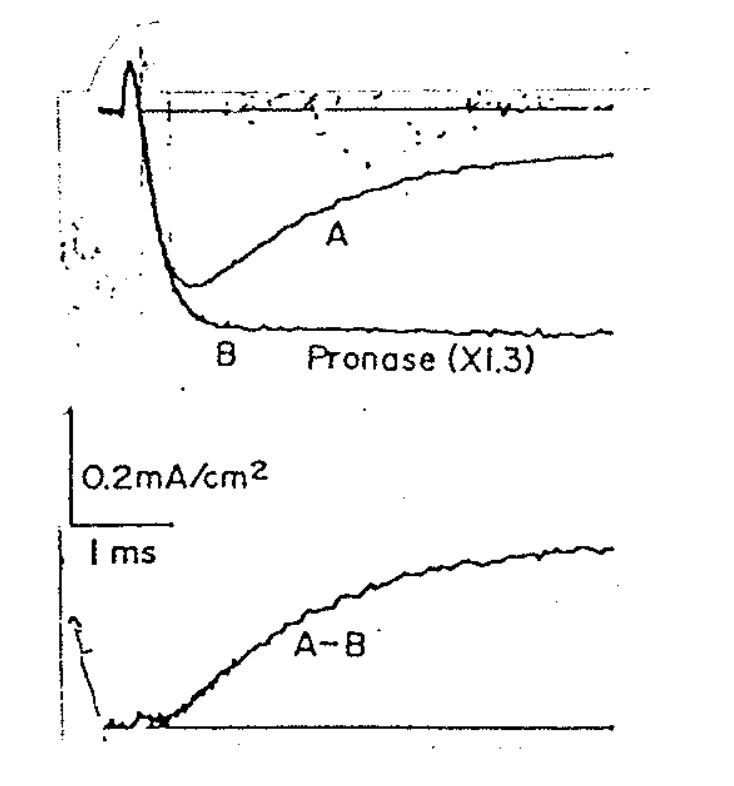

# Bezanilla & Amstrong：Ball and Chain (3 phase) model for Na channel

## 內文

如上圖，Bezanilla & Amstrong 發現在 voltage clamp 的實驗中，如果不是從 -100 mV 直接打到 0 mV ，而是在中間加入不同時間長度、不同電壓的 conditioning pulse，再比較之後打到 0 mV 時產生的 testing pulse，會發現幾個現象：

1. 發現一：隨著 conditioning pulse 本身的電位越正，testing pulse 的 peak 越小
2. 發現二：隨著 conditioning pulse 的持續時間越久，testing pulse 的 peak 越小
3. 發現三：在一開始 conditioning pulse 持續時間很短的時候，對 testing pulse 的影響不大，然後 conditioning pulse 的持續時間才開始對 testing pulse 產生影響

### 該如何解釋？

1. testing pulse 的 peak 大小，代表的是此時有多少 Na 可以用，即 [C] + [O]
2. 目前已知的是 Hodgkin–Huxley 的 model：activate 與 inactivate 為互不相關的事件，如下圖
   
3. 發現一：conditioning pulse 的電位越正，i 掉的 channel 就越多 ⇒ 頗為合理
4. 發現二：conditioning pulse 的持續時間越久，i 掉的 channel 就越多 ⇒ 亦頗為合理
5. 發現三：在一開始 conditioning pulse 持續時間很短的時候，對 testing pulse 的影響不大，然後 conditioning pulse 的持續時間才開始對 testing pulse 產生影響
   ⇒ **<u>不合理</u>**，如果 activate 與 inactivate 為互不相關的事件，則 i 掉的 channel 數量應該要呈現類似 $[C_0](1- e^{-t/\tau})$ 的表現，亦即剩餘的 channel 數量應該要呈現 exponential decay，與實驗不符
   ⇒ Bezanilla & Amstrong 提出 **<u>Ball and Chain model</u>**，即**<u>要先 activate 才能 inactivate</u>**（如下圖）
   
   化學式寫成 $\ce{C <=>[v_\alpha][v_\beta] O <=>[v_\gamma][v_\delta] I}$，其中在平衡狀態下 $v_\gamma \gg v_\delta$ 使 $[I] \gg [O]$
6. 如下圖，在用 Pronase 把 ball 切掉之後，Na current 就會從曲線 A 變成 B，即不會有 Inactivation State
   
7. Bezanilla & Amstrong 以為在 Na channel 中這顆 ball 是透過 diffusion 隨機的撞到 receptor 上，但實際上後來發現這是很精準的調控，從 Activate 到 Inactivate 的時間相當固定
