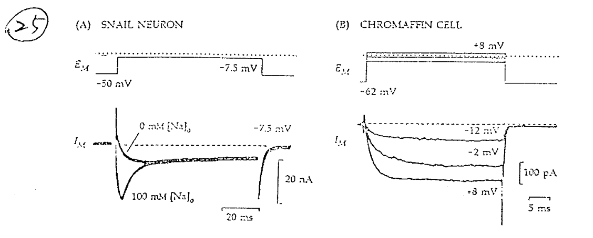
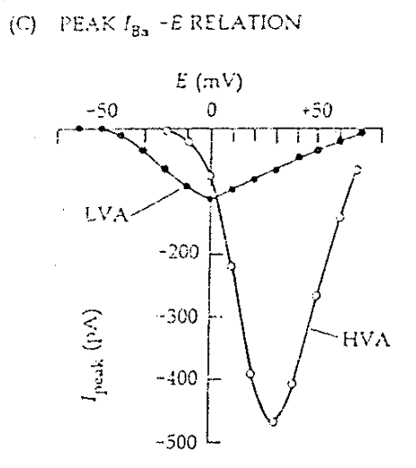
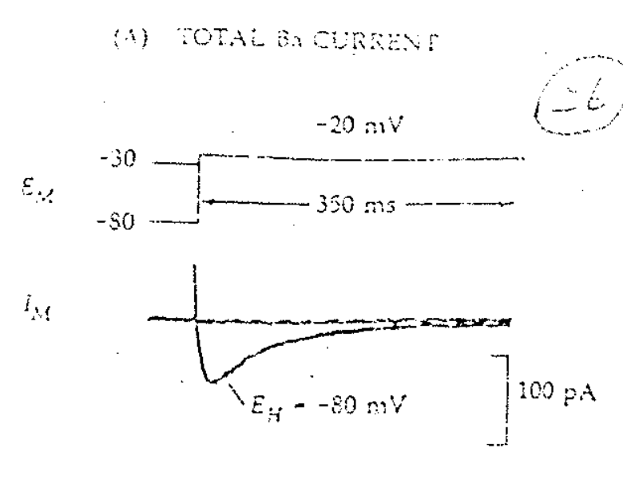
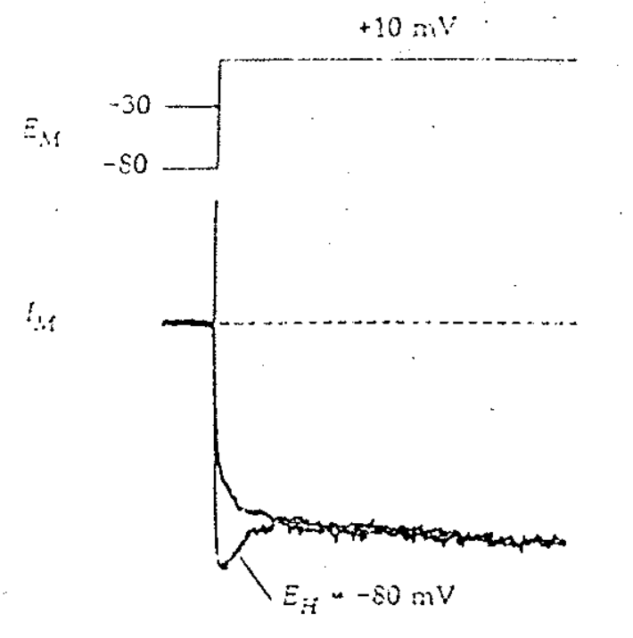
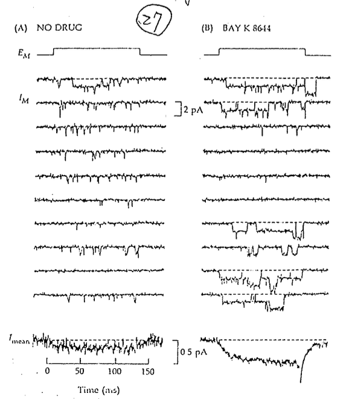

# Ca channel

## 內文

1. 發現過程（如上圖）：
   1. 圖左發現刺激 snail neuron 很久之後，仍然有很大 inward current
      Na channel 不是都 I 掉了嗎？⇒ 是不是有除了 Na current 以外的 current
      ⇒ 發現是 Ca 造成的
   2. 圖右：Ca channel 是 voltage dependent
      - 注意 -12mV 時 driving force 比 +8mV 時大很多，但 +8mV 時 current 比 -12mV 時大很多 ⇒ 超級 voltage dependent
2. Ca 同時身兼 electrophysiology & biochemistry 兩個功能
   - 這樣 Na & K 就可以專心處理 electrophysiology
3. 分類：
   1. Low voltage activated（LVA）：Type T （而且也會 inactivate）
   2. High voltage activated（HVA）：Type L、N、P、Q、R （不會 inactivate）
   3. 兩種 channel 打開的機率都符合波茲曼分佈，差別在於 $V_h$ 的大小
      
   4. 左上圖為兩種 channel 的 I-V 圖，其中 LVA 的 $V_h$ 較小， HVA 的 $V_h$ 較大
      - 關於此種 I-V 圖的解釋見 <u>P(Open) 與 Conductance 的關係</u>
4. T type 會 inactivate，L type 不會。T Type Vh 較低，L Type Vh 較高：
   

   
   左圖：
   1. 從 -80mV → -20mV 只有 T type 有反應（L type Type Vh 較高）
   2. 從 -30mV → -20mV 沒有人有反應 （T type I 掉了、Type Vh 較高）
      - 見 <u>會 inactivate 的 channel，越 depolarize 越不會有反應</u>
   3. 兩者相減即為 T type Ca channel 的 current
   右圖：
   1. 從 -80mV → +10mV T type + L type 都有反應
   2. 從 -30mV → +10mV 只有 L type 有反應（T type I 掉了）
   3. 兩者相減仍然是 T type Ca channel 的 current
5. Single channel recording
   
   1. 圖左可以看出此 channel 只有一種 conductance（因為 V 固定，channel 打開時電流 I 的大小均大致固定）
      - conductance 可以視為一個 channel 的指紋
      - 有些 channel 有兩種 conducatance，其中小的那個 conductance 稱為 subconductance
   2. 圖左最下面可以看出在分子層面，打開不打開是 probability 的問題，持續給電壓也不會持續打開 ⇒ 但是平均以後會有固定值
   3. 圖右：加入神秘的物質(Ba2+ & TTX)可以阻止 channel 關閉
      - 促進 channel 打開 VS 阻止 channel 關閉 有什麼不一樣？
        ⇒ 促進 channel 打開是增加 $k_{open}$，阻止 channel 關閉是減少 $k_{close}$
        ⇒ 會反應在 mean opening time & mean closing time 上
