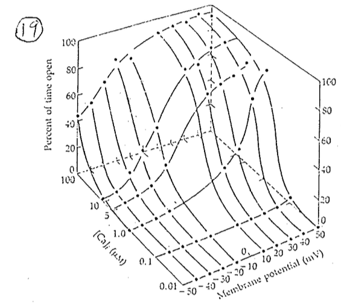
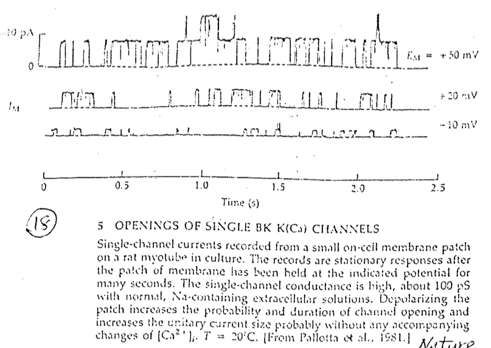
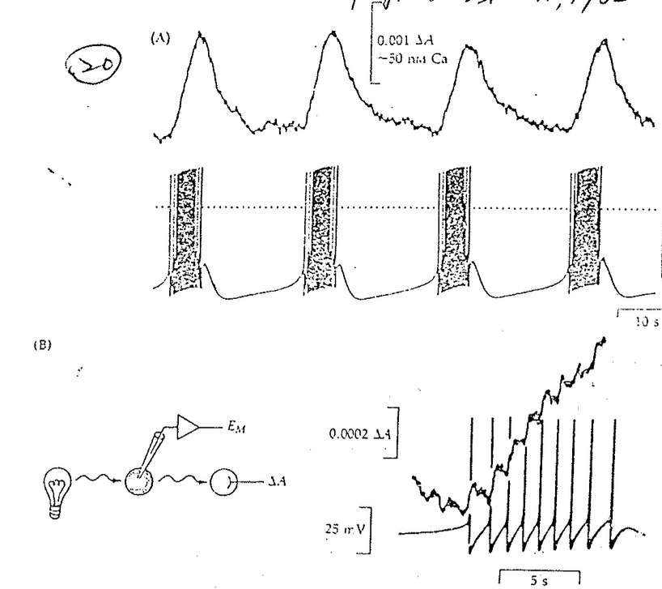
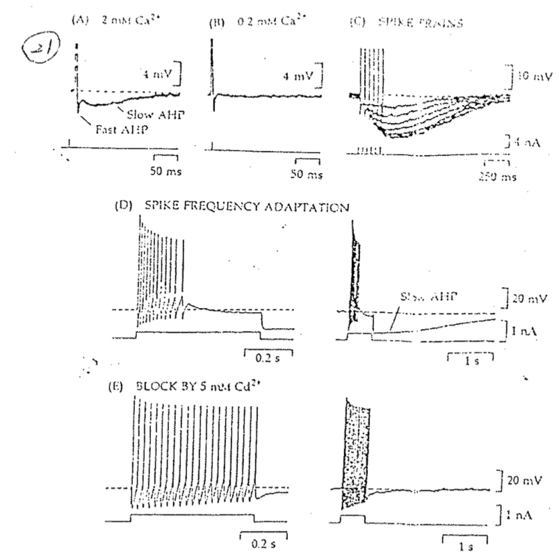

# Calcium-dependent K channel

## 內文

1. 如上圖，這是一個同時受膜電位調控 & $\ce{Ca^2+}$ 離子調控的 K channel
   
2. 上圖為 single channel recording，可以看出這個 channel 電導很大，可以到 100 pS
   
3. 上圖為某個神秘的細胞 ，跟時鐘一樣會定時 bursting
   1. 圖 A 上半為細胞內 $\ce{[Ca^2+]}$ 濃度
   2. 因為不斷的 burst 讓胞內 Ca 濃度不斷上升 (圖 B 右半)，引發 Calcium-dependent K channel ⇒ 於是 K 大量湧出細胞，造成 hyperpolarize，中斷 burst
      1. 可以看出同一群 burst 的每次 spike 之間，胞內 Ca 濃度仍然會下降，因為Ca 對 signaling 太重要了， 所以細胞會不斷把 Ca 弄出去讓 Ca 的背景值非常非常低
      2. 沒有 fire 時 胞內 Ca 濃度即會快速下降
      3. hyperpolarize 之後還會慢慢 depolarize 回來，是因為有 $I_h$
   3. 誰在 burst 時的 兩根 spike 之間頂住 K channel，誘發下一根 spike？
      ⇒ resurgent Na+ current（一般而言 Na channel 是 $O_{block} ⇒ C_{block} ⇒ C_{unblock}$，但有些是 $O_{block} ⇒ O_{unblock} ⇒ C_{unblock}$ ，這些途經 $O_{unblock}$ 的 Channel 自然會產生 Na current，稱為 resurgent Na+ current）
   
4. 上圖說明 Spike 過後的 Slow AHP 是由 Calcium-dependent K channel 所造成
   1. 圖 A & B：把胞外 $\ce{Ca^2+}$ 濃度變低，發現 Slow AHP 消失 ⇒ Slow AHP 需要 $\ce{Ca^2+}$ 離子
      - AHP（Afterhyperpolarization） 本身是由 K current 形成，見 <u>Action potential</u> 一節
      - 可以看出 AHP 分兩種， fast and slow ⇒ 代表有兩種 Voltage dependent K channel
   2. 圖 C：Spike 越多，Ca 累積越多，Calcium-dependent K channel 開的越多 ⇒ Slow AHP 越大
   3. 圖 D & E：圖 D 可發現在固定的方波電流之下，spike 越來越慢（間隔越來越寬），稱為 **Spike frequency adaptation**（注意：整件事是在 1 秒之內完成，這個 adaptation 超快）
      但是當圖 E 用鎘離子 $\ce{Cd^2+}$ 塞住 Ca Channel 時 ⇒ Calcium-dependent K channel 就開不了，因此 Spike frequency adaptation 就變得不明顯
      ⇒ 證實 Spike frequency adaptation & Slow AHP 是由 Calcium-dependent K channel 造成
      - 圖 D 停止放電以後有超強 AHP ，K conductance 超大 ⇒ 超難達到 threshold ，稱為不反應期
      - 鎘離子 $\ce{Cd^2+}$ 大小跟 $\ce{Ca^2+}$ 很像，親和力又更強，bind 上去就掉不下來
