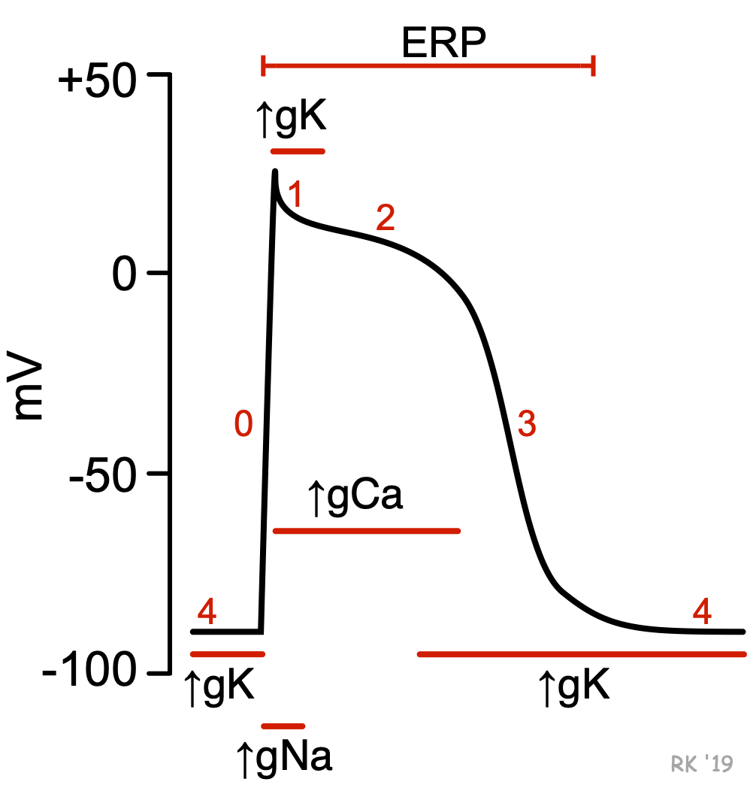

# Cardiac cell phase

## 內文

1. 最重要的目的是要獲得 $\ce{Ca^2+}$ 離子，以讓肌肉收縮（因此有 phase 2 plateau，要讓 $\ce{Ca^2+}$ 一直流進來）
   - 開的越久，心臟的 ionotropic (收縮力)越大
   - 對比：**<u>心臟的 chronotropic (速率)</u>** 由 $I_h$ channel 控制
2. 在 deporlarization + plateau 期間 $I_K$（Delay rectifier K channel） 就會越來越大最後發力（因此 plateau 實際上是慢慢往下的）
   - plateau 持續的時間長度，是由 $I_K$ 什麼時候開始發力決定的
3. phase 1 的 $g_K$ 是 A type K channel（會 i 掉），所以持續不久
