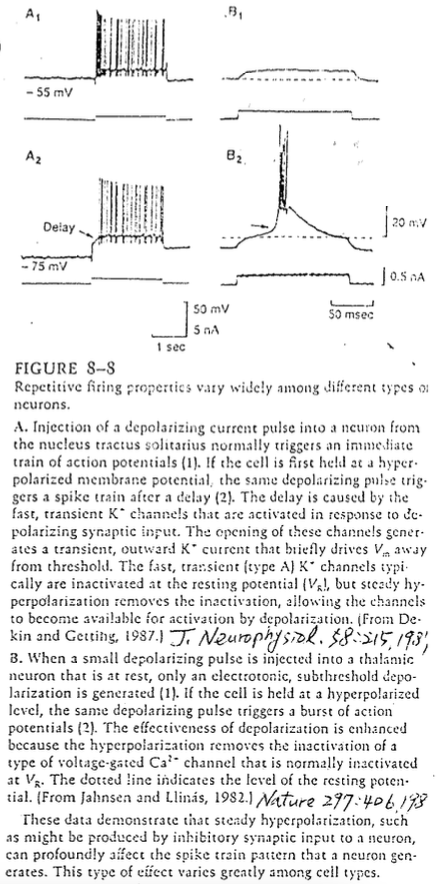
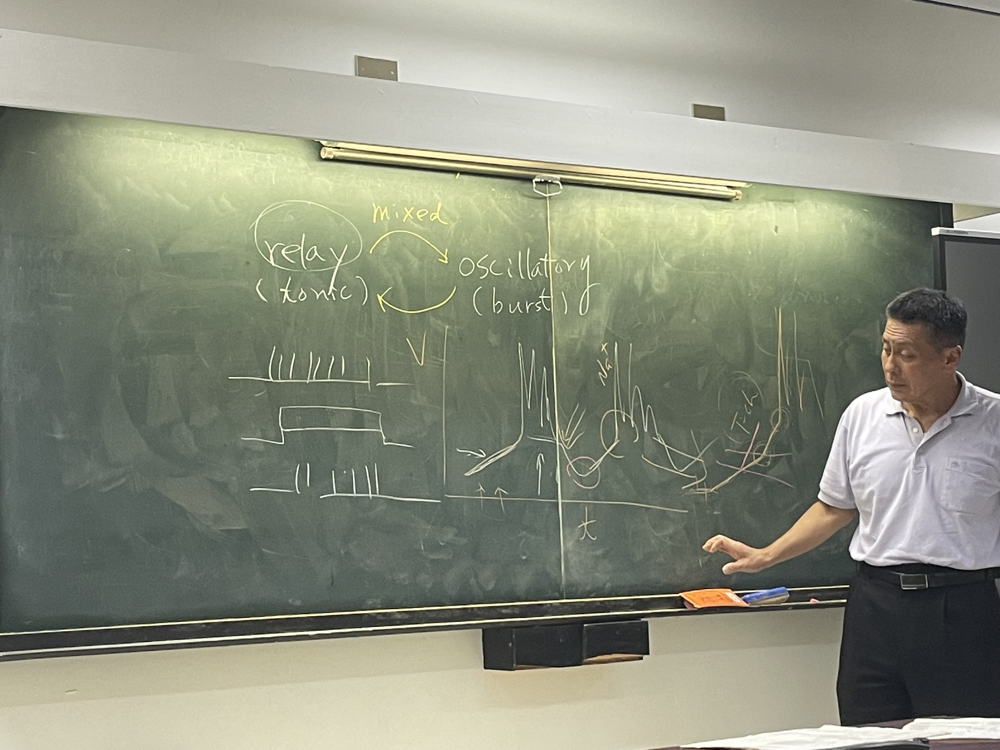

# Cell bursting mode & relay mode（聽不懂）

## 內文

1. 為什麼 burst 會一直有 spike
   1. 郭說是因為 resurgent current ⇒ 那為什麼平常的 action potential 不會也有一堆 spike？⇒ 是因為平常沒有一直有外加電場嗎？
   2. 那為什麼同樣都是 K 越來越強讓細胞最後inactivate ，cardiac muscle呈現的形式是 plateau，而 neuron 是 bursting？為什麼 Ca channel 不會像 Na 一樣 上上下下？因為少了inactivate？還是因為 spike 是欠阻尼，plateau 是過阻尼？
2. 同一個細胞可以在 burst mode 與 relay mode 之間轉換甚至是 mix 在一起
   1. 如果 K current 不夠強，導致膜電位最負的時候不夠負（有時候只差 5mV 就差很多），則沒 I 掉的 Na channel、 T type channel 數量不夠就無法 burst
      
   2. 但還是聽不懂 …??
