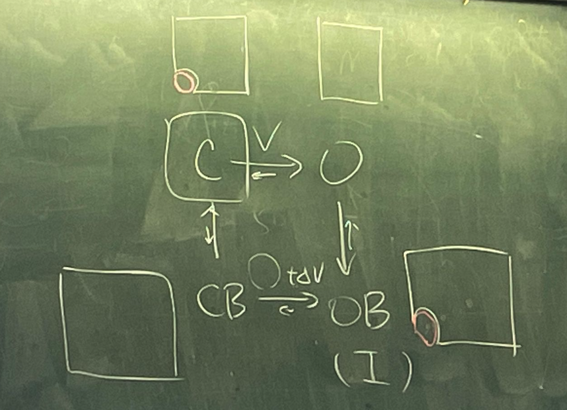

# Channel modulation

## 內文
藥物的作用效果，要看：

1. 與哪個構型 bind ⇒ 會把這個 channel 固定在哪個構型
2. 此 channel 的工作模式
   
   - ex: bind 住 C 構型時，這個 channel 就不能放電（一次都不行）
     ⇒ 不管是 burst 還是 relay 的 channel 都會被攔住
   - ex: bind 住 O_B 構型時，這個 channel 就只能放電一次
     ⇒ 如果是需要 burst 的 channel 就會被攔住；如果是需要 relay 的 channel 就不會被攔住
   因此有些藥物可以阻止癲癇放電 ← 因為癲癇放電有特殊的放電 pattern
