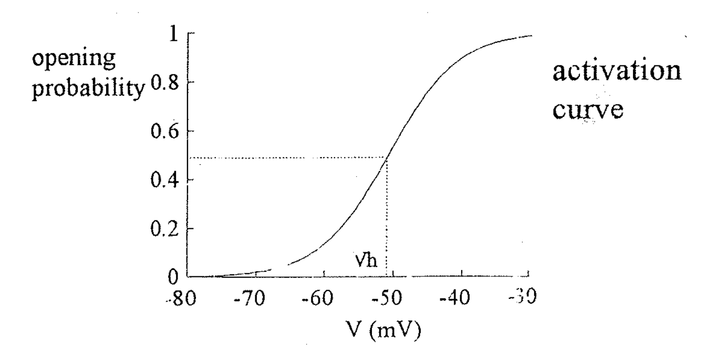

# Channel opening probability：Boltzmann distribution

## 內文
- 注意：Boltzmann distribution 的前提假設
  1. 此物質只有兩個 state
  2. 這兩個 state 之間必須達到 steady state 的平衡
  - 實際上沒有很準但是很好用，很方便可以比較兩個 channel 的性質，或是比較兩種藥物對同一個 channel 的影響

1. 雖然說粒子會喜歡處在最低能量的狀態，但實際上會形成一個分佈比例，而此分佈就是 Boltzmann distribution
2. Boltzmann distribution：如果一個物質可以兩個 state 之間轉換，那**<u>在平衡狀態下</u>**，這兩個 state 的分佈比例與兩個 state 之間的**<u>自由能差</u>**有關
   對於 $\ce{ C <=>[v_o][v_c] O}$ 這個可逆反應而言，平衡狀態下 $\frac{[O]}{[C]} =\frac{v_o}{v_c}=K = e^{\frac{-\Delta_r G^{\minuso}}{RT}}$
   1. K 為平衡常數
   2. $\Delta_r G^{\minuso} = G_o^{\minuso} - G_c^{\minuso}$ 為 Standard reaction Gibbs energy ，只與反應物 & 生成物本身性質有關
      - 詳細內容見 [<u>物理化學 → 化學反應的平衡</u>](https://www.notion.so/b89973e3e702410f97f9085a24994a4b?pvs=21)
   3. $\Delta_r G^{\minuso}$ 的來源：為什麼兩個 state 之間有自由能的變化？
      1. 拆掉凡德瓦力、拆掉氫鍵都需要外界做功，記作 $+W_N$，而形成凡德瓦力、形成氫鍵都會對釋放能量，記作 $-W_N$ ，此類的功稱為 **<u>非電功</u>** $W_N$
      2. 電荷順著電場中的電力移動會釋放能量，記作 $-W_E$，而當電荷逆著電場中的電力移動則會需要外界做功，記作 $+W_E$，此類的功稱為 **<u>電功</u>** $W_E$
         其中電力對每莫耳電荷做功釋放的能量 $- W_E = QV = z \mathcal F V$
         - z 為單個粒子的帶電數
         - $\mathcal F = eN_A = 96500$ 為法拉第常數(即一莫耳電荷的電量)
         - V 為電荷在電場移動前後位置的電位差
      3. 因此從 C 變成 O 需要的自由能變化即為 $\Delta_r G^{\minuso}= W_N + W_E=W_N-z \mathcal F V$
   4. 對式子繼續改寫： $\frac{1}{K} = e^{\frac{\Delta_r G^{\minuso}}{RT}} = e^{\frac{W_N-z \mathcal F V }{RT}} = e^{z(V_h -V)/V_T}$
      1. 其中 $V_h = \frac{W_N}{z\mathcal F}$，即從 C 到 O 的過程中，非電功可以等效於什麼電壓下的電功
      2. 而 $V_T = \frac{RT}{\mathcal F} = \frac{kT}{e} =25mV$，為常數
3. $\mathrm{P(Open)} = \frac{[O]}{[O] + [C]} = \frac{e^{\frac{-\Delta_r G^{\minuso}}{RT}}}{e^{\frac{-\Delta_r G^{\minuso}}{RT}} + 1} = \frac{1}{1+e^{\frac{\Delta_r G^{\minuso}}{RT}}} = \frac{1}{1+e^{z(V_h -V)/V_T}}$
   此即為 **<u>Opening probability</u>**（曲線如下圖）
   
4. $\mathrm{P(Open)} = \frac{1}{1+e^{z(V_h -V)/V_T}}$ 的意義：
   1. $V_h$ 代表非電功對電荷而言的等效電壓，從圖上亦可看出 $V_h$ 為 $\mathrm{P(Open)} = 0.5$ 時的電壓
   2. $z$ 為單個粒子的等效帶電數，但與真正實際上的 charge 數不一樣：它是用能量推導的。如果 z 算出來是 2 ，但是打開 channel 發現有 4 個 charge，代表這些 charge 平均只跑到一半（只享受到一半的電位差），這樣的話只利用了相當於兩個 qV 的能量
   3. 同樣 $V_h$ 的曲線，斜率比較陡的那個（相較於斜率比較和緩的那個）更為 voltage dependent，亦即運動的 charge 較多（$z$ 較大）
   4. 同樣的 $z$ （斜率）的曲線，不同的 Vh 代表不同蛋白打開時所需要做的非電功是不同的（拆掉凡德瓦力、拆掉氫鍵都需要做非電功）
