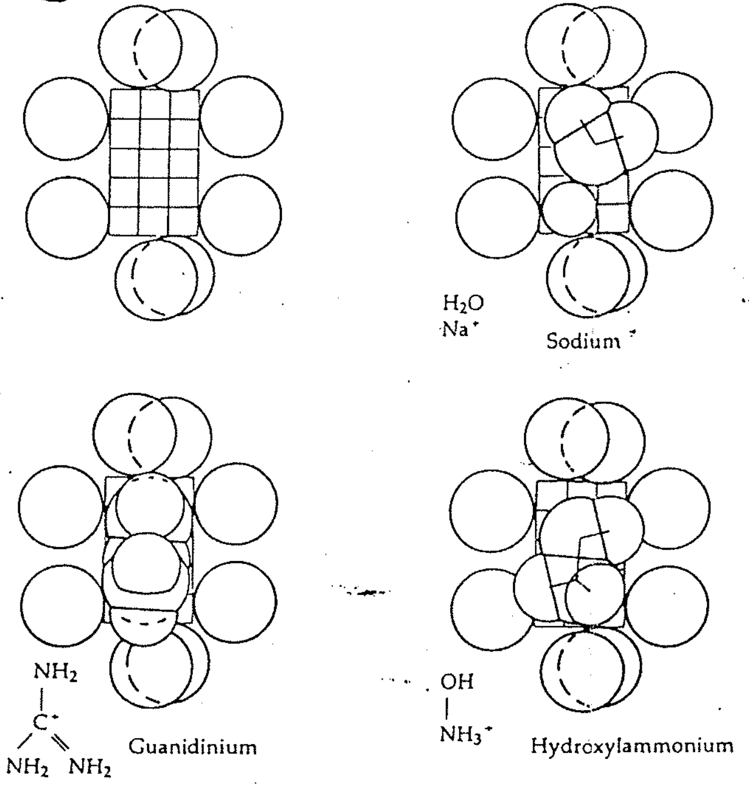

# Channel 的構型

## 內文
1. 用可以通過某 channel 的物質種類，可以推測此 channel 最窄的地方有多窄
2. 例：如下圖，連 Guanidinium & Hydroxylammonium 都可以通過 Na channel
   - 在 Na channel 的 Permeability 那張表中也可以發現 Guanidinium & Hydroxylammonium 的 Permeability > 0
   
3. 例：triethylammonion 這麼大也能通過 End plate 的 Acetylcholine receptor ion channel，代表這個 channel 的洞很大
