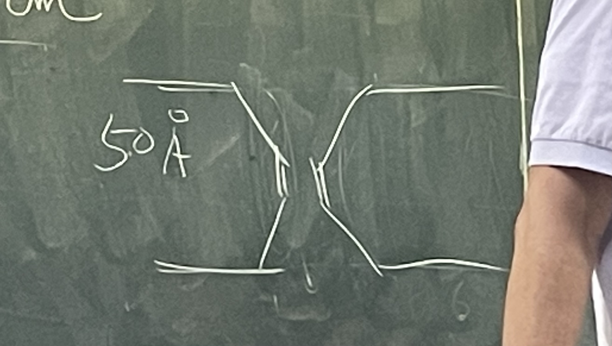

# Conductance

## 內文
1. 通道的 Theoretical conductance $G = \kappa \frac{\pi R^2}{l}$
   1. 其中 R 為半徑，如果此 channel 想要有 selectivity，那就不可以太大（不然水包裹就一起過去了），所以基本上不可以超過 3Å
   2. l 為長度，膜的半徑為 50Å
   3. 電導率 $\kappa = 0.01$ （生理環境下，即 Ringer）
   4. 但這樣算出來的 Theoretical conductance 是 50 pS ⇒ 實際上可以到 500 pS
      ⇒ 因為通道不必完全等粗，只要有一段夠細就可以有 selective 了，如下圖
      
2. 為什麼離子濃度高到一定程度之後，conductance 會飽和？
   
   Channel 讓離子通過的機制就是離子隨機的碰撞 Channel，角度碰對的離子就可以通過去
   如果 channel 只是單純的通道，則 <u>conductance</u>、<u>碰撞頻率</u>、<u>離子濃度</u> 這三者應該永遠成正比 ⇒ 但實際上並沒有
   1. 根據 Kohlrausch’s law $\Lambda_m = \Lambda_m^{\minuso} - Kc^{\frac{1}{2}}$，濃度與 conductance 本來就不會成正比（離子之間互有靜電作用力，因此會彼此干擾而非獨立存在）
      1. $\Lambda_m$ 為溶質的莫耳導電度 $\frac{\kappa}{ c}$，$\Lambda_m^{\minuso}$ 為超級稀薄溶液的莫耳導電度，K 為係數
      2. 但那個濃度要夠高，這裡的濃度只有幾十 mM，很不足
      3. 注意這張圖的 x 軸座標名稱是 activity，即已經考慮過 Kohlrausch’s law 了，用的不是實際濃度而是等效濃度（相當於多少濃度自由的、有效的離子）
   2. 真正的原因：有些碰撞是**無效碰撞** ⇒ **<u>一定有 binding</u>**，因此才會有無效碰撞（即 binding site 塞住時其他人再去碰撞就沒用了）
