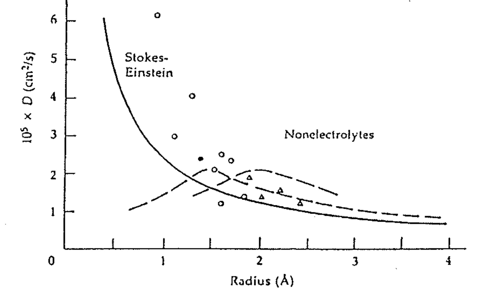
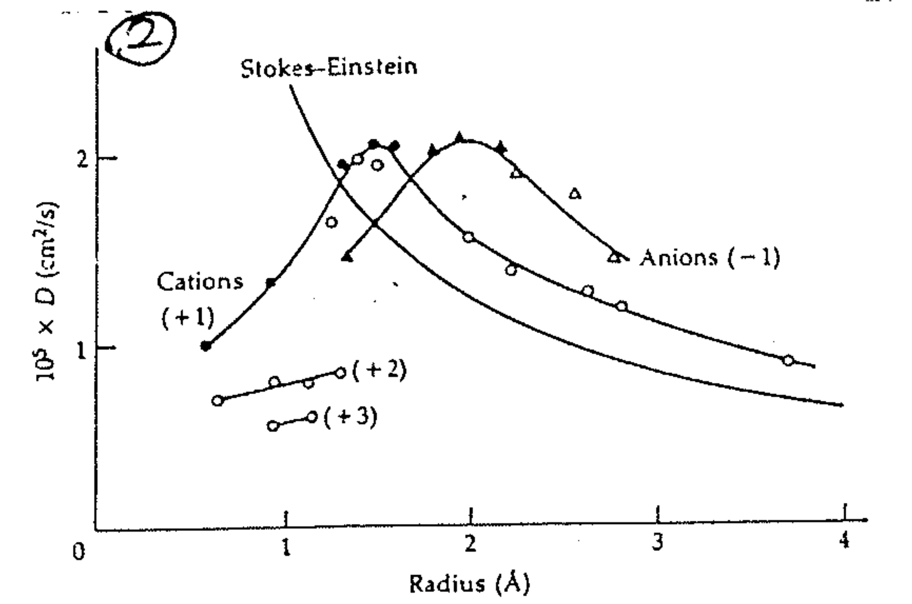
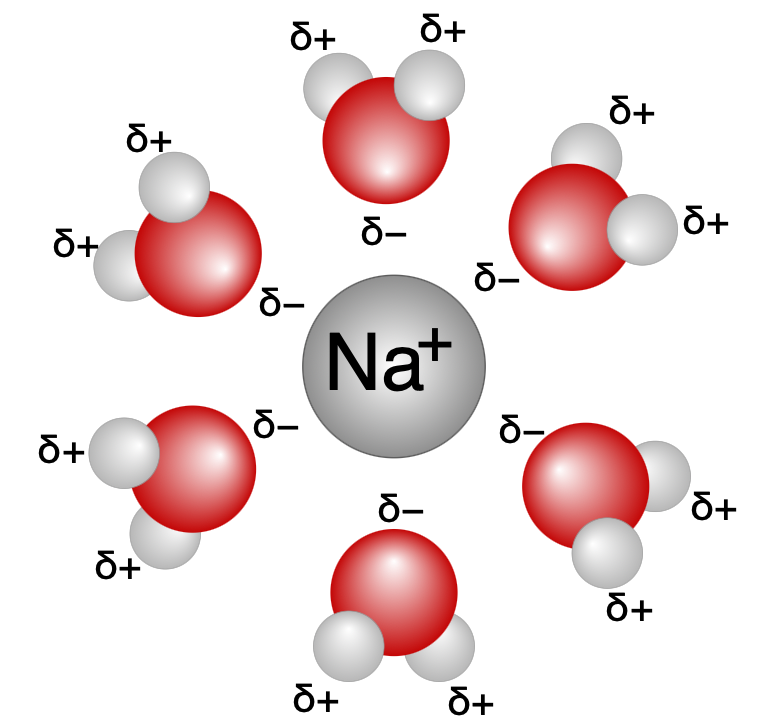
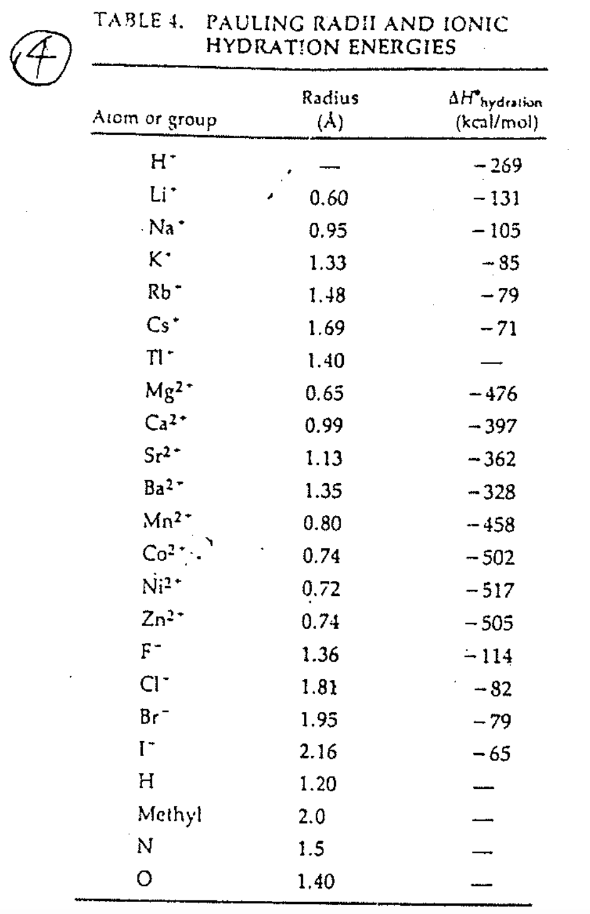

# Diffusion

## 內文
1. 複習：根據 Fick’s law，理想溶液的粒子擴散符合 $J_n = -D\frac{\partial \rho_n}{\partial x}$
   1. $J_n = \rho v$ 為單位時間內通過單位面積的粒子數量通量
   2. $\rho_{n}$ 為空間中的數量密度
   3. D 為擴散係數
   4. 擴展為三維的話則寫作 $J = -D \nabla \rho_{n}$
2. 複習：根據 Stokes-Einstein equation， 擴散常數 $D = \frac{kT}{6\pi \eta R}$
   1. k 為波茲曼常數、T 為溫度
   2. $\eta$ 為黏度 viscosity
   3. R 為粒子半徑
3. 如下圖（忽略那些虛線），不帶電荷的粒子（即那些圓點 & 三角形），<u>擴散係數 D</u> 與 <u>粒子半徑 R</u> 的關係符合 Stokes-Einstein equation，即兩者成反比
   
4. 如下左圖，帶電荷的粒子，擴散係數 D 與 粒子半徑 R 的關係不符合 Stokes-Einstein equation
   原因：離子外面會裹一層水分子（如下右圖），造成更大的有效半徑（ex: 圖上可以看出同樣帶 +1 的離子，本來半徑 1Å 的離子，有效半徑會變成 3Å，即 1Å 離子和 3Å 離子的擴散係數差不多），所以其實還是符合 Stokes-Einstein equation
   

   
5. 如下圖，半徑越小的離子，帶電密度越大 ⇒ 水和能越負 ⇒ 外面包的那堆水越大圈
   
6. 水合能這麼負（即要去掉包裹的水需要額外提供這麼多能量），為什麼 selective channel 可以去掉這些水？selective channel 與 ion 形成錯合物，提供能量
   1. 不把水去掉就無法辨識個別 ion
   2. non-selective channel 就沒差，可以連水包裹一起送，但是擴散係數 D 就會比較小
