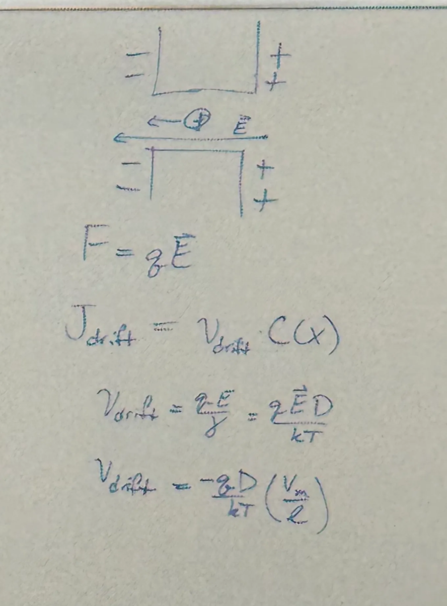
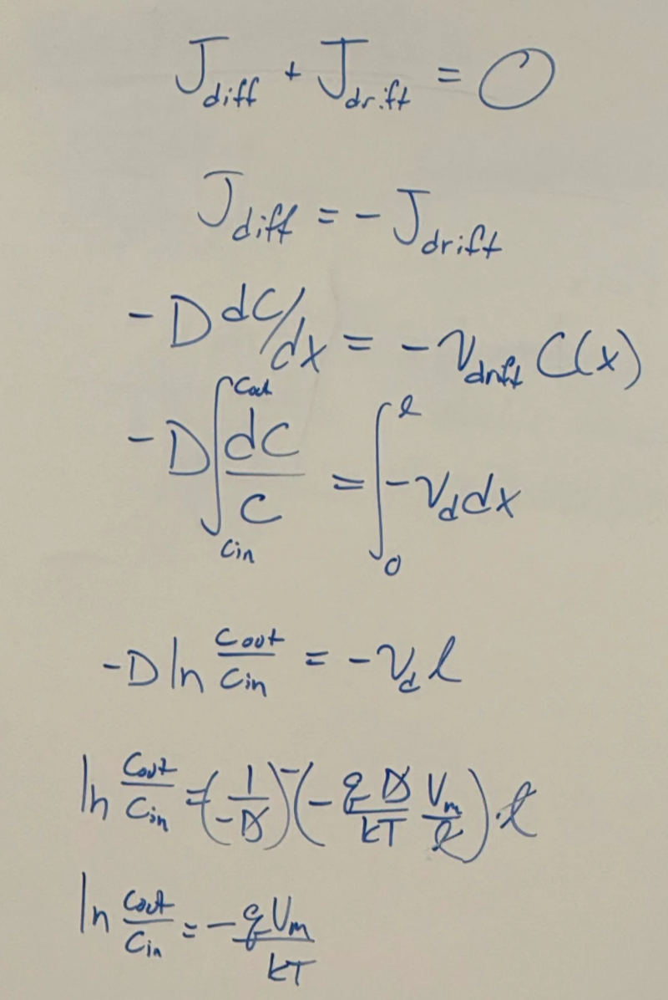
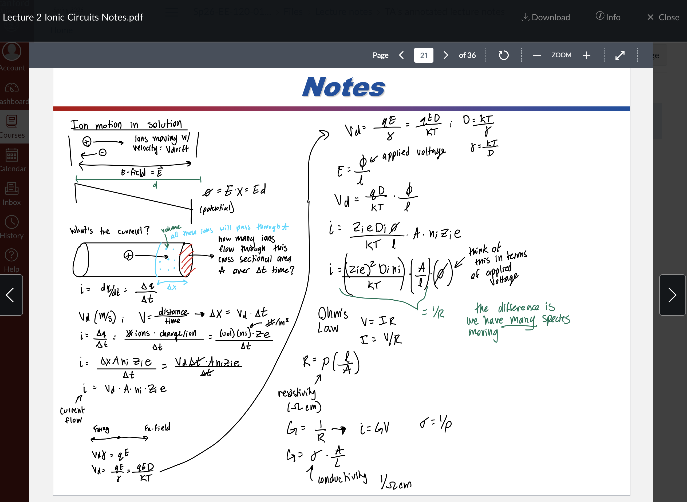

# Driving force & Nernst Equation & reversal potential

## 內文
可以用 F_{diffusion} + F_{drift} = 0 也可以用 J_{diffusion} + J_{drift} = 0

這邊用 J (離子通量, #/s/area)，另外 C 是離子濃度, V 是電位差，L 是膜厚度

1. 根據 Fick’s law, J_{diffusion} = -D \frac{dC}{dx}
2. J_{drift} = v_{drift} \* C = \frac{q \vec E D}{kT} = \frac{-q D}{kT} \frac{V}{L}
   
   
   
3. 算完之後 \frac{C_{out}}{C_{in}} = e^{\frac{q V}{kT}} 或是 V = \frac{kT}{q} \ln{\frac{C_{out}}{C_{in}}} ，其中 \frac{kT}{q} = 25mV
4. 可以想像 \frac{C_{out}}{C_{in}} = e^{\frac{q V}{kT}} 就是 boltzmann equation，q V 就是能量 E，\frac{C_{out}}{C_{in}} 就是機率

[https://courses.lumenlearning.com/chemistryformajors/chapter/the-nernst-equation/](https://courses.lumenlearning.com/chemistryformajors/chapter/the-nernst-equation/)
