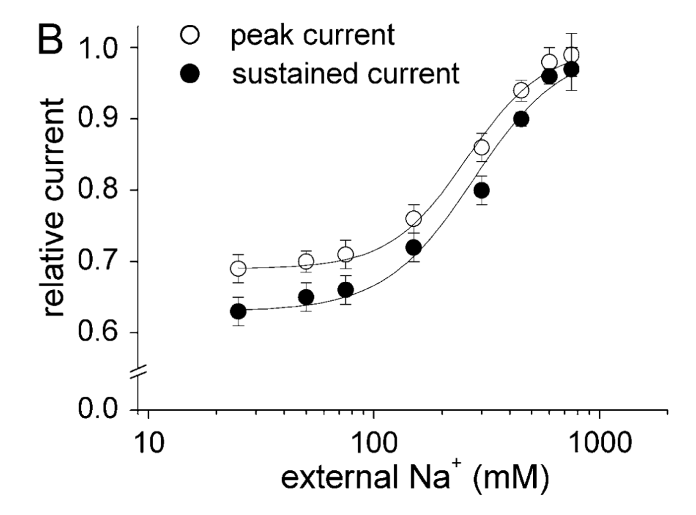
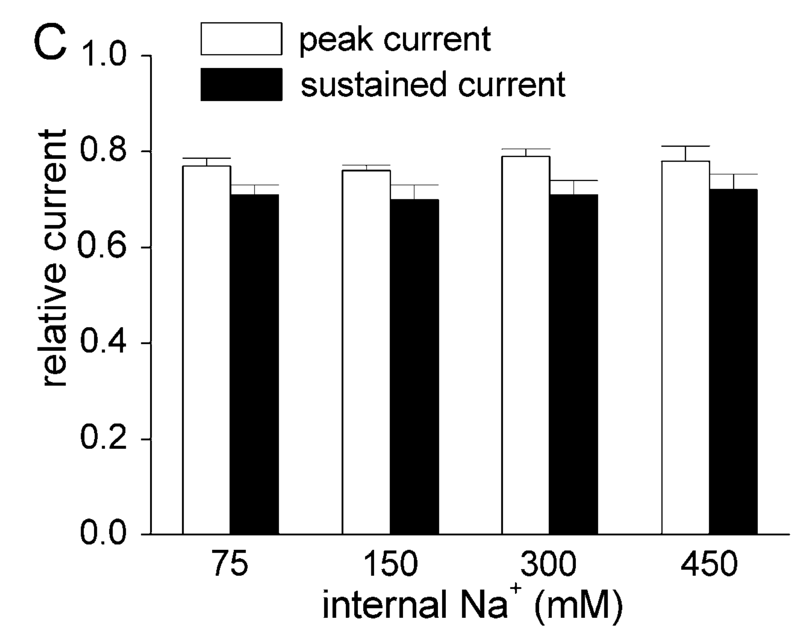
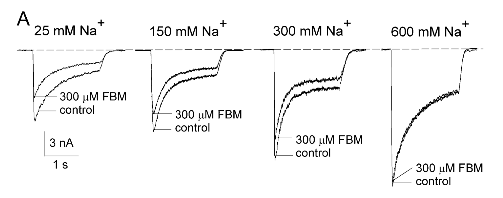
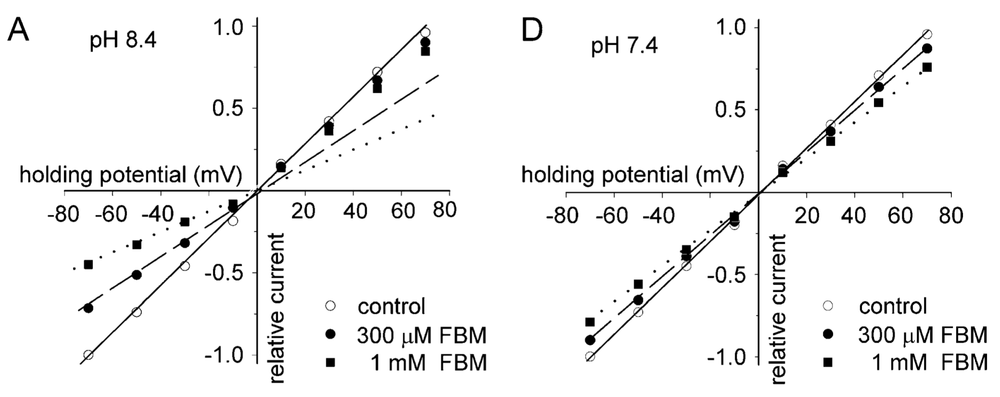
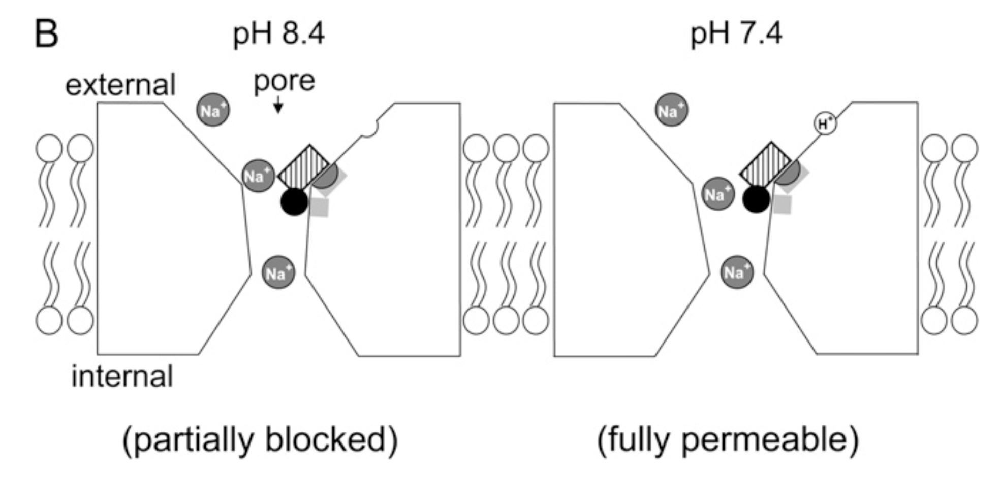

# Felbamate 的 binding site：biophysic 猜測

## 內文
1. 從前面計算可以知道，雖然 $K_c \approx 200 \mu M$ 和 $K_{o+d} \approx 80 \mu M$ 差不多（只差兩三倍），但是兩組的 on rate 差百倍以上， off rate 也差百倍以上
   1. 可以想像 channel 在 close form 時，FBM 難以結合上去也難以掉下來
   2. 郭鍾金：close form 的時候好像有一個蓋子蓋住 channel 一樣，Felbamate 進不去、出不來、結合不了、掉不下來
      **<u>⇒ 這個蓋子會不會就是 channel 的 gate？</u>**
   3. 因此現在找到 Felbamate 在 NMDA receptor 上的 binding site 變得很重要，說不定可以告訴我們 NMDA receptor 的 Ligand gate 在哪
2. 發現 external $\ce{Na+}$ 對 FBM 的 blocking 效果有影響：
   

   
   1. 上圖左可以發現 external $\ce{Na+}$ 對 FBM 的 blocking 效果有巨大的影響 （y 軸代表 $\mathrm{ \frac{with\ FBM}{without\ FBM}}$）
      - 即 **<u>external</u>** $\ce{Na+}$ **<u>越多，FBM 越無法 inhibit NMDA receptor</u>**，如下圖
        
   2. 上圖右可以發現 **<u>internal</u>** $\ce{Na+}$ **<u>對 FBM 的效果完全沒有影響</u>**
3. 發現 pH 值對 FBM 的 blocking 效果有影響：
   
   1. 上圖左可以發現，**<u>在 pH 8.4 的時候 FBM 的 blocking 效果和 current 的流向有關</u>**：如果 current 往內流，則 FBM 濃度越高，blocking 效果越好；而如果 current 往外流，則 FBM 不管什麼濃度都沒有 blocking 效果
   2. 上圖右則可以發現，**<u>在 pH 7.4 的時候 FBM 的 blocking 效果和 current 的流向無關</u>**：即不管 current 往哪流，FBM 濃度越高，blocking 效果都越好
4. 猜測：FBM binding site 在洞口，才會被 external Na & inward Na current 影響，如下圖
   
   1. 在 pH 8.4 的時候洞口比較小，因此 FBM 的 binding site 會被 Na current 干擾撞掉
   2. 在 pH 7.4 的時候洞口比較大，因此 FBM 的 binding site 不會被 Na current 影響，大家各過各的
   3. comment：怎麼覺得好像在亂猜一樣？
