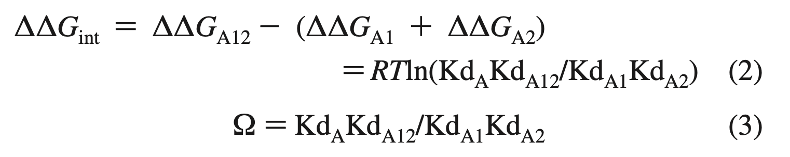
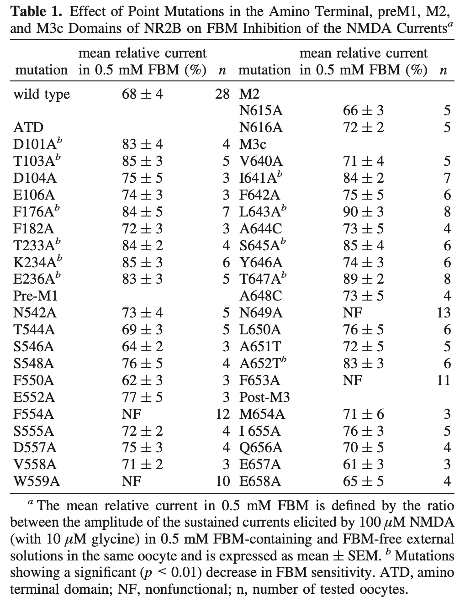
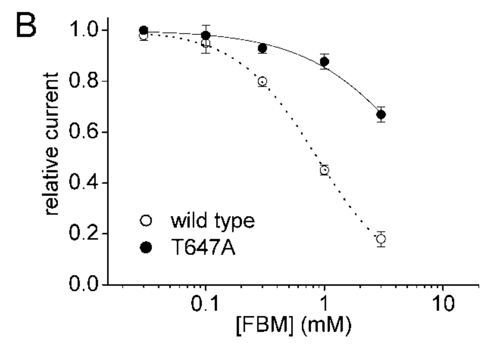
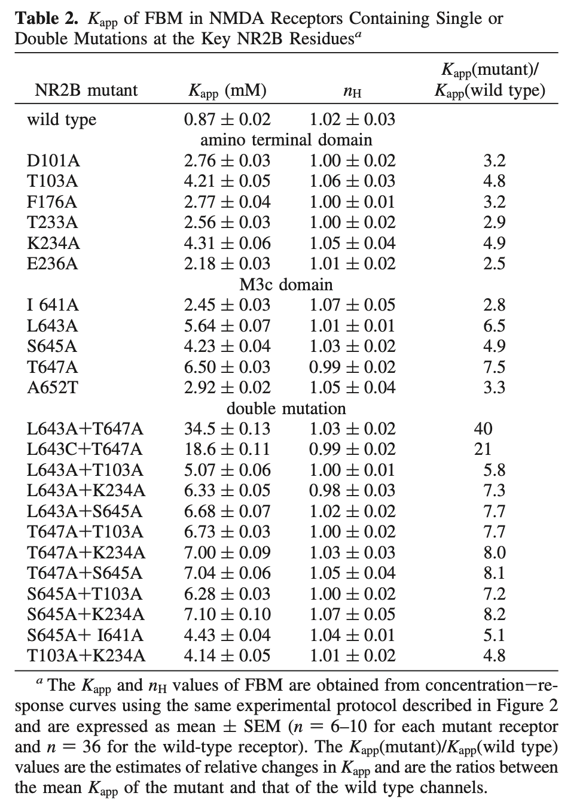
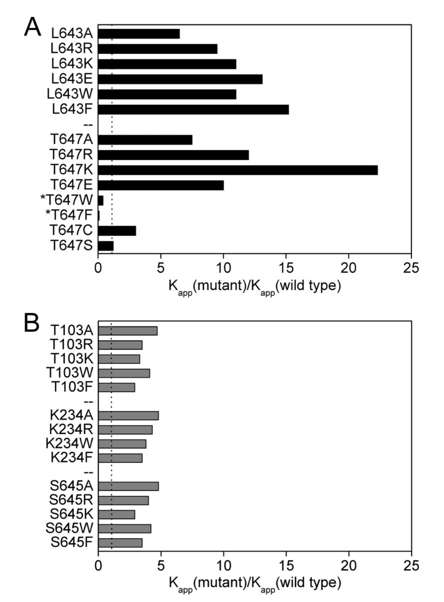
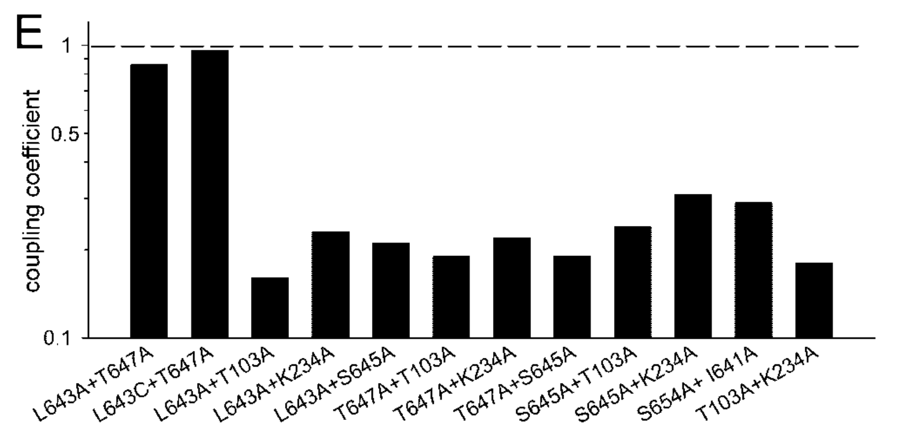
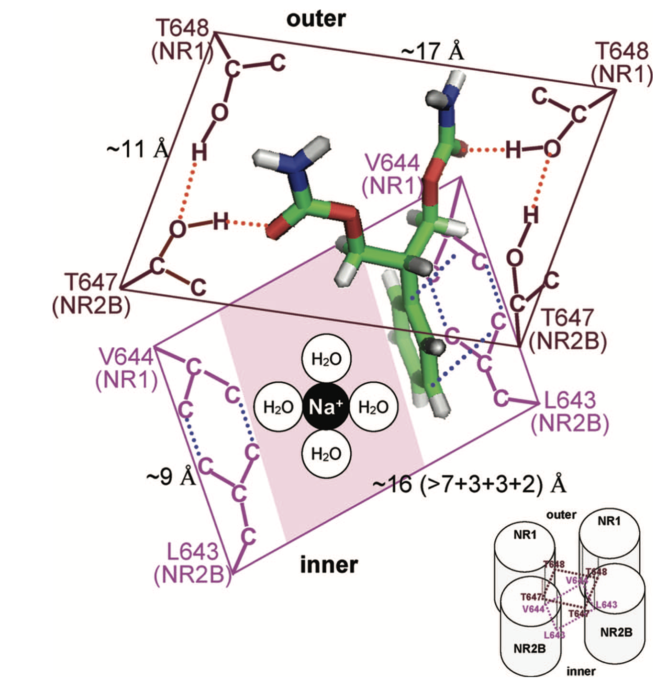

# Felbamate 的 binding site：mutation analysis

## 內文
1. **<u>Mutation analysis 的方法與原則（重要！）：</u>**
   1. 因為 protein 像麻糬一樣，在空間中扭來扭去而且有大量的 interaction，因此不能只做一個 mutation，發現有影響，就宣稱是它。
      怎麼做才是對的？
   2. **<u>藥物與蛋白的結合的</u>** $K_D$ **<u>代表藥物與蛋白結合前後的自由能差</u>**。親和力越強（$K_D$ 越小）的結合，結合後的自由能下降越大。
   3. 如果對蛋白做 mutation，就會改變這個藥物與蛋白的 $K_D$。此時就可以根據 $K_D$ 的變化，計算出此 mutation 對藥物與蛋白的結合的自由能差的變化
   4. 如果認為藥物的 A 結合點、B 結合點都是直接的藥物結合點，那直接把 A 點突變時，可以根據 $K_D$ change 可以計算出自由能改變 ΔA；直接把 B 點突變時，可以根據 $K_D$ change 可以計算出自由能改變為 ΔB
   5. **<u>如果 A、B 不互相關聯，則同時把 A 、B 兩點突變，自由能改變應該要是 ΔA+ΔB</u>**
   6. **<u>如果同時把 A 、B 兩點突變，但自由能改變不是 ΔA+ΔB ，代表兩點位相互關聯</u>**。可能其實藥物的真正結合點是 C 點，而 A 、B 點突變都會造成 C 點構型改變。但是經過 mutation analysis 之後就會發現，兩點都突變時不會讓自由能差直接相加
   7. 計算：如下圖，透過計算突變時各自 $K_D$ 的變化就可以知道自由能的變化，即如果 coupling coefficient Ω 越接近 1，就代表 double mutation 後的自由能差可以直接相加
      
   8. 這是做 mutation study 時一定要回答的問題：**<u>如何證明不是 allosteric</u>**
2. 回到 FBM 與 NMDA receptor：
   

   

   示意圖，解釋什麼叫做影響 FBM binding：原本 FBM 越多，current 越小；現在因為 mutation 造成 FBM binding 效果不好，因此 current 沒有變小很多
   如上圖左邊表格，可以篩選出很多會影響 FBM binding 的 mutation（共 11 個 significant）
   （為排除其他干擾，全部換成 A）
3. 針對這 11 個 amino acid，進行更進一步的篩選：
   

   
   1. 如上圖左，計算這 11 個點位分別造成多少 FBM 與 NMDA receptor 結合的 $K_D$ 變化（為排除其他干擾，全部換成 A）
   2. 找出 $K_D$ 變化最大的 5 個點（T103、K234、L643、S645、T647），把這些點做更詳細的 mutation analysis：各自換成 A（基本）、R、K（正電）、E（負電）、W、F（芳香環）看看
   3. 從上圖右可以發現，L643 換成大側鏈影響更大，而 T647 換成不同基團的效果差很多。其他三個（T103、K234、S645）好像換成誰都沒差
   4. 上圖左下即是這五個點各自組合成的 double mutation 表格，計算 coupling coefficient Ω 即可發現只有 L643A/C + T647A 才有接近 1 的 coefficient（即這兩個點的 double mutation 對 FBM 的影響是互相獨立的），如下圖
      
4. 根據其他複雜的方法重建出 FBM 的 binding site，如下圖
   - 重建蛋白的 conformation 時要注意氫鍵的位置、方向都要對
   
