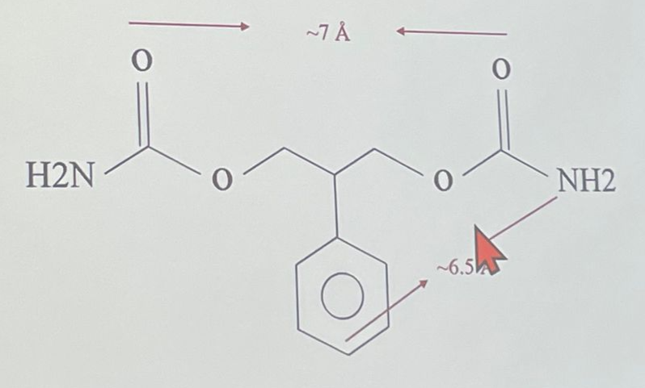
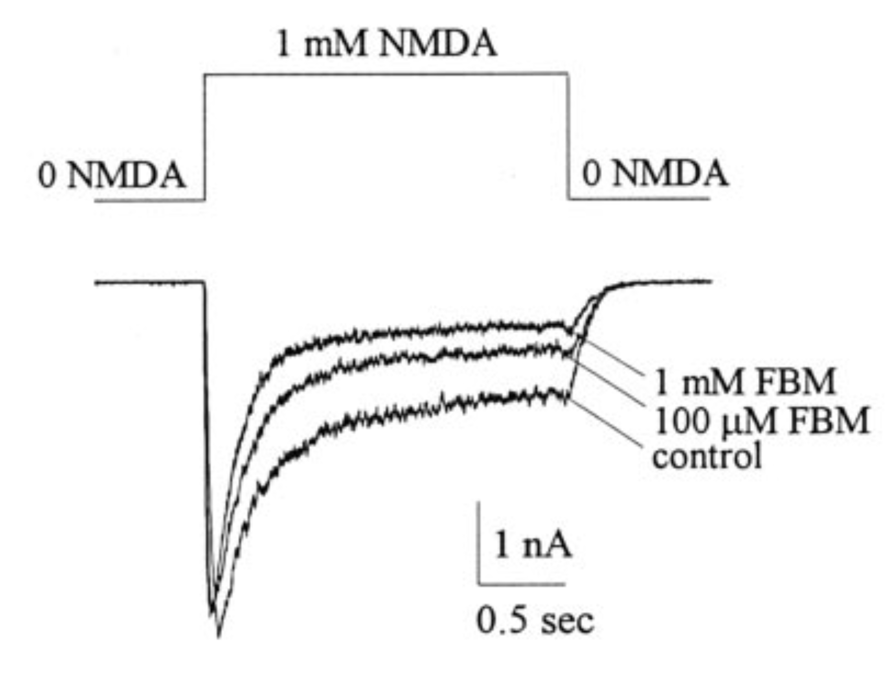
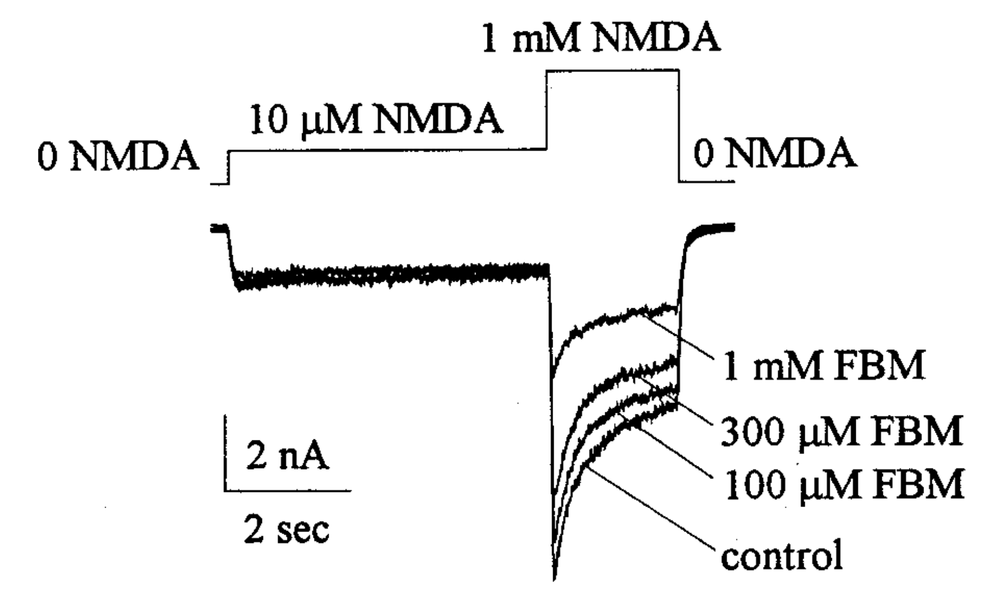
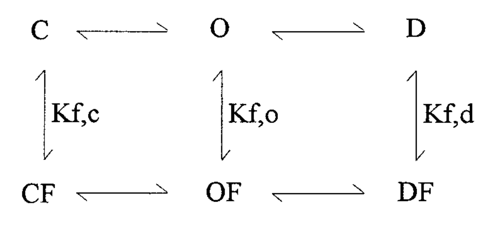

# Gating Scheme of Felbamate on NMDA receptor

## 內文
1. Felbamate (FBM) 介紹：
   Felbamate 是強大的抗癲癇藥物，被認為可以抑制 NMDA channel，但因為肝毒性超強因此台灣臨床上不用
   
2. Felbamate’s action on NMDA receptor：
   
   1. 如上圖，可以看出 NMDA receptor 是一個會 inactivation 的 ion channel
   2. 在 late phase 的時候，Felbamate 可以抑制 NMDA channel
   3. 在 early phase 的時候，Felbamate 並不會抑制 NMDA channel，反而好像有點促進的效果。為什麼？
3. 看起來好像 Felbamate 主要影響 late phase，那如果事前就先給一些微量 NMDA 呢？
   
   如上圖，可以發現確實整段 1mM NMDA 的反應有被 FBM block 住，但前面那段 10 µM NMDA 的反應卻好像沒有被 FBM 濃度影響
4. 結論：FBM 對 NMDA receptor 的影響似乎是 use dependent，即 NMDA 濃度越大、持續越久，Felbamate 作為 Blocker 的效果越好
5. 猜測：FBM 可能並不是純粹的 Blocker，而是 channel modifier，如下圖。而因為 $K_c、K_o、K_d$ 都不一樣，因此會改變 Channel 的行為，表現出複雜的調控效果
   
   - 註：這裡的 K，指的都是解離常數 $K_D$，即 $K_{r} = \frac{[R][F]}{[RF]}$
