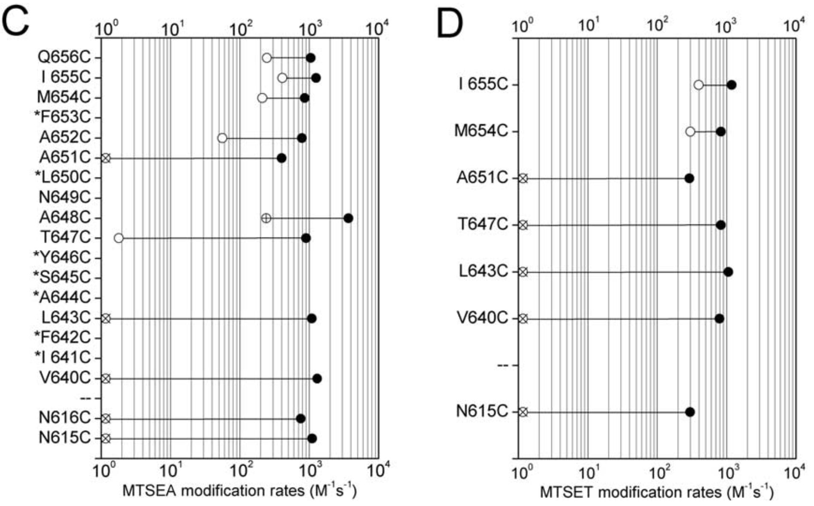
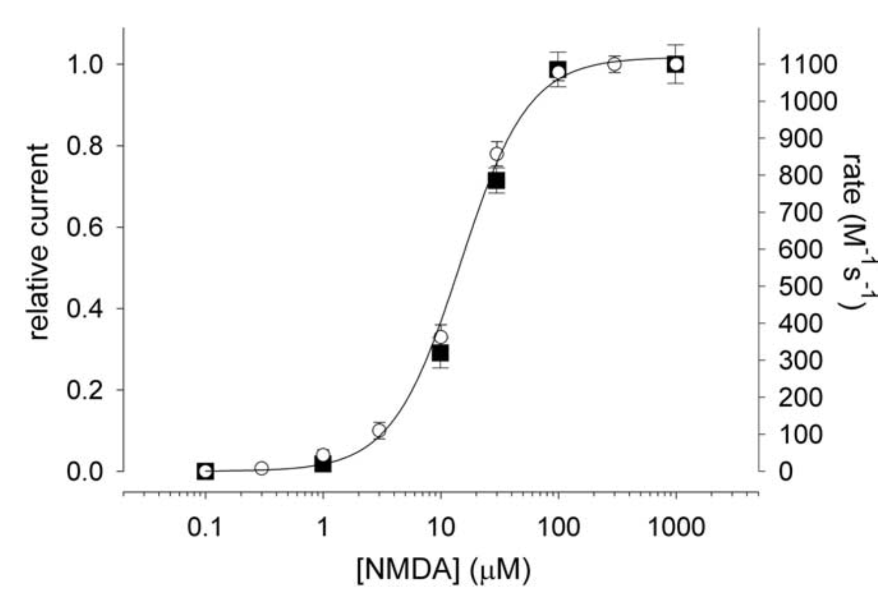
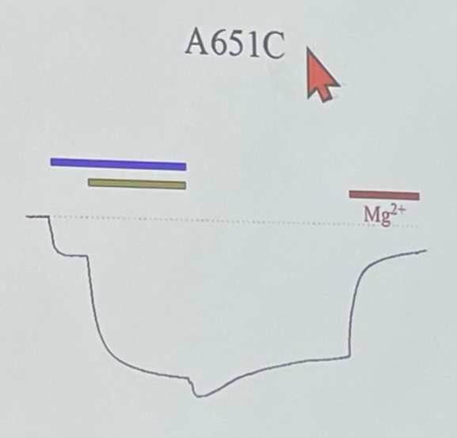
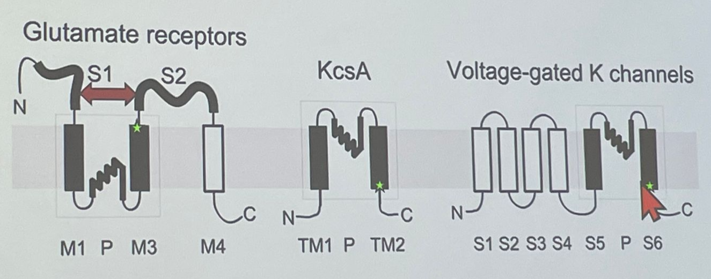

# Gating site（ligand gated） of NMDA receptor

## 內文
1. 已知 NMDA receptor 的 Ligand gate 應該在 FBM 的 binding site 的外面附近，又已經找到 FBM 的 binding site（L643、V644、T647、T648）了
2. 使用 MTS cysteine scaning 在 647 附近做全套 scaning：看看哪邊開始會被 gate 擋住
   
   1. 從上圖可以發現，在 A651 以內的地方，當 Gate 關起來的時候（白色點）MTS 就進不去，無法 modify cystine；而在 A651 以外的地方，Gate 的開關似乎沒有這麼重要
   2. 暫時將這個 gate 稱為 A651 gate
3. 此時其實還不能確定 A651 gate 就是 Ligand gate，因此進行 MTS modification analysis
   
   1. 上圖右邊的 Y 軸是 modification rate，即不同的 NMDA 濃度會影響 A651 gate 打開的機率，讓外面的 MTS 可以進來 modify L643C
   2. 上圖左邊的 Y 軸則是不同的 NMDA 濃度影響到通過 NMDA receptor 的 Na current
   3. 可以發現兩條曲線幾乎上完全重合，因此認為 A651 gate 即為 NMDA receptor 的 ligand gate
4. 其他 confirmation：A651C + MTS 以後 ligand gate 就關不起來，但是 Mg 一樣可以把這個 channel block 起來（即 selectivity site 沒事），如下圖
   
5. 總回顧：其實從 K channel、Na channel 到 NMDA receptor，控制 gating（activation / inactivation）的位置一直都在 S6 的 N 端，沒有改變
   
