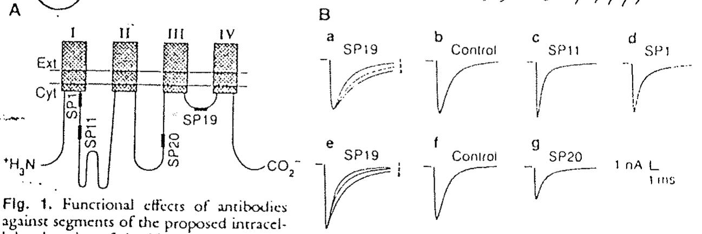
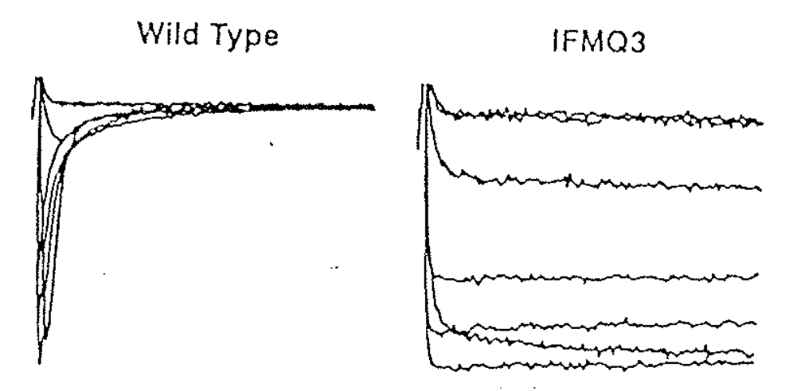
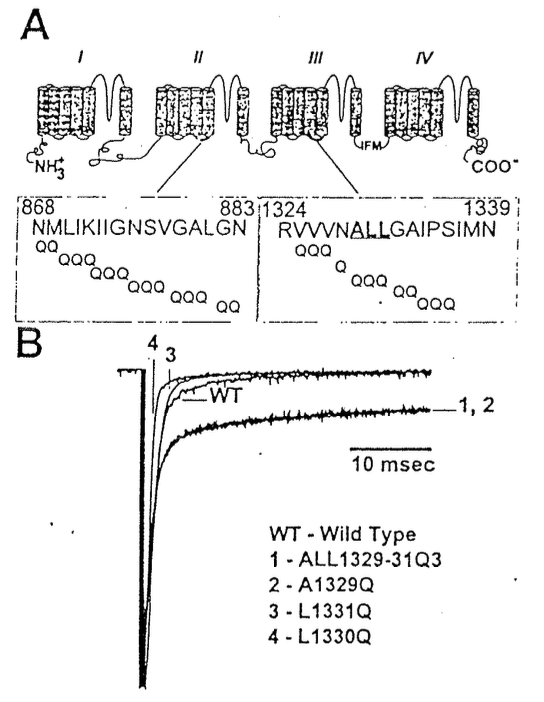
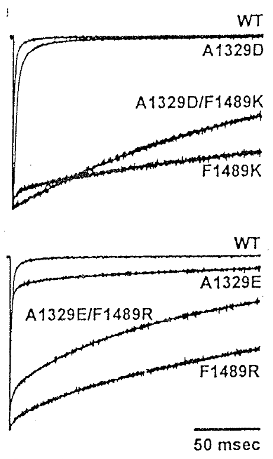

# Gating：Inactivation of Na channel

## 內文
1. Na channel 的 inactivation：把每段 peptide 拿去做對應的 antibody，打回去體內，找哪個 antibody 會影響到 Na channel inactivation
   
   ⇒ 發現是 SP19（在 III-IV linker 上， 即 Domain 3 & Domain 4 之間的那段）

   [[Gating：Inactivation of Na channel/SP19 實際上就是 Domain 4 的 N 端。Domain 13 負責 activation|摘要]]
2. 後來發現在 III-IV linker 之中，有一段由 IFM 三個胺基酸組成的序列（I1488 & F1489 & M1490）特別重要，稱為 **<u>IFM-motif</u>** 。如果把 的 IFM 變成 QQQ，會發現 inactivation 消失了 （事實上這三個氨基酸只要任一個改變都會直接破壞 inactivation）
   
3. 有了 IFM-modif 作為球，那仍然要尋找球的 binding site：
   可以猜測大概也是在 S4-S5 linker，因此對整段 linker 序列進行突變分析
   

   
   1. 由上圖左可以發現 A1329 很重要，大概是 inactivation 的 binding site
   2. 由上圖右可以發現 A1329E + F1489R 兩個都突變的效果還不如只突變 F1489R（F1489 就是 IFM-modif 的 F） ⇒ 這兩個之間肯定有 interaction
      ⇒ 由此確認 **<u>A1329 是 IFM-modif 的 binding site</u>**
   - 為什麼 A1329E + F1489R 兩個都突變的效果還不如只突變 F1489R？
     ⇒ 因為 E (-) & R (+) 會互相吸引
