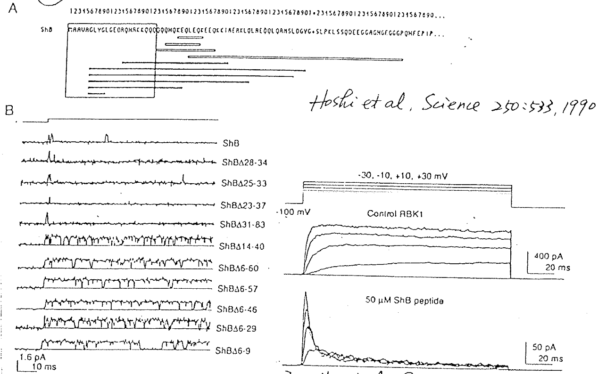
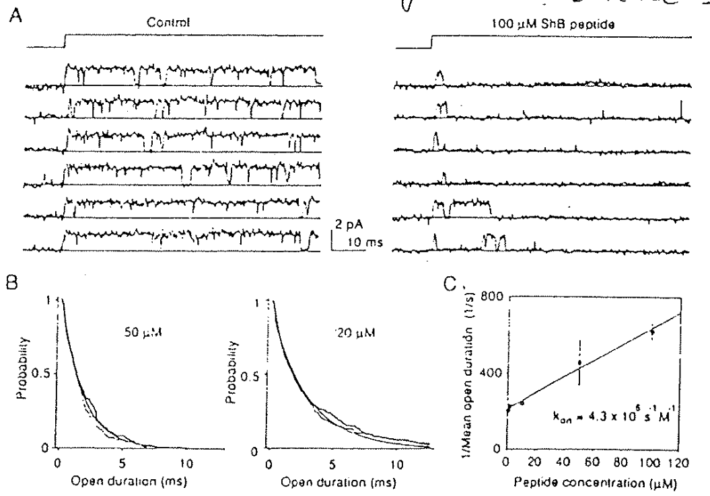
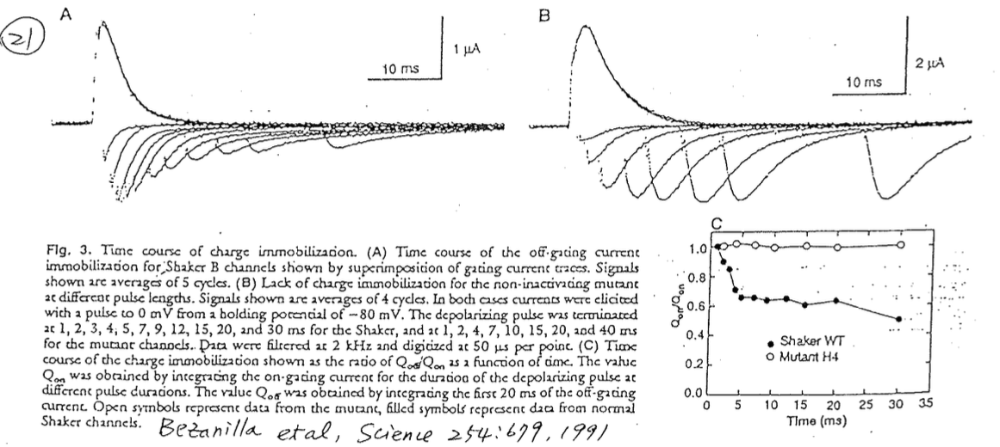
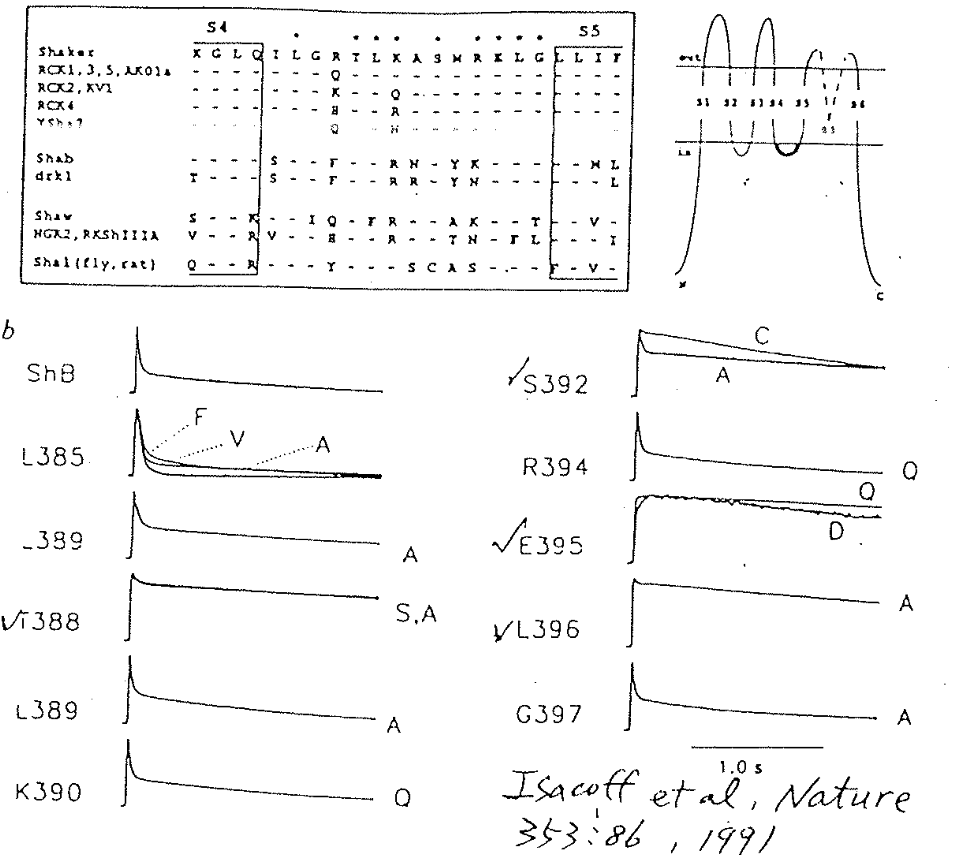

# Gating：Inactivation of Shaker B protein （會 inactivation 的 K channel）

## 內文
1. 把 Shaker B protein （會 inactivation 的 K channel）每個地方都切掉試試看，尋找 Ball
   ⇒ 發現把 peptide 序列第 6-9 切掉，inactivation 就會消失（下圖左下） ⇒ Ball 在 **<u>N 端</u>**
   
   1. 上圖右下：只取 Shaker B 的 Ball peptide，丟給 RBK1（不會 i 掉的 channel），發現居然會讓 RBK channel i 掉
   - 補充：之所以當初 Bezanilla & Amstrong 會提出 ball & chain 就是因為 ball 可以被蛋白酶可以切掉，所以這個被切掉的 site 肯定是暴露在外面的（如果包得好好的怎麼切得掉）
2. 可以透過 mean opening & closing time 計算此 Shaker B ball peptide 與 channel 之間的 $k_{on} = 4.3 \times 10^5 \ \mathrm{M^{-1}s^{-1}}$（當然也能算 $k_{off}$），如下圖
   
3. 複習：在有 ball 的狀態下，Gating current 回來的速度很慢（因為有 inactivation state），但在把 Ball 切掉以後 Gating current 回來的速度就會跟 activate 的時候一致（因為 inactivation state 消失了，見 <u>Gating current</u>）
   
4. 找到球了，球總要有結合的位置吧？
   
   1. 如上圖，對 S4-S5 linker 進行 mutation，發現把這裡突變掉了以後，就算 Ball 還在，仍然是無法 inactivation
      ⇒ 推論 **<u>S4-S5 linker 是球的 binding site</u>**
   2. 在 S4 & S5 中間那段作成球的 Binding site 蠻有道理的，因為 S4 是帶電荷的，S4 運動帶動 S4-S5 linker 一起運動，暴露 binding site 讓球結合上來
   3. 進階討論：Shaker K Channel 需要四顆球才能 i 掉還是一顆球就能 i 掉？⇒ 發現只要一顆球 bind 住就好了
