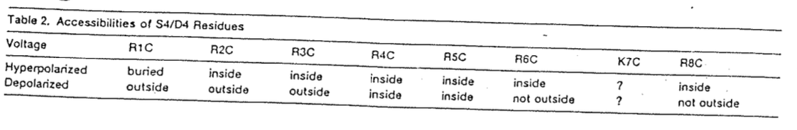
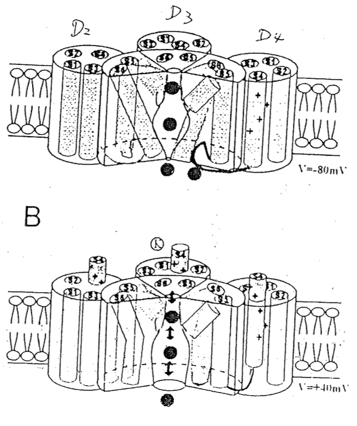
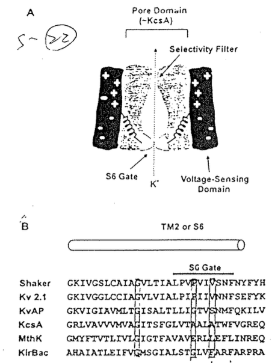
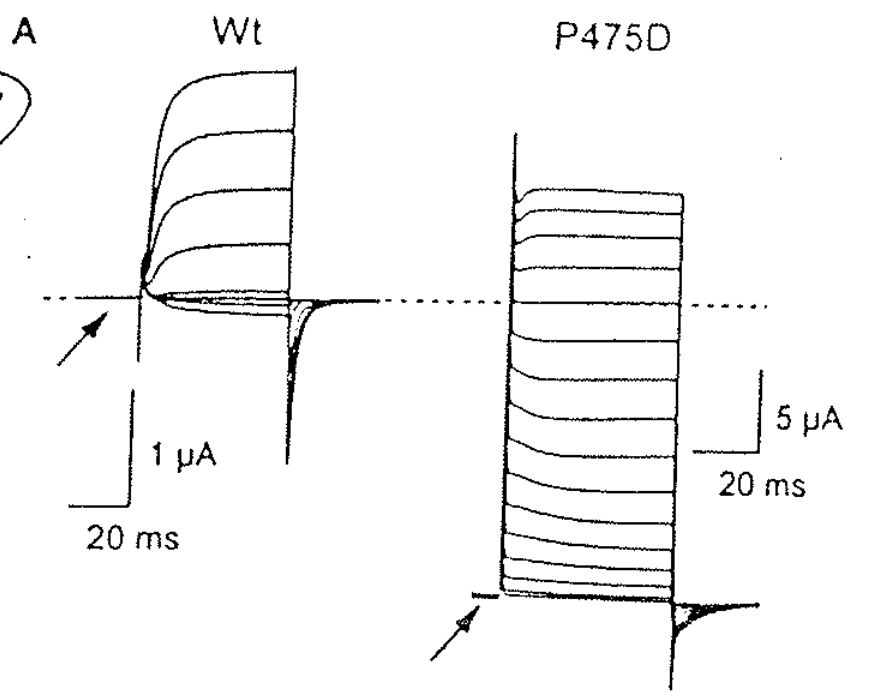
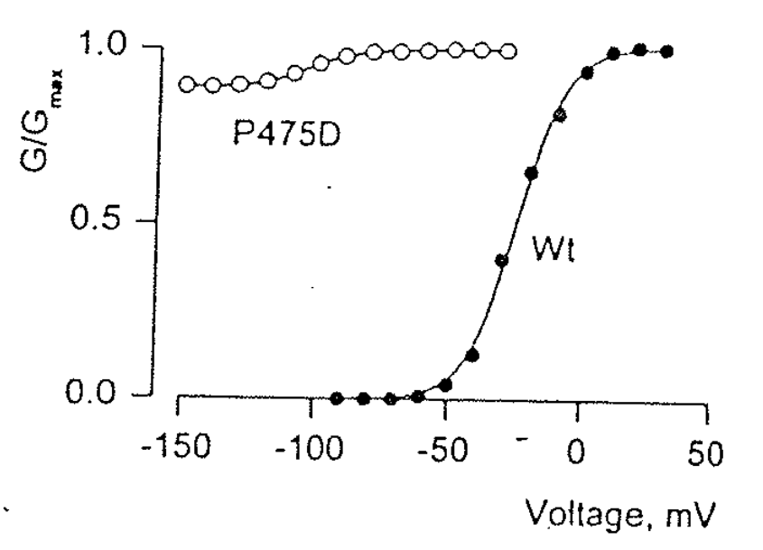

# Gating：Voltage gating（Activation）of Na channel （with MTS reagent）

## 內文
1. 已知 S4 是重要的 voltage sensor，因此可以試試看把每個 R 都換成 C，看看誰可以被 MTSET modify、被哪邊的 MTSET modify
   
   1. buried 代表無法被 modify，被膜或是其他疏水性 peptide 包埋住
   2. 可以看出有些 R 在 hyperpolarized 時會跑到膜內，depolarized 時會跑到膜外
   3. R1~R3 從 inside/buried → outside 代表這些 charge 應該跑很遠，相對更重要
2. 實際結構：如下圖左，S4 的 charge 會動，depolarized 時往膜外突出來，拉動 S4-S5 linker，而 S4-S5 linker 會和 S6 interaction，讓 S6 把 Voltage gate 打開
   

   
3. 上圖右為最原始的細菌的 K channel (KcsA)，此種 Channel 只有 S5 & S6，一樣是四組圍起來形成一個完整的 K channel
   1. 接在 S6 gate 後面的 YFYH 會和 S4-S5 linker 互動，即 S4 感應到 voltage → 拉動 S4-S5 linker → 拉動 S6 上的 YFYH → 拉動 S6 gate
      - S4-S5 linker 被拉動以後也會同時暴露 binding site for IFM，即 activation 一起動就準備 inactivation
   2. 後來發現 S6 gate 中 PV**<u>P</u>**VIV 的第二的 P（即 P475）尤其重要，把 P475 mutation 掉就無法進行 Voltage gating，如下圖
      

      
