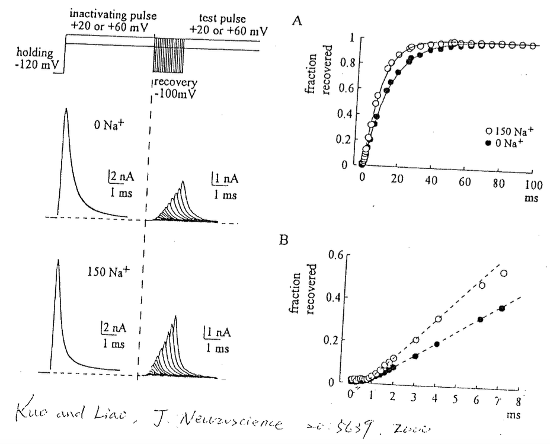

# Gating：用 Na channel 的 Inactivation gate 間接推測 Voltage gate（Activation gate）的位置

## 內文
1. 下圖為郭鍾金自己的實驗內容，想知道不同胞外 Na 離子（控制為 0 或 150 mM）對於 Na channel recovery 的影響。透過短暫的 repolarize，可以看 Na channel 回到 $C_U$ 的比例
   

   [[Gating：用 Na channel 的 Inactivation gate 間接推測/郭鍾金畫的實驗裝置示意圖，因為胞外 Na 離子為 0 時不會有 inward current|摘要]]

   [[Gating：用 Na channel 的 Inactivation gate 間接推測/4 phase model 複習（左上角是 CU，右上角是 OU。U 代表 Unblocked）|摘要]]
2. 如上圖，可以發現
   1. Na channel 在 recovery 之前會出現 Recovery delay，推測是 $O_B → C_B$ 這段過程
      - 因為都還在 blocked (inactivated) stage，因此在這段時間內馬上提高膜電位，channel 也無法打開
   2. Recovery delay 的 duration 與 Na 離子濃度無關
   3. Recovery delay 過後的 recovery rate，即 $C_B → C_U$ 的速度與胞外的 Na 濃度有關
      - 複習：$C_B → C_U$ 是 ball & chain 那顆球脫落的速度，見 <u>4 phase model</u>
3. 這個結果代表什麼？
   1. 那顆球很可能是被 Na 撞擊而脫落的，因此球脫落的速度才會與胞外的 Na 濃度有關
   2. 即便是在 $C_B 、 C_U$ 的狀態下（意即此 channel 的 voltage gate 已經被關起來了），但recovery rate 依然會受到到胞外的$\ce{[Na+]}$影響，即球仍然會被胞外的 Na 撞擊而脫落
   3. 據此推測 voltage gate 必須在球的更內側，不能影響到球與胞外 Na 離子的接觸。但因為球應該已經在 channel 最內側了，因此推測 ball (inactivation gate, h gate) 和 voltage gate (activation gate, m gate) 全都擠在 Na channel 的內側
   4. 郭：大自然的演化讓 selection 在 channel 外面，而 gating 在 channel 裡面，讓兩者儘量互不影響
