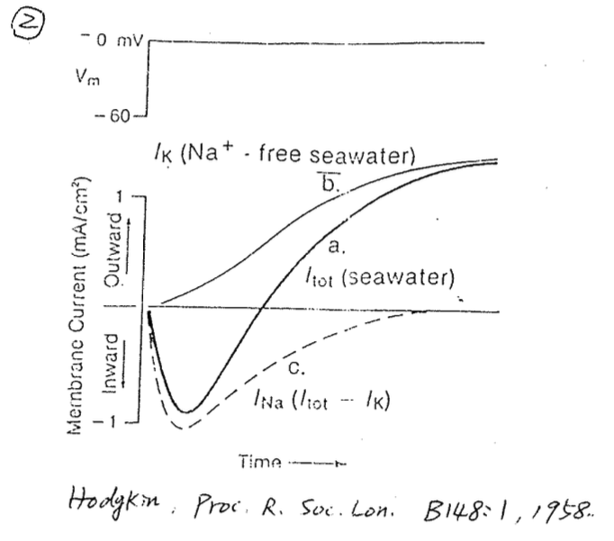
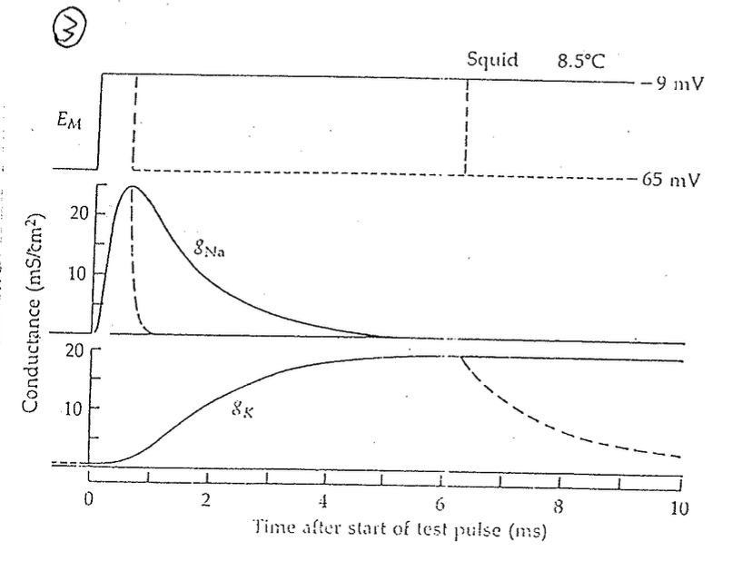

# Hodgkin–Huxley：發現 Na channel 會 Inactivation & K channel 由四扇門構成

## 內文

### Hodgkin–Huxley 的發現

Hodgkin–Huxley 利用 voltage clamp + squid axon 進行實驗，發現細胞膜上有 K channel 和 Na channel：

如上圖左，在 voltage 從 -60 mV 變成 0 mV 時， Voltage gated channel 會打開，形成電流

1. 如果細胞外是一般的海水，則會先有 inward current 再出現 outward current
2. 如果細胞外是沒有 $\ce{Na+}$離子的海水，則只會有 ourward current
3. 兩者相減即為 $\ce{Na+}$離子貢獻的 current
4. 如上圖右，亦可看到 $g_{Na}$ 和 $g_K$ 隨時間的變化

⇒ **<u>發現一</u>**： $\ce{Na+}$ <u>current 會變小</u>（同理，在右圖可以看到 $g_{Na}$會自己變小但 $g_K$不會）

⇒ **<u>發現二</u>**： $\ce{K+}$ <u>channel 慢半拍才打開</u>（ $\ce{K+}$ current 會慢半拍出現）

- 注意：一般的 $\ce{Close state <=> Open state}$ scheme 無法解釋這兩個發現

### 如何解釋這些發現？

[[Hodgkin–Huxley：發現 Na channel 會 Inactivation & K/發現一： ceNa+ current 會變小 ⇒ 發現 Na channel 有|摘要]]

[[Hodgkin–Huxley：發現 Na channel 會 Inactivation & K/發現二： ceK+ channel 慢半拍才打開 ⇒ 發現 K channel 由四扇獨立的門構成|摘要]]

[[Hodgkin–Huxley：發現 Na channel 會 Inactivation & K/發現三：conductance 的 peak 會 saturate，但達成 conductance|摘要]]
