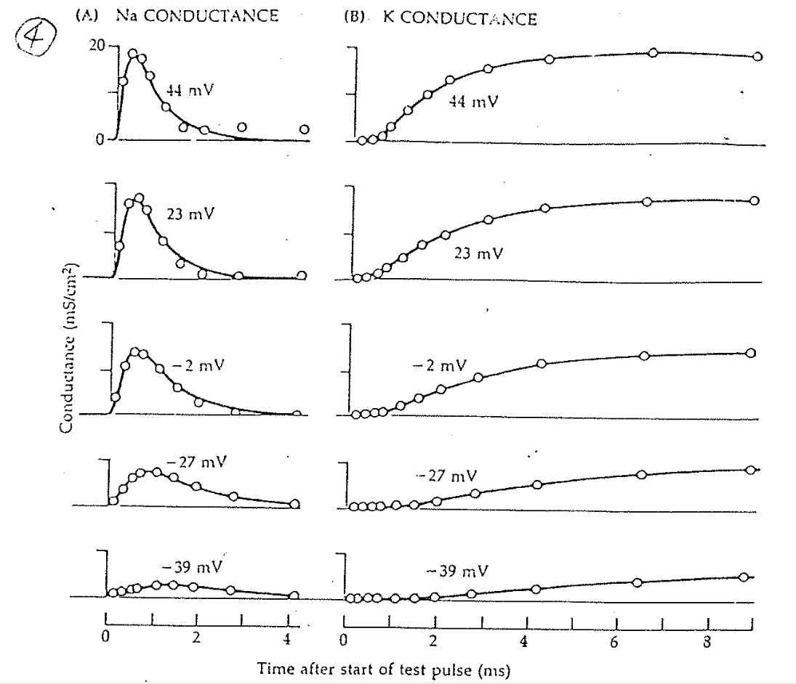

# 發現三：conductance 的 peak 會 saturate，但達成 conductance peak 的時間不會 saturate

## 內文

1. 如上圖，conductance 的 peak 會 saturate，即上圖左側 $g_{Na}$ 與右側 $g_K$ 的高度在 > 23mV 之後就固定不變了
   原因：因為離子通道的 P(Open) 會 saturate
   1. 在某電位時 $\frac{v_α}{v_β} = 99$ ⇒ $\mathrm{P(Open)} = \frac{[O]}{[O]+[C] } = 0.99$
   2. 在某電位時 $\frac{v_α}{v_β} = 9999$ ⇒ $\mathrm{P(Open)} = \frac{[O]}{[O]+[C] } = 0.9999$
   ⇒ 結論是到某個程度以後 P(Open) 都差不多，形成 saturation
2. 然而上圖亦可發現，達成 conductance peak 的時間不會 saturate，即達成 peak 的時間仍然會變短（在 44 mV 時第一個點上升的高度比在 23 mV 時第一個點上升的高度還高）
   1. 如果是正常的 $\ce{C<=>[v_\alpha][v_\beta] O}$，則 $v_\alpha$ 越大，達成 peak 的時間越快，不可能 saturate
   2. 架空設想：如果上升速度也會 saturate ， 則代表從 $\ce{C ->O}$ 不是單純的兩個 state 轉換，而可能是 $\ce{C_0 <=>[v_1][v_2] C_1 <=>[v_3][v_4] O}$
      1. 原本的速率決定步驟（假設是 $v_1$ ）是 voltage gated
      2. 現在 $v_1$ 很快了，速率決定步驟變成是 $v_3$，而 $v_3$ 是 non-voltage gated
3. 仔細看數據的話會發現 Na channel 其實也會慢半拍打開：在 -2 mV 時第一個點上升的高度比第二個點上升的高度還小（代表 Na channel 確實也有好幾扇門）
