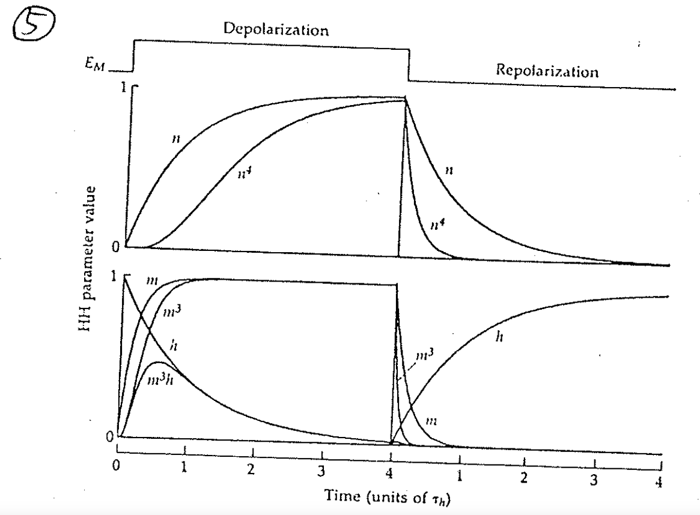

# 發現二： $\ce{K+}$ channel 慢半拍才打開 ⇒ 發現 K channel 由四扇獨立的門構成

## 內文
1. 如果 $\ce{C ->[v_\alpha]O}$ 是一級反應，則 [C] 與時間 t 的關係應該是
   $\frac{d[ C ]}{dt} = -v_\alpha [C]$ ⇒ $\ln[C] = -v_\alpha t + A$，其中 A 是積分常數
   代入$\begin{cases}[C_0] = [C_0]\\
   [O_0]=0\end{cases}$ ⇒ $\begin{cases}[C](t) = [C_0]e^{-v_\alpha t} = [C_0] e^{-t/\tau}\\
   [O](t) = [C_0](1- e^{-v_\alpha t}) = [C_0](1- e^{-t/\tau})\end{cases}$
   ，即 [C] 應該要是 exponential decay，不應該慢半拍
   - time constant $\tau = \frac{1}{v_\alpha}$ ，即經過 $\frac{1}{v_\alpha}$ 的時間之後 $[C]$ 會變成 $e^{-1} [C] = 0.37 [C]$

   [[發現二： ceK+ channel 慢半拍才打開 ⇒ 發現 K channel 由四扇獨立的門構成/如果寫成 ceC =valphavbetaO 仍該是 exponential decay|摘要]]
2. 可能有兩道門：兩扇門都符合 $[O](t) = [C_0](1- e^{-v_\alpha t})$ ⇒ $[O]_{real} = [O]^2$ ⇒ 即會變出 sigmoid function
   1. 甚至有可能不是兩道門，而是三道、四道…
      
   2. 如上圖，實驗證實 $g_K$ 曲線與四次方曲線 $n^4$ 擬合 ⇒ 猜測 K channel 有四個彼此獨立的次單元
   3. $g_{Na}$ 的曲線與 $m^3 h$ 擬合 ⇒ 猜測 Na channel 有三個次單元 m 都要打開，但關起來只需要一個次單元 h 關起來就好，而這四個次單元彼此獨立（被 Bezanilla & Amstrong 證明是錯誤的）
   - **<u>看到 delay 就要想到多步驟反應</u>**
3. 因為 K channel 有四個次單元，所以也可以寫成 $\ce{ C_0 <=> C_1 <=> C_2 <=> C_3 <=> O}$ 的形式
   不過並不是 $\ce{C_0 <=>[α] C_1 <=>[α] C_2 <=>[α] C_3 <=>[α] O}$ (錯誤)
   而是 $\ce{C_0 <=>[4α] C_1 <=>[3α] C_2 <=>[2α] C_3 <=>[α] O}$ (正確)
   因為在 $C_0$ 時四扇門中任一扇門打開都可以變成 $C_1$，而在 $C_1$ 時三扇門中任一扇門打開都可以變成 $C_2$
