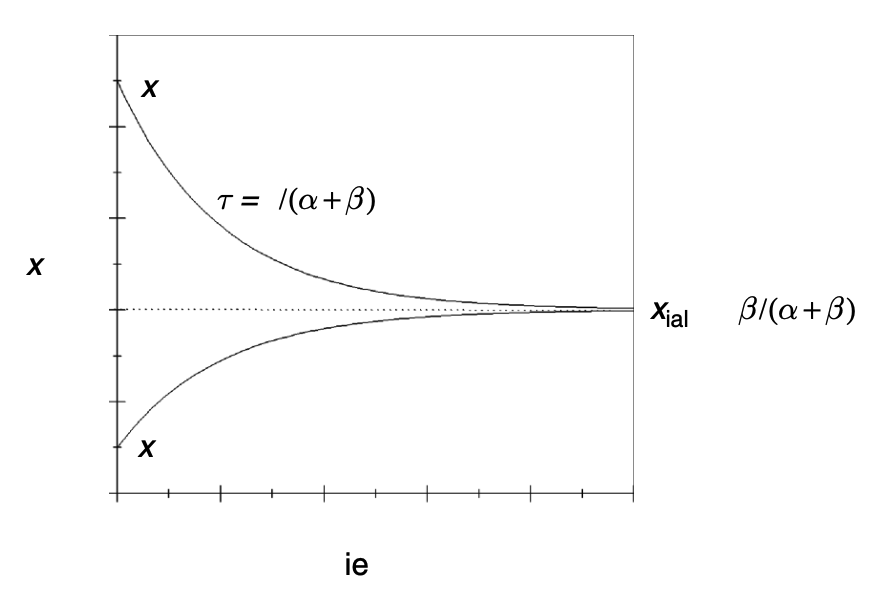

# 如果寫成 $\ce{C <=>[v_\alpha][v_\beta]O}$ 仍該是 exponential decay

## 內文
$\begin{cases}\frac{d[C]}{dt} =  -v_\alpha[C] + v_\beta[O]\\
\frac{d[O]}{dt} =  v_\alpha[C] - v_\beta[O] \end{cases}$

⇒ $\begin{cases}[C](t) = [C_0](\frac{  v_\alpha}{v_\alpha + v_\beta}e^{-(v_\alpha+v_\beta) t}   +\frac{v_\beta}{v_\alpha + v_\beta} )\\
[O](t) = [C_0](-\frac{  v_\alpha}{v_\alpha + v_\beta}e^{-(v_\alpha+v_\beta) t}   +\frac{v_\alpha}{v_\alpha + v_\beta} )  \end{cases}$

圖形如下：

