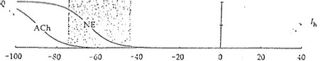
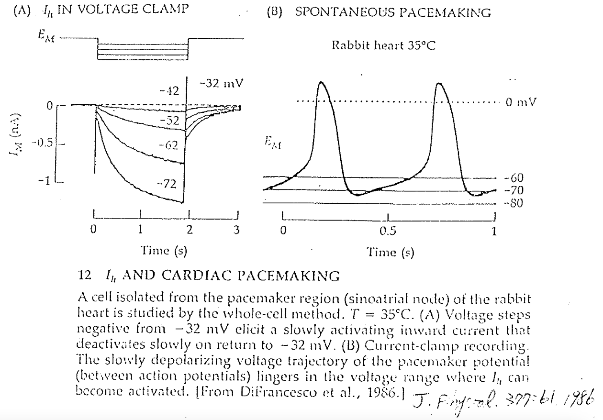

# $I_h$ channel

## 內文
1. 本質是 non-selective cationic channel ⇒ reversal potential = 0 mV
2. 一樣是 voltage gated，不過是在 hyperpolarization 階段打開（h for hyperpolarization）
   ⇒ 分子結構上很容易想像就是把一般 voltage gated channel 內外反過來裝
3. 對於 pacemaker cell 而言，$I_h$ channel 是維持 cycle 的關鍵
4. $I_h$ channel phosphorylation 之後 conductance 會更大 ⇒ pace 更快
   
   - adrenergic / acetylcholine 的效果就是把 $I_h$ channel phosphorylation / dephosphorylation ，控制 **<u>心臟的 chronotropic (速率)</u>**
   - 對比：**<u>心臟的 ionotropic (收縮力)</u>** 由 Ca channel 控制
5. 左圖為 Voltage clamp，右圖為 Current clamp

