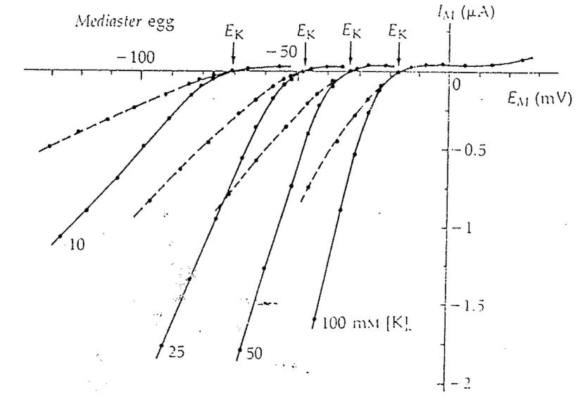
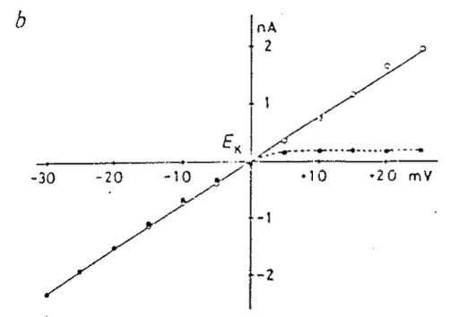
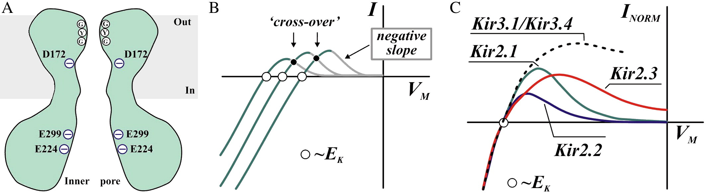

# Inward Rectifier K channel

## 內文

1. 從上面 I-V 圖可以看出，通過此 channel 往內的電流超順，遵守歐姆定律；但是往外的電流超爛超極小，所以稱為 Inward rectifier
   圖中不同曲線是改變胞外 $\ce{[K+]}$ ，發現不管哪個濃度都是往內超順往外超爛
2. 之所以有這個特性，是因為有一個單向閥 (郭鍾金說自己實驗室做出來有一個 polyamine 跟 $\ce{Mg^2+}$ 當 blocker，類似 ball and chain)
   
3. 上圖虛線 Inward rectifier ，實線是把 blocker 拿走，可以發現把 blocker 拿走以後就恢復成符合歐姆定律的通道
4. 雖然名字是 Inward rectifier，但事實上在生理上只有 outward 那段才有可能發生（畢竟 $E_K < E_{mem}$ ）
   
5. 如上圖，實際上它的 outward current 那段放大起來有一個 peak，接著膜電位越大電流反而越小
6. 存在目的：希望在平時（沒有 activation 時）可以維持膜電位 < 0 ，但是在 action potential 時可以乖乖關起來 （ex: 在 Heart Phase 2 plateau 時如果一直開著會很麻煩，會需要更多正離子流入來維持 plateau）
   - 所以正常細胞會是少少的 leaky + 比較多 Inward rectifier 這樣比較有效率
   - ex: 卵子也有 fertilization potential ，在第一個精子進入時迅速 depolarization 讓其他精子進不來，也需要很多 Inward Rectifier K channel
7. 蛋白質結構：Segment 5 & 6 負責辨認 $\ce{K+}$，Segment 1~4 負責 gating (S4 上面很多 charge)
