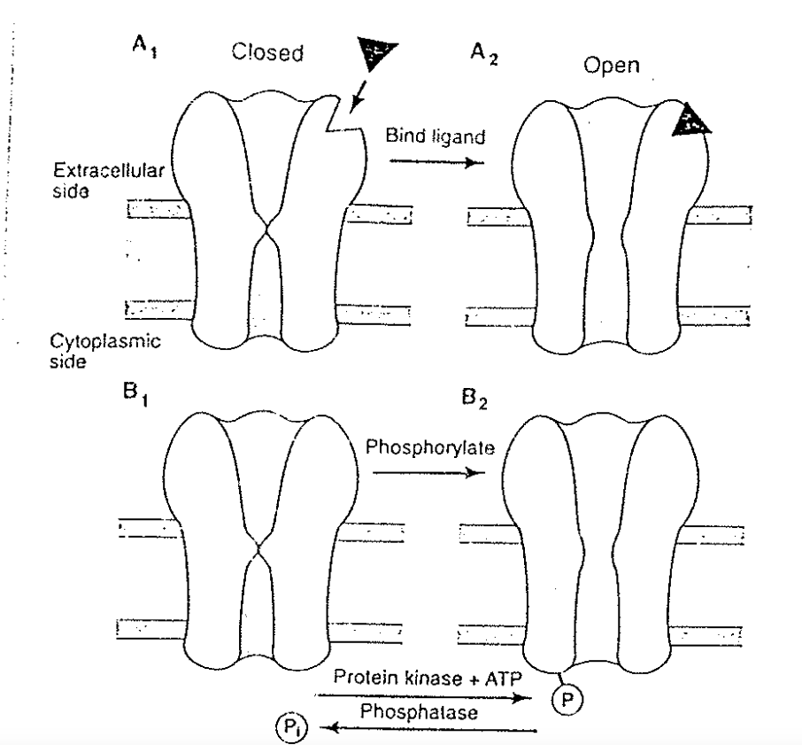
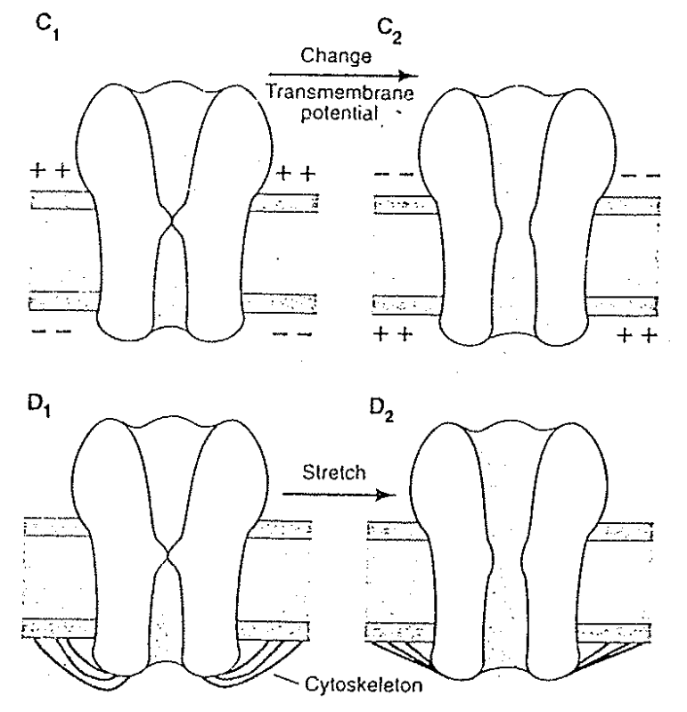

# Ion channel 為何可以打開

## 內文
1. 對於所有粒子而言，都會喜歡處在最低能量的狀態，通道蛋白也不例外
2. 為什麼通道蛋白可以開開關關？因為**<u>外在環境改變</u>**，使本來此蛋白質最低能量的狀態是關，現在變成最低能量的狀態是開
   ⇒ 因此外在環境改變是一切的前提
3. 外在環境如何改變？
   1. ligand gate channel：與 ligand 之間的 binding energy 會影響打開通道的困難度
   2. modulation ex: phospholylation
   3. Voltage gated channel：會被電場影響，代表此蛋白質一定帶電
   4. cytoskeleton：物理方法改變蛋白質結構 ex: 內耳細胞的 hair cell
   

   
