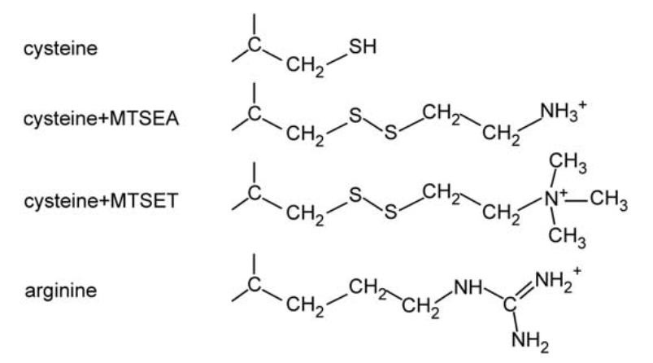
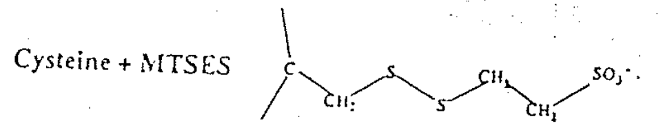

# MTS reagent

## 內文

1. 如上圖，MTS reagent (ex: MTSEA、MTSET) 會與 cysteine 結合，讓 cysteine 表現的像 arginine 一樣
   1. 如果用 MTSES 則會帶負電
      
2. 用途一：可以把胺基酸 mutation 成 cysteine 之後再給 MTS reagent，觀察是否有變化
3. 用途二：因為 MTS reagent 與 cysteine 的結合反應需要在水相中進行（即在包在膜中或是包在 peptide 中就無法反應），因此可以觀察此 cysteine 是否暴露、暴露在何處
   - 要注意其餘裸露的 Cystine 也需要一起換掉，不然會一起被 modifiy
