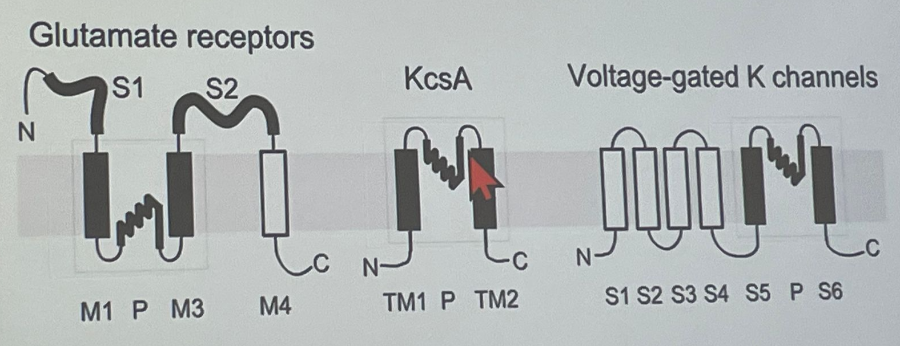

# NMDA receptor

## 內文
1. NMDA receptor 介紹：
   1. Glutamate gated ion channel (iGluRs) 有兩種：NMDA & AMPA
   2. NMDA & AMPA 都是小分子，可以作為 ligand 打開 channel
   3. 因為 NMDA / AMPA 與 Glutamate 畢竟不一樣，因此重要的 finding 都要重複實驗，一次用 NMDA / AMPA，再來還要用 Glutamate 檢查
   4. NMDA receptor 有兩個 binding site，一個是 for Glutamate，一個是 for Glycine，兩個都有才會打開
2. 從 K channel 到 Glutamate gated ion channel：
   
   1. 中間 KcsA 是細菌上面的 K channel，最原始（只有兩個 segment + 中間 P-loop）
   2. 後來演化出在外面的 S1~S4，成為 Voltage-gated K channel，如上圖右
   3. 上圖左則是 Glutamate gated ion channel，可以看出基本上就是倒著裝的 K channel + Amino acid sensor（上圖左 S1 & S2）
      - 這裡的 Amino acid sensor 大概也是從細菌身上偷來的，原本是拿來當 Amino acid transporter
      - 把 K channel 倒著裝是為了讓 gating site 在外面，才感應的到 Glutamate
