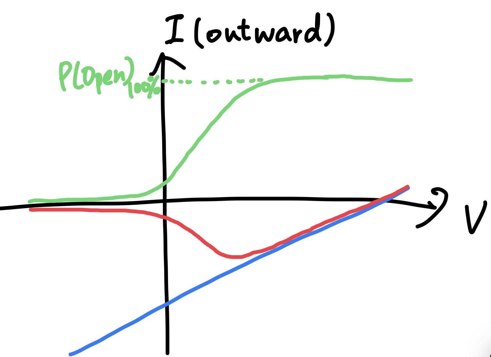

# P(Open) 與 Conductance 的關係

## 內文

1. 如上圖，綠色曲線為 P(Open)，服從 Boltzmann distribution
2. 藍色線為打開的 channel 的 I-V curve，其中與 x 軸焦點為此離子的 reversal potential，斜率為此 channel 的 conductance
3. 紅色線為藍綠兩線相乘，代表實際在不同膜電位下的 I-V curve
