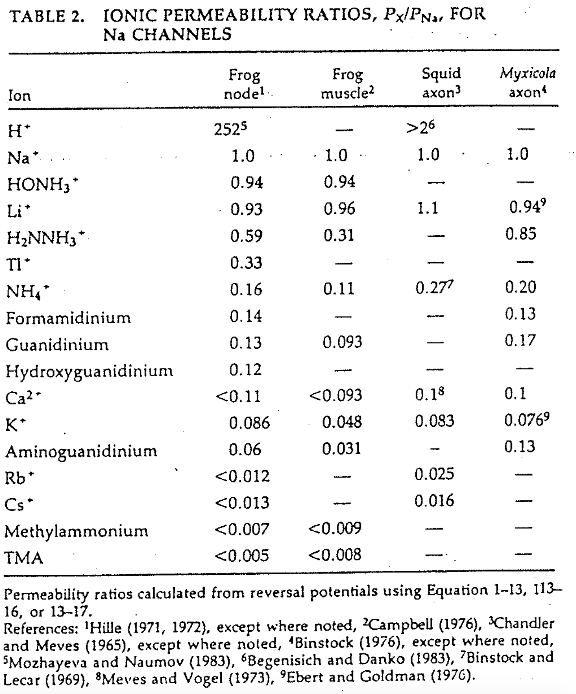
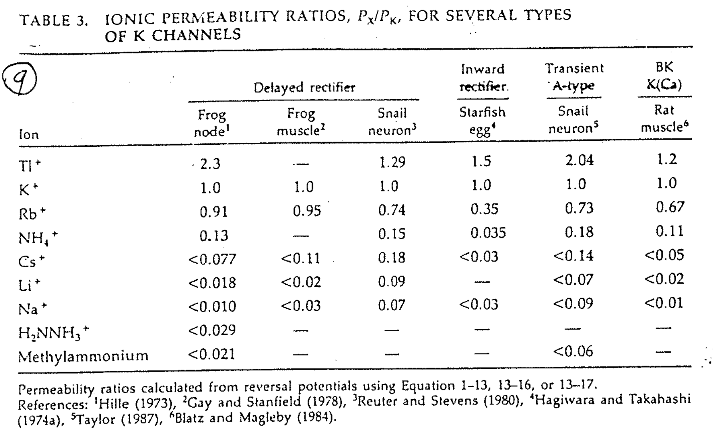
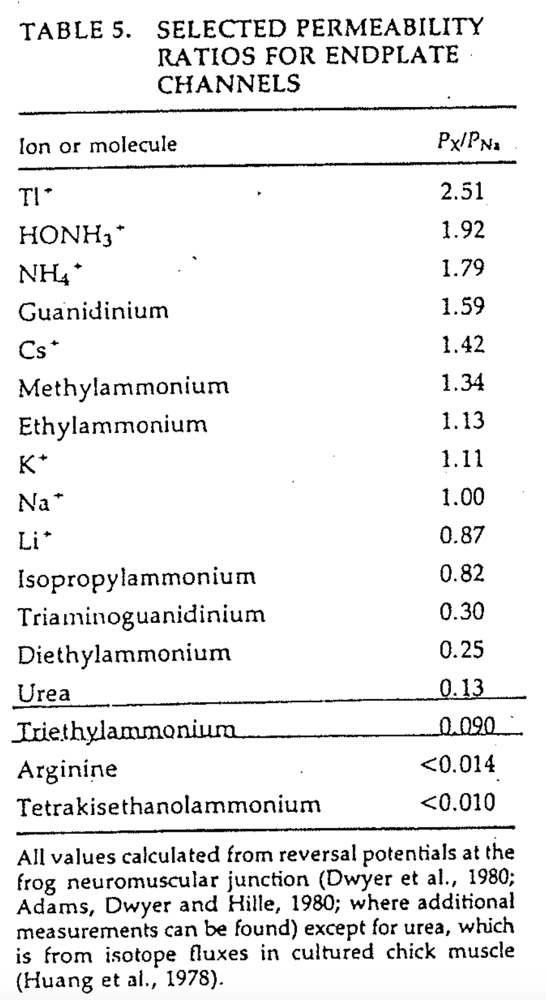

# Permeability

## 內文
Permeability (P) 是 GHK equation 中定義的一個物理量

1. 然而 GHK equation 的兩個前提假設
   1. 電場固定，即在膜中間每前進一小步 dx，膜電位的變化 dV 都是固定的
   2. 離子彼此獨立互不影響，即通道完全不塞車
   根本不可能成立
   1. 電場固定 ⇒ 不可能，因為膜蛋白跟膜通道根本不是均勻的物質
   2. 離子彼此獨立、通道完全不塞車 ⇒ 不可能，不塞車就不可能有 selective
   雖然不可能達成，但是我們沒有更好的式子了
2. 雖然 P 的定義很奇怪很複雜，但是可以測出來，如下圖為 Na channel 的數據
   
   1. GHK equation 中的 R、T、z、F 都是已知，有 $E_{rev}$ 就可以算出 $\frac{P_K}{P_{Na}}$
   2. 因為 P 是比較出來的，所以 Na channel 常用 $P_{Na} = 1$
   3. Na channel 的 $P_K$ 並不是 0，只是很小（0.08 $P_{Na}$ ）
   4. 因為是測量值，且 GHK 的假設根本就是錯了，因此 Permeability ratio $\frac{P_K}{P_{Na}}$ 不會固定，即在不同的濃度底下會有不同的 $\frac{P_K}{P_{Na}}$
   5. 所以 P 不可以用算的，只能用測的
3. 下圖為 K channel 的數據，為什麼 K channel 的 $P_{Na}$ 比 Na channel 的 $P_K$ 小這麼多？
   
   ⇒ 如果 K channel 的 $P_{Na}$ 太高，repolarize 以後到達的電位就不會到夠負的位置，這樣 I 掉的 channel 就回不來
   反過來說，如果 Na channel 的 $P_K$ 有點高，其實也就是降低一點 action potential 的 peak，影響不大
4. 下圖為 End plate 的 Acetylcholine receptor channel 的數據，可以發現 $P_{Na}$ & $P_K$ 差不多 ⇒ 所以是 non-selective ion channel
   
