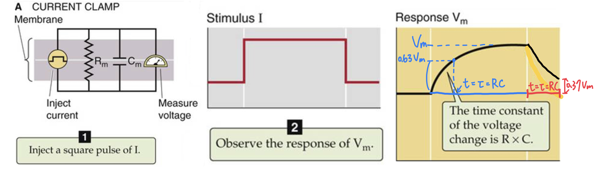

# RC circuit analysis：Current Clamp

## 內文

1. 對於膜上模擬的 RC 電路而言，如果此時外加電流供應器供應此電路，則可以發現此電流 $I$ 會在電阻、電容的兩端（即膜的兩側）製造電位差 $V$
2. 此電流 $I$ 可以再切分成流向電阻的電流 $I_R$ 以及流向電容的電流 $I_C$
   1. $I_R = \frac{V_m}{R_m}$
   2. $I_C = C_m\frac{dV_m}{dt}$
3. 綜和各式得知 $I = \frac{V_m}{R_m} + C_m\frac{dV_m}{dt}$ ，可以看出是 $V_m$ 的一階非齊次微分方程 ⇒ 通解 + 特解
   1. 特解：$I = \frac{V}{R_m}$ ⇒ $V_m = IR_m$
   2. 通解：$\frac{V_m}{R_m} + C_m\frac{dV_m}{dt} = 0$
      ⇒ $\int \frac{1}{V_m}dV_m  = \frac{-1}{R_mC_m}\int dt$
      ⇒ $\ln(V_m) = \frac{-t}{R_mC_m} + a$，a 為積分常數
      ⇒ $V_m = Ae^{\frac{-t}{R_mC_m}} = Ae^{\frac{-t}{\tau}}$，可以看出 $\tau = R_mC_m$，$A =e^{a}$ 為積分常數
   3. 正解為通解 + 特解，即 $V_m = Ae^{\frac{-t}{\tau}} + IR_m$ ，帶入初始值 $V_0 = 0$ 得 $A = -IR_m$
      ⇒ $V_m = IR_m (1-e^{\frac{-t}{\tau}} )$
4. 其中 **<u>time constant</u>** $\tau$ 代表的是變化的速度，即過了 $\tau = R_mC_m$ 秒之後， $V_m$ 就會增加 $1-e^{-1} = 0.63$ 倍的 $V_m$，再過 $\tau$ 秒之後又會增加剩下的 $0.63$
5. 同理，當外加電流關掉時，每過 $\tau$ 秒就 $V_m$ 就會衰減成原本的 $e^{-1} = 0.37$ 倍
