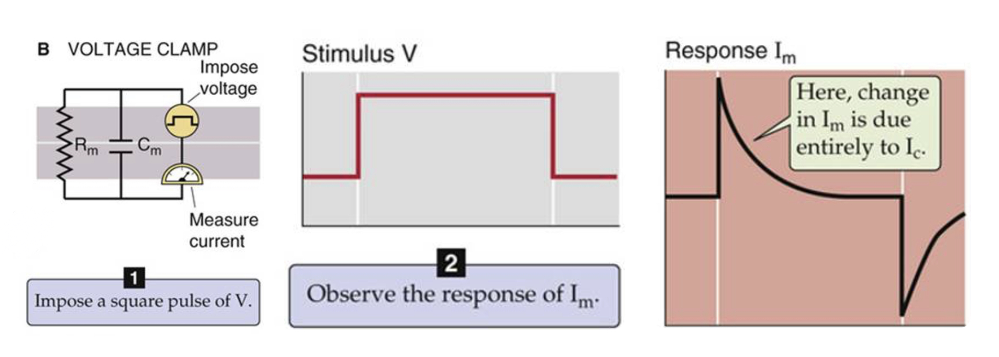

# RC circuit analysis：Voltage Clamp

## 內文

1. 對於膜上模擬的 RC 電路而言，如果此時外加電壓供應器供應此電路，則可以發現此電壓 $V$ 會在電阻、電容各自形成電流
2. 此電流 $I_m$ 由流向電阻的電流 $I_R$ 以及流向電容的電流 $I_C$ 組成
   1. $I_R = \frac{V}{R_m}$ ⇒ 為定值
   2. $I_C = C_m\frac{dV}{dt}$ ⇒ 在變化時會超快速的充放電（畢竟電壓不可能是完美的方波）
   3. 因為兩者為並聯， $I_R$ 與 $I_C$ 不會互相影響
3. 實際上因為細胞一直有活動，因此 Voltage clamp 是一項複雜的技術，需要 processor 實時調控，發現電壓變小了就趕緊給多一點電流，發現電壓變大了就趕緊給少一點電流，從而將電壓固定在某個想要的區間
   - clamping speed: 整套系統從偵測 ⇒ feedback 的速度。因為要維持膜電位對付的是 Voltage gated channel，因此必須很快(< 10ms)，反應太慢的話根本就維持不了電位
