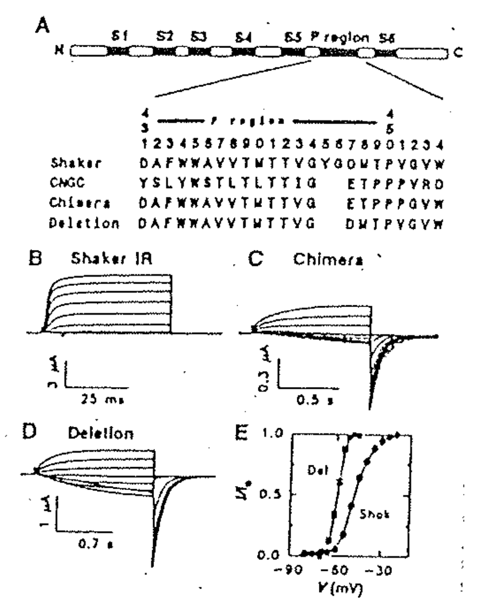

# Selection / Permeability site：P-loop on K channel（Shaker gene）

## 內文
1. 實驗裝置是把胞內裝純 $\ce{K+}$，胞外裝純 $\ce{Na+}$
   ⇒ 因為胞外沒有 $\ce{K+}$，因此 Shaker IR 只看得到出去的電流，看不到進來的
2. Shaker IR：Shaker 是會 inactivation 的 K channel，而 Shaker IR 是把 Ball 拿走讓它不會 inactivation
3. 下圖 Shaker IR vs Deletion：把 Shaker IR P-loop 上的 YG 進行人為 Deletion，發現產生 Tail current（即可以通過 Na 了）
4. 下圖 CNGC：一種神秘的 nonselective cation channels，一樣沒有 YG
5. 下圖 Chimera：前半段用 Shaker 後半段用 CNGC，總之發現只要把 YG 拿掉就能通過 Na（其他放什麼不重要）
6. 經由氨基酸序列的比較，推測 YG 就是 K selectivity 的關鍵
7. 右下圖 E 發現 Divalent (二價離子 ex: Ca、Mg) 可以把這個 YG deletion 的 channel block 住
8. 亦可推測把 YG 丟掉就是當初 K channel 演化成其他 channel 的關鍵

