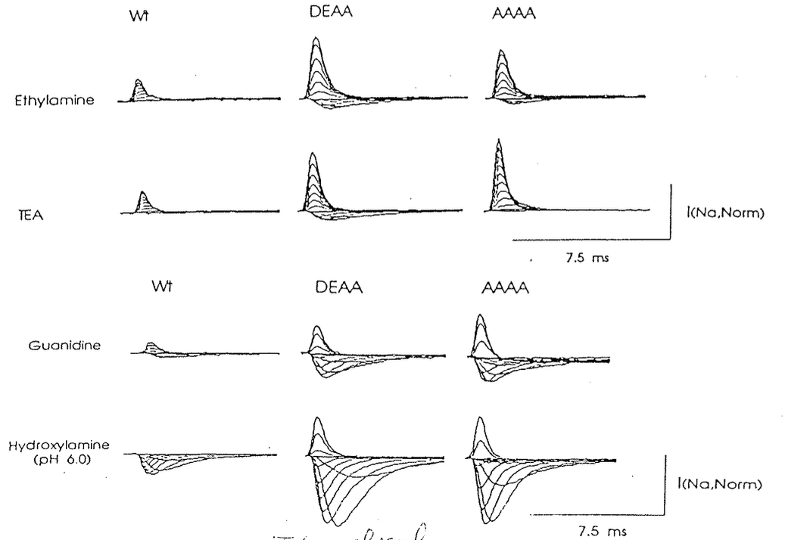
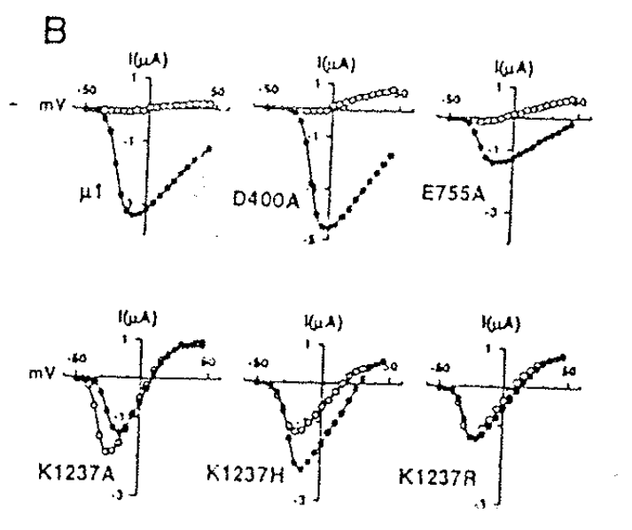
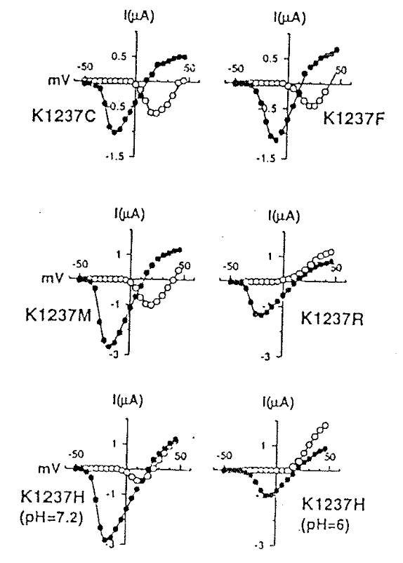
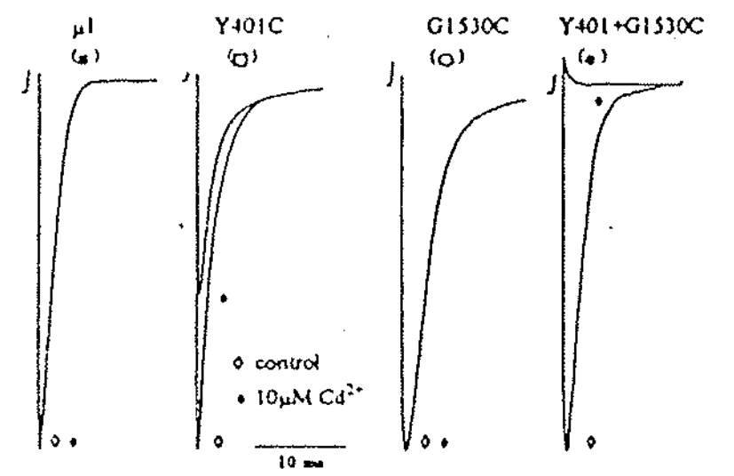

# Selection / Permeability site：P-loop on Na channel & Ca channel -2

## 內文
1. 把 Na channel 的 DEKA 換成 DEAA 之後發現可以多通過很多很奇怪的東西 ⇒ 這個 K 很重要（換成 A 是因為化學性質差不多，不能換成 G 是因為沒有側鏈，會有很多性質不相似）
   
2. 把 DEKA 換成 DEAA （K1237A）之後檢查看看其他 ion 的 permeability
   

   這裡黑點是 Na current，白點是 K current

   

   這裡黑點是 Na current，白點是 Ca current
   1. 如上左圖，可以發現 DEKA 只有 K 特別重要，換其他的鉀離子都過不去
   2. 如上左圖，K1237R 一樣無法阻止鉀離子通過 ，代表 K1237 不是靠電荷進行 selection（K、R 都帶正電）
   3. 那 K 跟 R 差在哪裡？差在形成氫鍵的能力。氫鍵是定位鍵（需要方向角度都對），而離子鍵不是
   4. 氫鍵代表 K 是和其他胺基酸互動，而不是單純和離子結合
   5. Ca channel 演化成 Na channel ，是把那堆 EEEE（長得像 EDTA 一樣，在水中漂浮、bind 住 Ca）變成 DEKA 後，轉向往蛋白內形成氫鍵
3. DEKA 四個胺基酸之間彼此真的很靠近嗎？
   
   1. 如上圖，發現 Y401C + G1530C 的兩個硫(C 有硫)，會和 $\ce{Cd^2+}$ 形成配位鍵，以至於通道被堵住 ⇒ 證實 Y401 & G1530 在空間上很接近
   2. 又因為這兩個剛好各自在 D、K 前一格 ⇒ 證實 DEKA 在空間上真的很貼近
