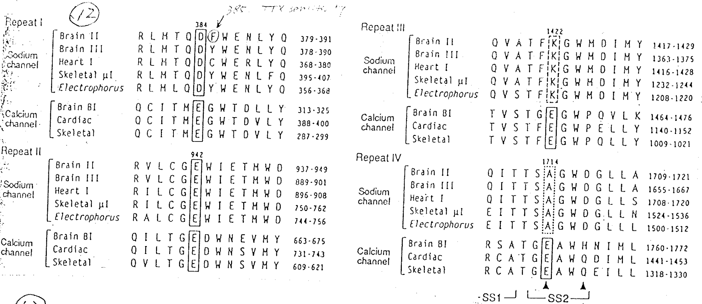
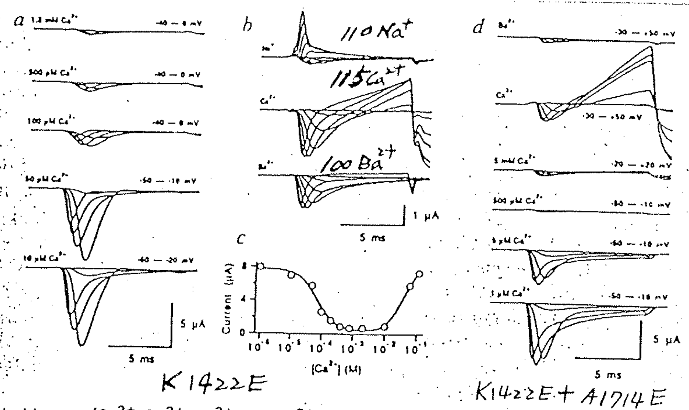
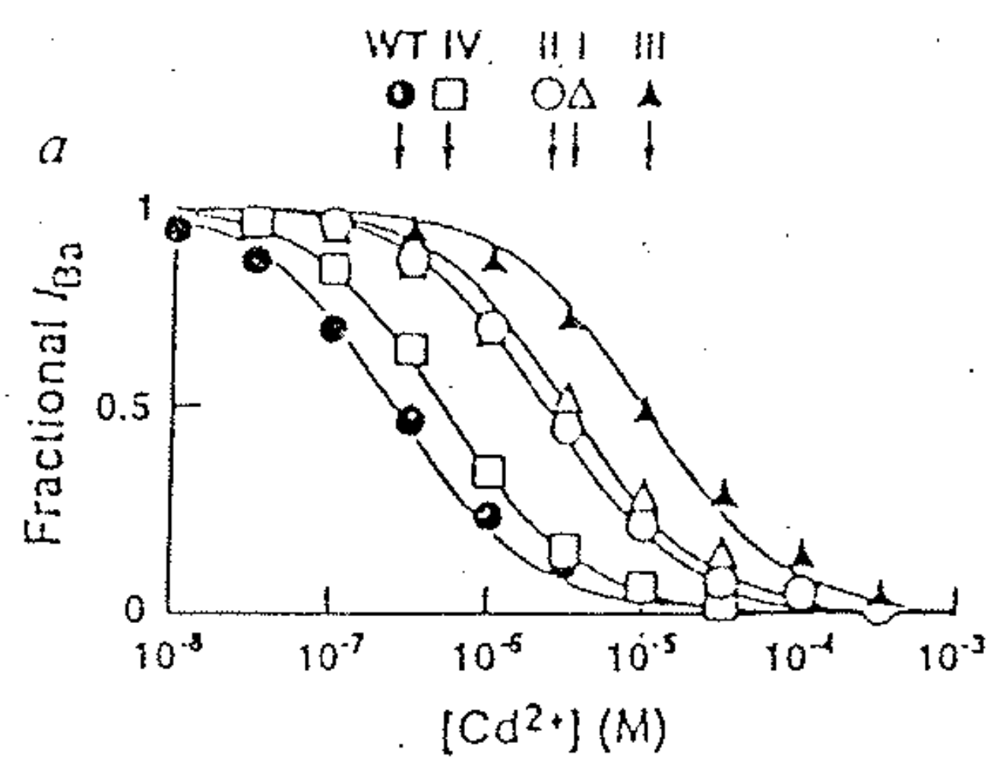

# Selection / Permeability site：P-loop on Na channel & Ca channel -1

## 內文
1. 把 Na channel & Ca channel 的 P-loop（有四段）都抓出來看一下，看是誰影響 selectivity
   
   ⇒ 發現所有的 Ca channel 整排的 E 很整齊，Na channel 則是 DEKA （注意 E 帶負電，但 DA 不帶電、K 帶正電，各自不同）
   ⇒ 這個差異很可能就是影響 Na channel & Ca channel selection 的關鍵因素。如何證實？
2. 如果把 Na channel K1422E，發現 Ca 居然會 block Na current（下圖左 & 中，$\ce{[Ca^2+]}$ 變大以後 Na current 變小，且出現 Anomalous effect）
   
   如果同時 K1422E + A1714E，發現 Ca 離子 block Na current 的效果更強（看 $500 \mu m$）
3. 如果對 Ca channel 分別進行 E384Q、E942Q、E1422Q、E1714Q，發現真的會影響 $\ce{Cd^2+}$ 的 Blocking 效果，如下圖。
   
   1. 可以發現這四個 loop 不對稱，mutation 的效果不同
   2. Cd 跟 Ca 一樣都是 2+，但是因為是過渡金屬，因此 affinity 比 Ca 好很多，可以當 Ca channel blocker
