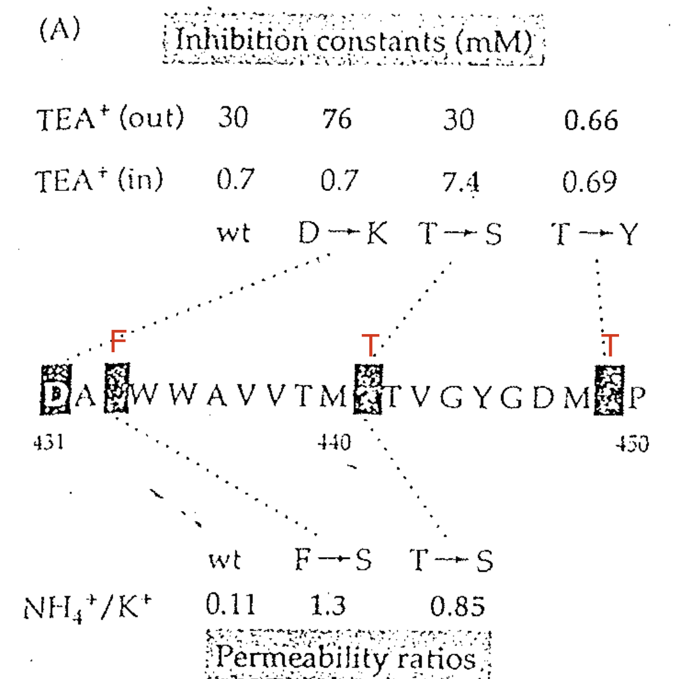
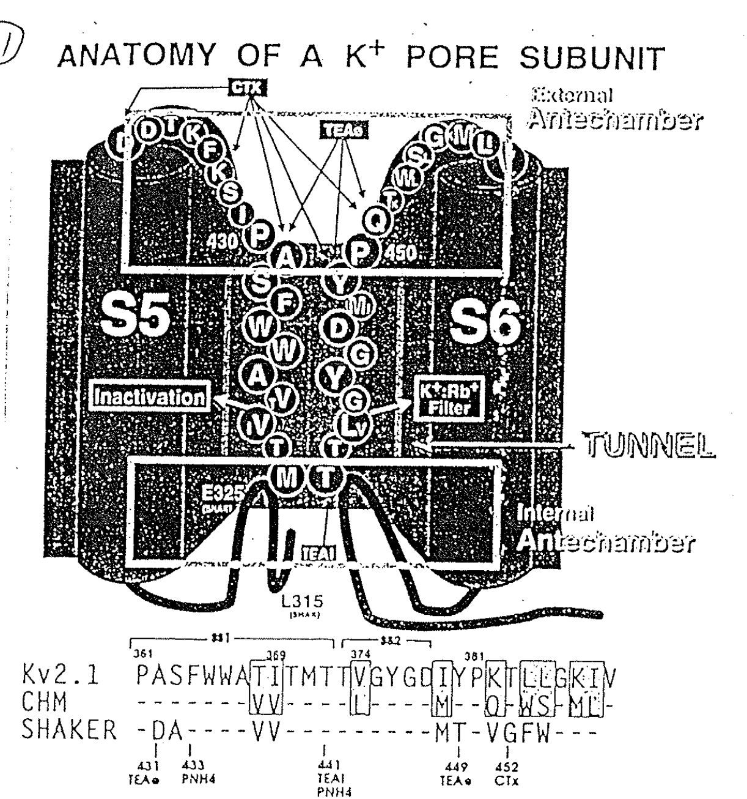

# Selection / Permeability site：P-loop 是什麼

## 內文
1. 下圖為 S5~S6 中間的 linker，實驗發現把某些 amino acid 換掉之後可以改變 TEA 與這個通道的 Inhibition constant（即 $IC_{50}$，或 $K_D$）
   
   1. D431K 改變胞外的 TEA 的 inhibition constant，因此發現 D431 在靠近膜外的位置
   2. T441S 改變胞內的 TEA 的 inhibition constant，因此發現 T441 在靠近膜內的位置
   3. T449Y 改變胞外的 TEA 的 inhibition constant，因此發現 T449 在靠近膜外的位置
   4. 根據膜的厚度（50A），有人計算如果要在這 20 個氨基酸內從膜外 → 膜內 → 膜外，只能是 Beta sheet

      [[Selection ／ Permeability site：P-loop 是什麼/⇒ 但是 Beta sheet 這麼硬，怎麼又當 pore 的牆壁、又與 ion 互動，當|摘要]]

      [[Selection ／ Permeability site：P-loop 是什麼/⇒ 發現原作者錯了，因為這段蛋白又不必 50A 這麼長（見 Pic 11）|摘要]]
2. 後來發現這段 S5~S6 linker 其實是 loop 狀構造，稱為 **<u>P-loop</u>**，如下圖。因為它的改變會影響 TEA 的 inhibition constant，也會影響 $\frac{P_\ce{NH4+}}{P_\ce{K+}}$ 的 Permeability ratio，因此猜測與 ion channel 的 selectivity 有關
   
