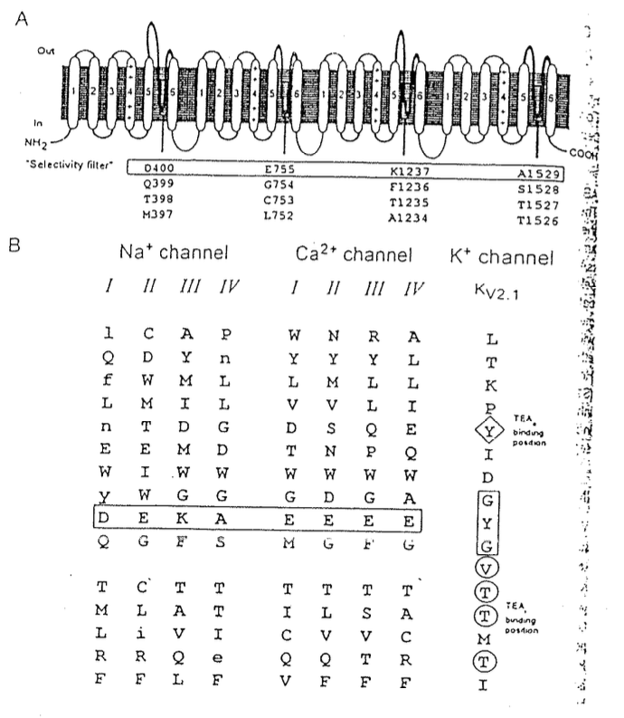
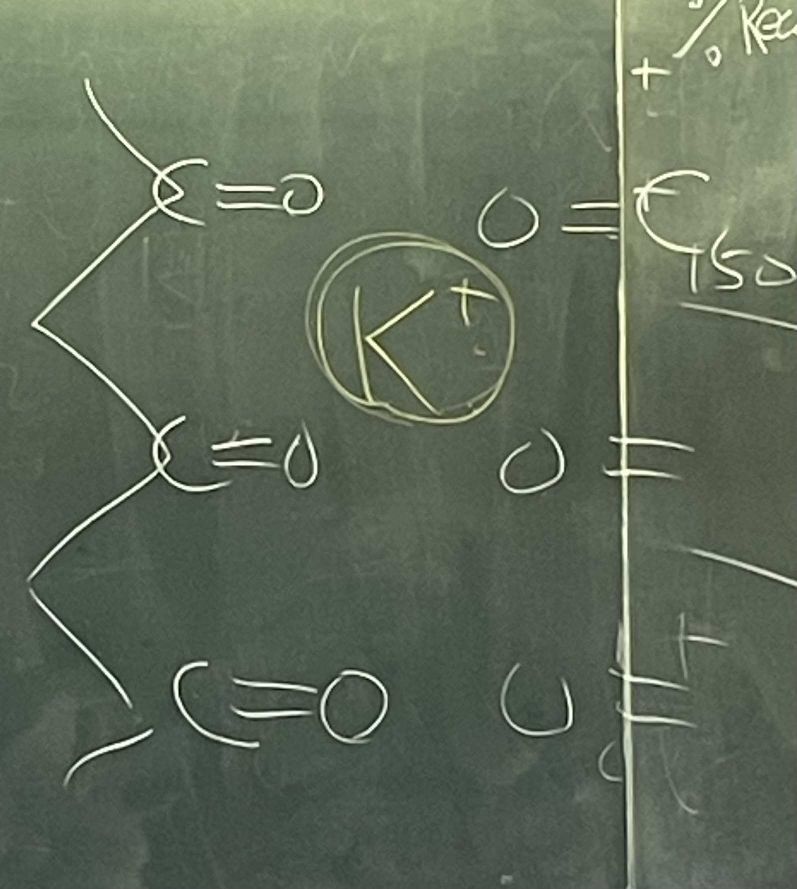

# Selectivity of channels 整理

## 內文
1. Summary：P-loop，即 S5~S6 中間的 linker，對於 Na、Ca、K channel 的 selectivity 都非常重要
2. Selectivity filter 總整理： Na channel 是 DEKA、Ca channel 是 EEEE、K channel 是多出來的 YG
   
3. Selectivity 方式整理：
   1. K channel 靠 main chain 上的 C=O 鍵進行選擇，甚至可以說他是 K-binding protein，即如果沒有 K 這個 channel 會直接 collapse ⇒ 必須有我，得不到就毀掉
      
   2. Ca channel 是靠長得像 EDTA 的 EEEE 把 2+ 離子 bind 住 ⇒ 有我在的時候其他人不准用，但是我不在的時候大家可以用
   3. Na channel 是靠那個 pore 的 size 來做 selection，因此對其他離子的 selectivity 不太好，K、Ca 都可以過，但因為 Na 太多了所以沒差 ⇒ 大家都可以用，但我最強
   4. 演化上 K channel 是為了有產生膜電位，Ca channel 是為了 chemical messenge，Na channel 是為了多細胞生物可以有 action potential 控制全身（ Ca channel 也可以產生 action potential，但是為了要和 chemical messenge 隔開所以另外用 Na 離子）
