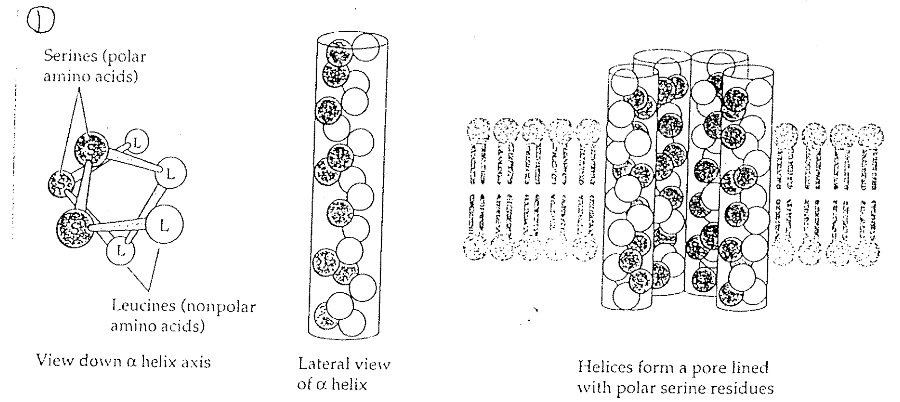
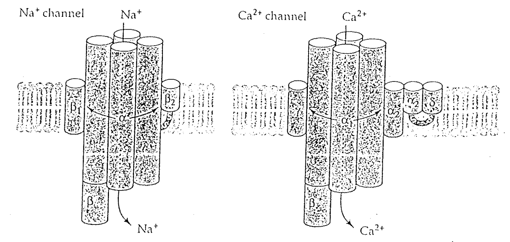
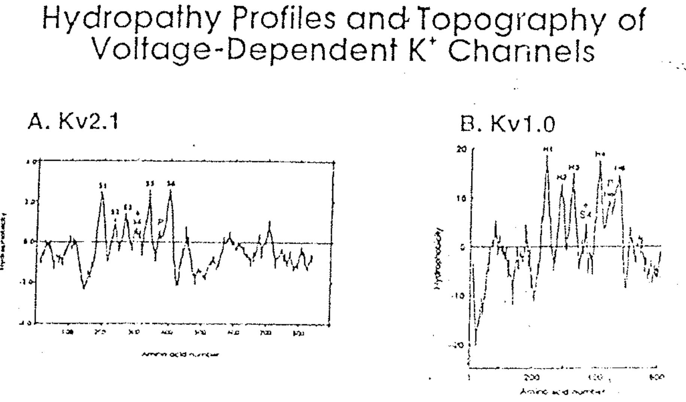
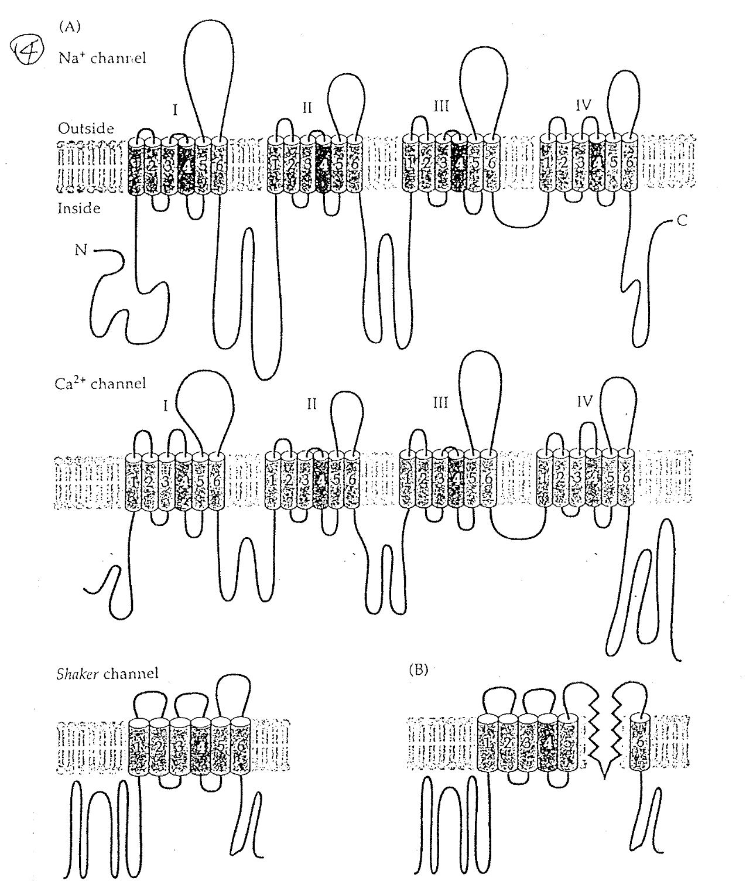

# Structure of channel

## 內文
1. 想製造一個離子通道，只要製造一個 alpha helix ，其中一側疏水、一側親水（下圖左）。疏水那側在外面碰到膜，親水那側在裡面讓離子通過，這樣好幾根圍起來就是一個 channel（下圖右）。只是這樣看起來不太 selective
   
2. 實際 channel 主體就是由四根 alpha helix 組成，再加上旁邊那堆小區塊（for modulation）
   
3. Hydropathy Profiles of channel（以 K channel 為例）：如下圖，把 channel 蛋白序列打開來，發現有幾段 Hydrophobic & Hydrophilic 交替 ⇒ 穿膜蛋白，在膜中間的疏水性部分即為 S1~S6
   
4. 如下圖，因為 Na、Ca channel 蛋白有 24 段穿膜，但是 K channel 只有 6 段穿膜
   ⇒ 猜測一：K channel 要好幾個蛋白組出完整的 channel
   ⇒ 猜測二：K channel 是演化上最早出現的 channel
   - 這些穿膜區域被稱為 S1-S6 region
   
