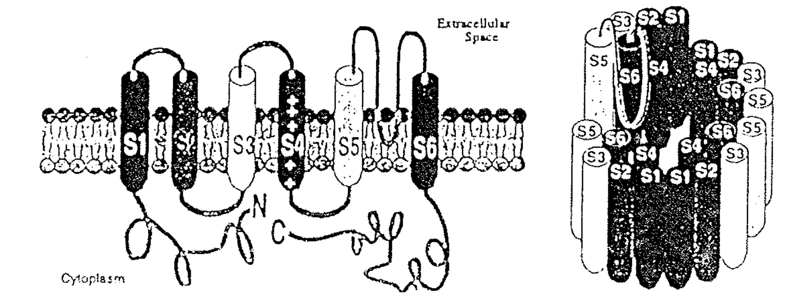
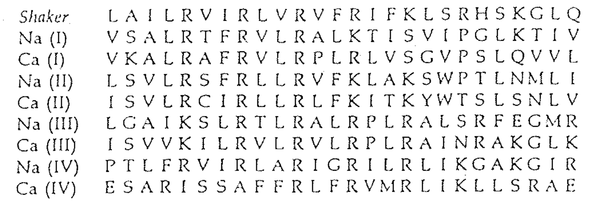
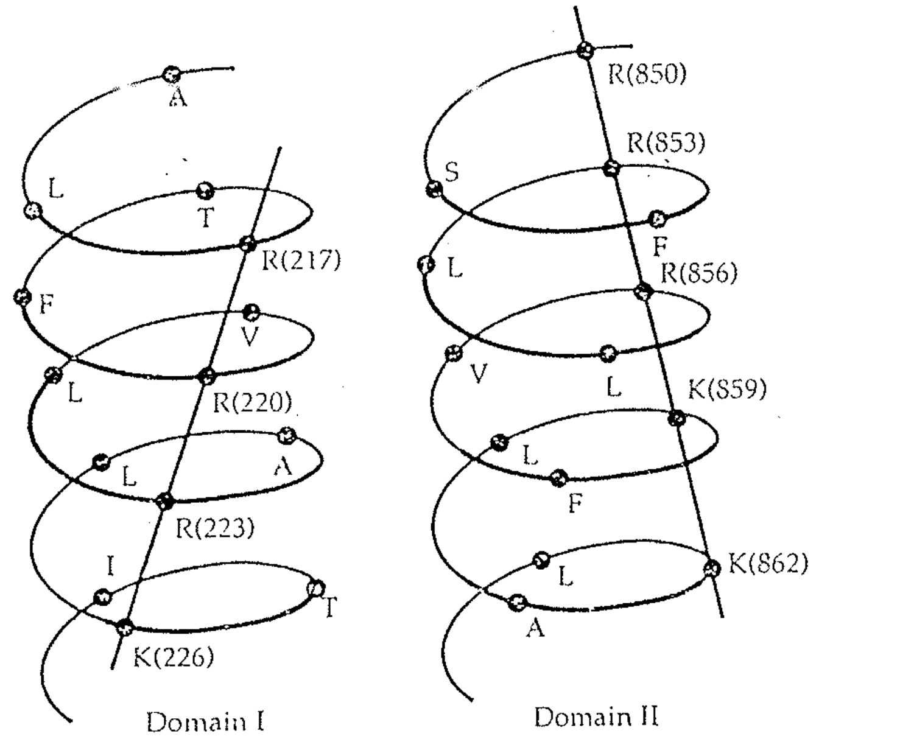
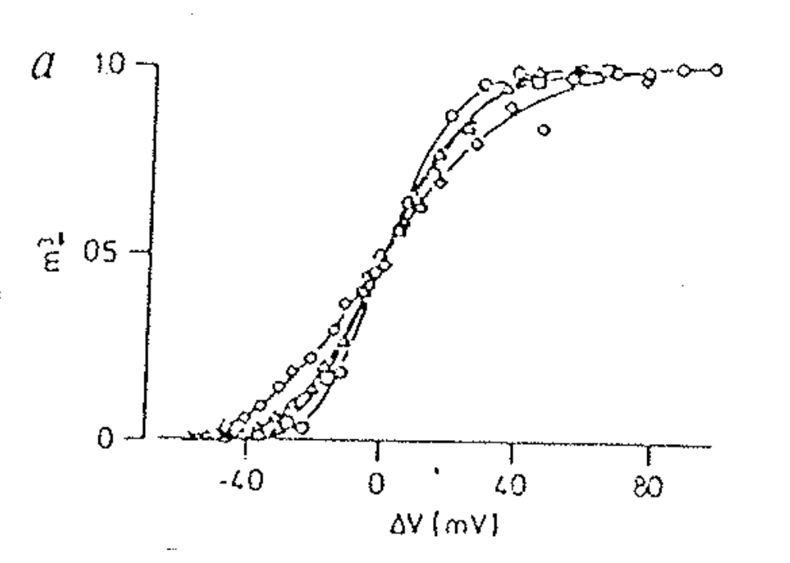
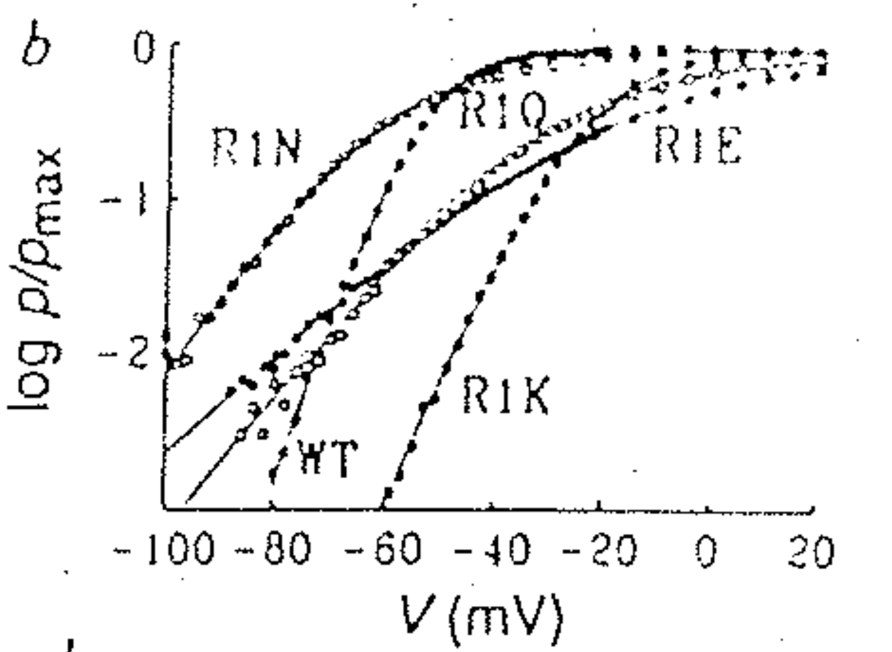
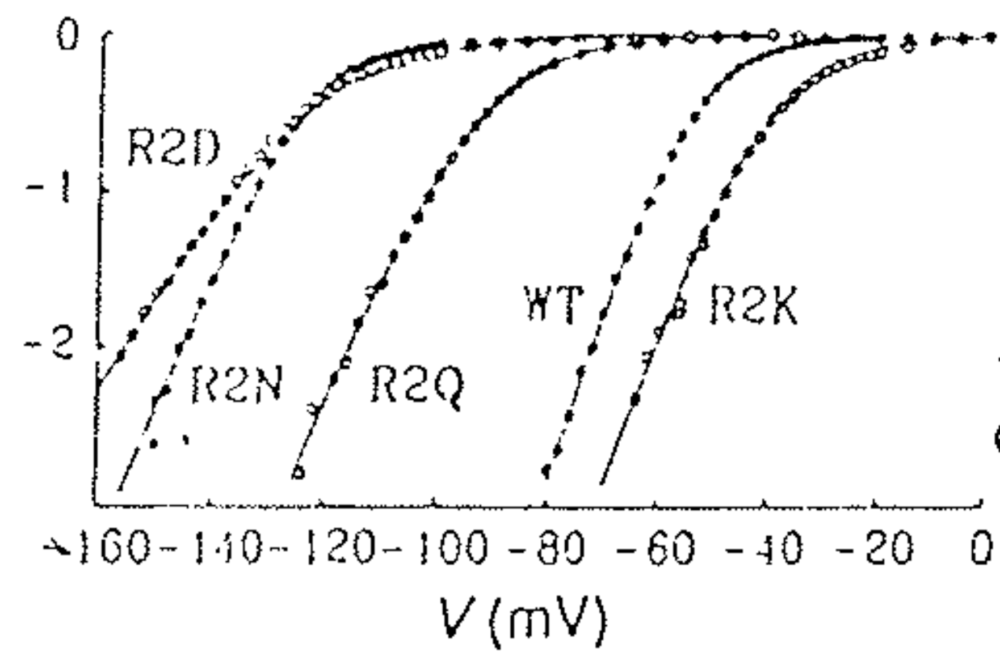
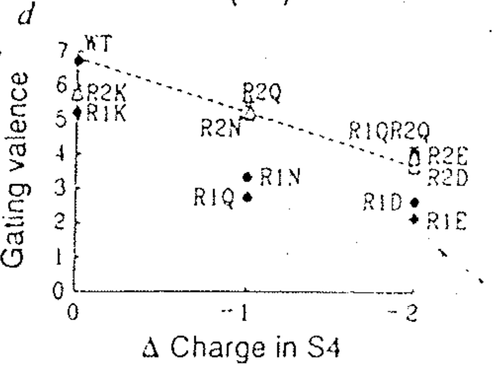
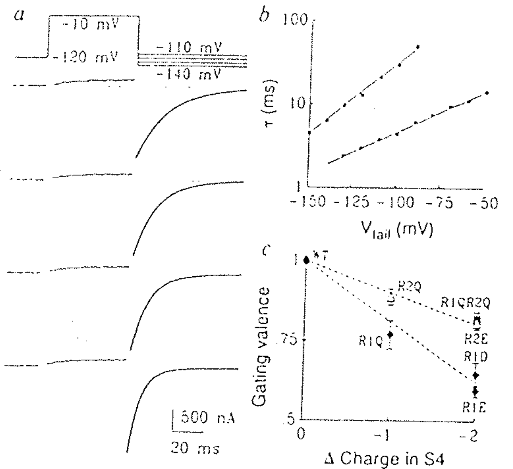
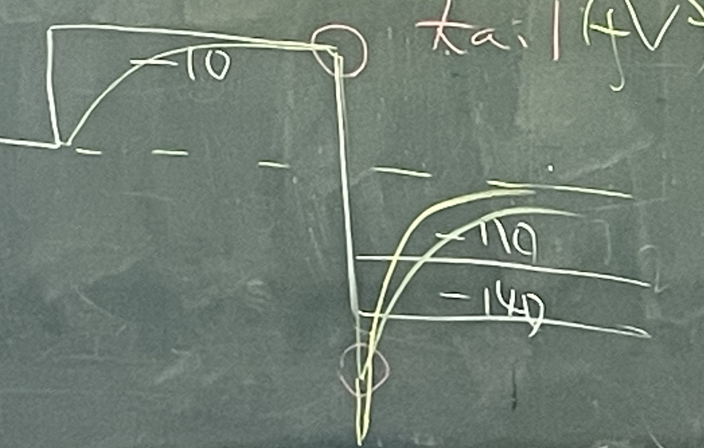
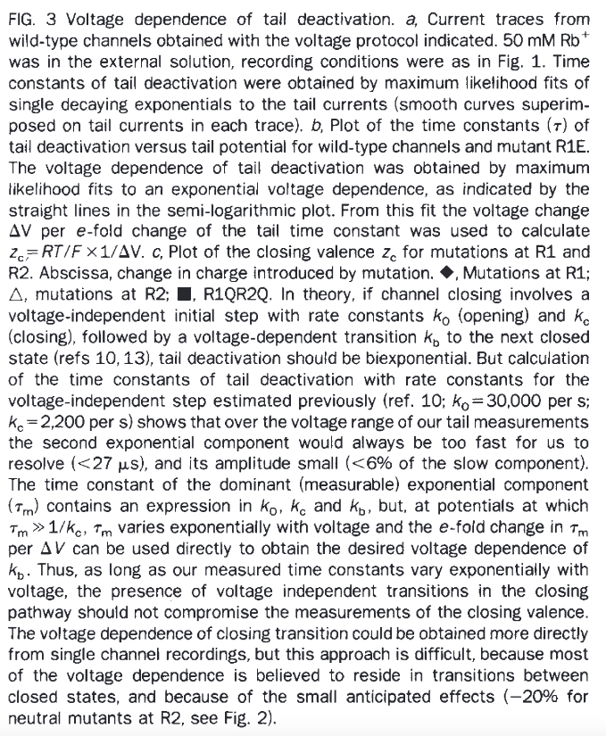

# Voltage sensor（即 charge）on S4

## 內文
1. 已知 S4 是帶電荷的部分（沒有講是怎麼知道的）
   
2. 仔細放大看序列會發現一直重複出現 R (Arginine) & K (Lysine)
   
   1. Shaker gene 是 A type K channel（會 inactivate）
   2. R & K 是唯二帶正電的氨基酸
   3. 可以發現每隔三個就有一個 R & K ，其在空間中的構型應該如下圖
      
3. 把 R 突變成其他胺基酸（N、Q、E、K）：
   1. 在下面的 P(open) - Voltage 圖可以發現這些 curve 的 Vh 相同但是 z charge 不同（因為 R 被突變了）（詳情見 <u>Channel opening probability：Boltzmann distribution</u>）
      
      ⇒ 確認這個氨基酸的 charge 就是 gating charge
   2. 下圖可以看到不同個 R 的不同 mutation 有可能會改變 Vh，即某些 mutation 也會改變非電功（影響氨基酸之間的氫鍵、蛋白與膜的互動）
      

      

      
      1. R1、R2 是兩個不同的 R
      2. 注意縱軸單位換成 log[P(open)]
      3. 右圖 gating valence 指的就是等效電荷 z ，可以發現不同的 R 的 Charge 價值不同
   3. 下圖左右用不同的方法測量
      

      
      1. 左圖為測量 tail current 尾巴電流的結果（channel 從 O→C 來不及關）
      2. 比較：一下拉到 -140 （右圖黃線）vs 一下拉到 -110（右圖綠線），發現一下拉到 -140 的 tail current 又大又負但是消失的快（很合理）
      3. 上述結果畫在左圖右上：
         1. 電位差越大，$\tau$ 越小
         2. z charge 越大，$\tau$ 越小
      4. 上圖右下亦可看出：不同的 R ， Charge 價值不同
      5. <mark>問題一：為什麼左圖右上會是斜直線？</mark>
      6. <mark>問題二：怎麼從左圖右上計算出 gating valence？</mark>
         
