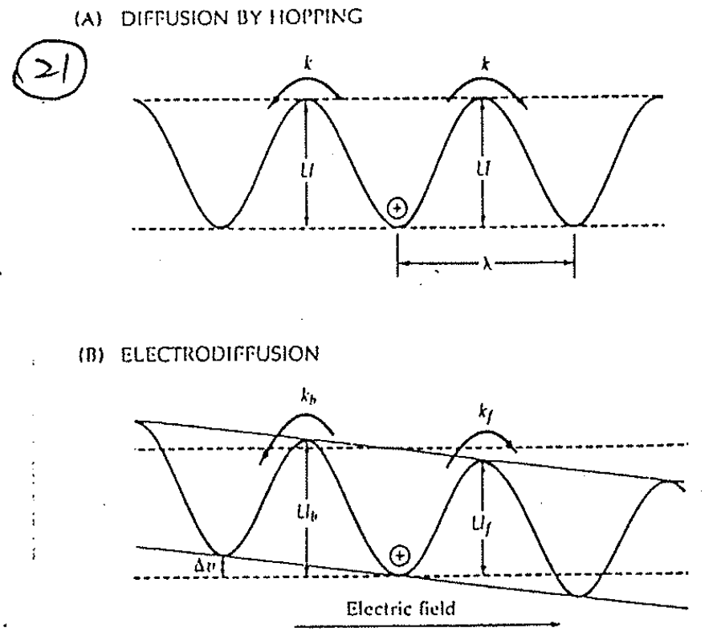

# electric distance

## 內文
1. Pic 18：Channel 如何與 ion 結合？⇒ 0 氨基酸上的 CO 基 或是 COO 基 可以與陽離子產生配位化學鍵（每個陽離子喜歡的配位化學鍵都不相同）
2. Pic 19：nature 上面曾經宣稱苯環的 \pi 電子雲可以和 K 產生配位化學鍵，後來被自己推翻 ⇒ 看 nature 要看之後同作者有沒有 full paper
3. 習題：如 Pic 21，如何用統計的方式計算 中間結合位 在電場中的位置
   
   1. electric distance：膜外 = 0，膜內 = 1，中間則用 0.x 的小數表示
   2. 方法提示：人工製造不同膜電位，觀察親和力 Kd 的變化
      1. ex: 如果膜電位一直變化但親和力 Kd 一直不變，代表 electric distance = 0
   3. 雖然膜中的電位降與位置 x 不是呈現 linear 的變化，但是仍然有代表性 ex: 兩 channel 的 binding site 如果有同樣的 electric distance ，可以猜測結構相的類似
   4. 試證明：對於 帶 +1 價的離子，膜電位每變化 25mV ，如果親和力變成 e 倍，則代表 electric distance = 1
   5. 試說明：對於 帶 +2 價的離子，膜電位每變化 12.5 mV ，如果親和力變成 e 倍，則代表 electric distance = 1
   - 這個方法稱為 biophysical 的方法，而 biochemical 的方法則是用生化方式找到那個負責結合的基團
