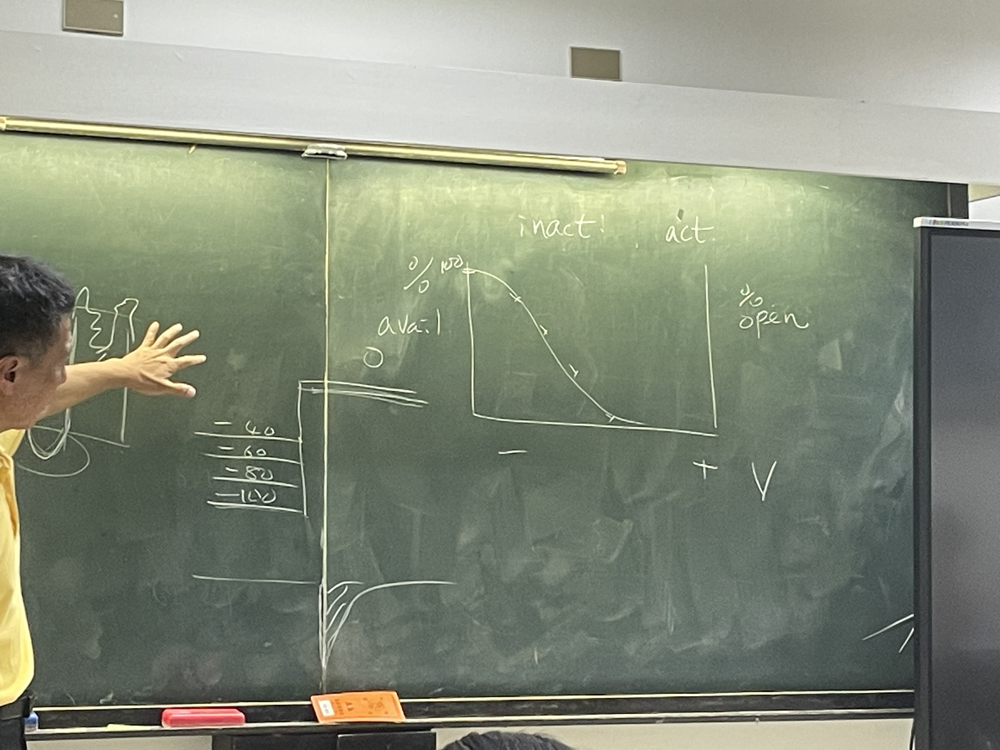
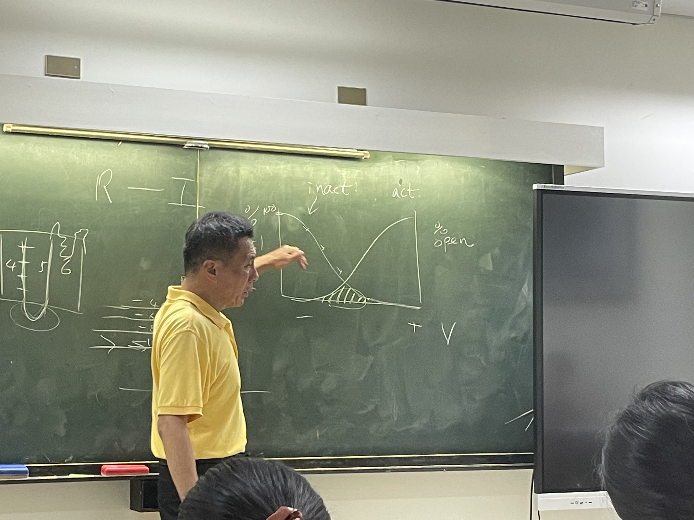
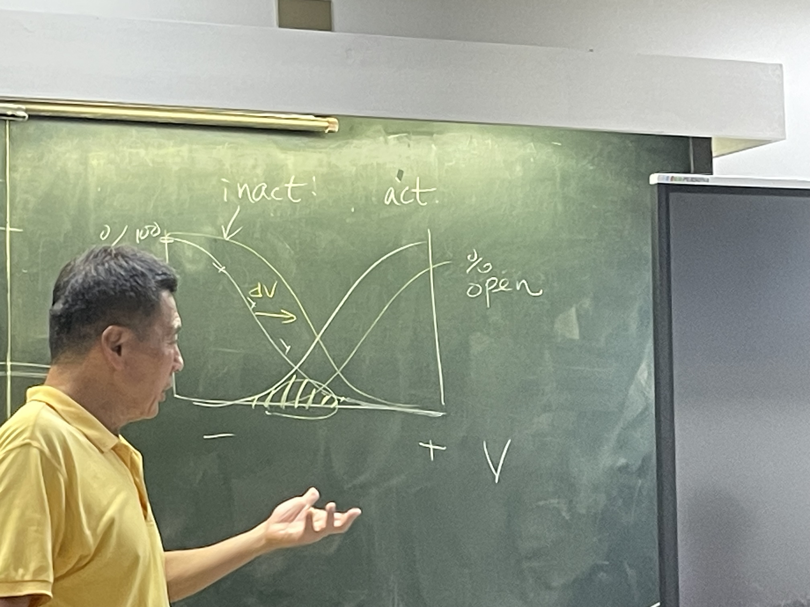

# 其他

## 內文
- Ki Kd EC50 IC50 [https://www.sciencesnail.com/science/the-difference-between-ki-kd-ic50-and-ec50-values](https://www.sciencesnail.com/science/the-difference-between-ki-kd-ic50-and-ec50-values)

1. Pic 13 右半 Table 1 & Pic 14：發現 D384 、E287 是 TTX 的重要作用 site
   ⇒ 代表這兩個點靠近 channel 外口）
2. Pic 18：根據上面這三個已知的 Channel ，猜測有一個 Ligand gated high selective K channel ⇒ 發現確實有 Glutamate-gate K channel
3. inactivation curve：不同起始平衡電壓會有不同的 inactivation 比例，打到高電壓以後看看剩多少 Channel 活下來還可以開
   
   
   - 作業ㄧ：為什麼 inacitvation curve 會比 activation curve 還要左邊？
   - 作業二：圖色的 window area 有什麼意義
   - 作業三：如果對 channel 做 mutation，使 inactivation curve 移動 $+\Delta V$，那 activation curve 會如何移動？如果移動 $< +\Delta V$ 代表什麼？如果移動 $> +\Delta V$ 代表什麼？等於又代表什麼？
   
