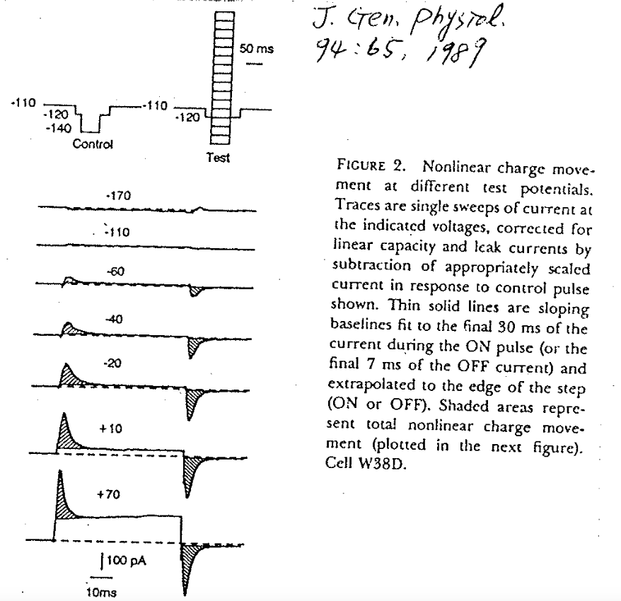
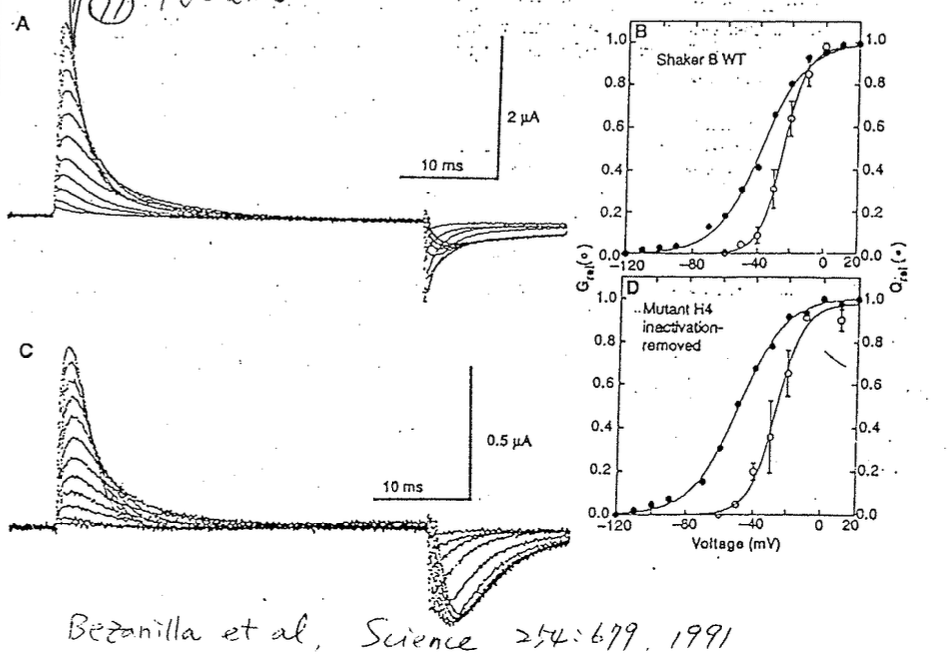

# 如何測量 P(Open)？ ⇒ Gating current

## 內文
1. 蛋白質（Ca channel）構型改變時，雖然是在膜內部，但是本來吸附膜內溶液的離子會變成吸附膜外的離子，等效於一個 current，稱為 gating current
2. 如何測量：
   1. 在利用 Voltage clamp 改變細胞的膜電位時（即把電壓架在膜的兩側時），人為外接的那個電源會供應 current，可以直接測量此 current 就好了
   2. 要量 gating current 的話要把蛋白中間的 channel 塞住，不然 ion current 太強會蓋過一切
   3. 由於膜本身是電容 ，因此改變 voltage 本來就會有電流，稱為 capacitative current ⇒ 此時量到的 current 大部分都是 capacitative current $I_C = C\frac{dV}{dt}$
      ⇒ 先用 -110 ~ -170 mV（這段區間 channel 已經關緊了，無法再有構型上的變化）量出膜電容的影響（ capacitative current ）
      ⇒ 再用 -110 ~ +70 mV （這段區間 channel 開始有動作了）量出 capacitative current + gating current
      ⇒ 最後相減即為 gating current
3. Gating current 的性質（以 Ca channel 為例）
   
   1. Gating current 代表 **<u>電荷移動的速度</u>**
   2. Gating current 曲線下的面積 $\int Idt$ 則代表 **<u>電荷移動的總量</u>** ，相當於打開的通道數量
   3. 如上圖，膜電位從 -120 mV 改變為 -170 mV ~ -110 mV 時，沒有任何 Gating current 出現，代表此時通道蛋白並沒有變化
   4. 將膜電位從 -120 mV 提升到 -110 mV ~ +10 mV 時，此膜電位的提升越大，Gating current 就越大，<u>移動的電荷總量</u>也越大，即打開的通道數量也越大
   5. 將膜電位從 -120 mV 提升到 +10 mV ~ +70 mV 時，可以看出<u>移動的電荷總量</u>（即曲線下的面積） 是一樣的，但膜電位的提升越大，仍然可以看到<u>電荷移動的速度</u>（即 Gating current 本身） 仍是越來越快
   6. 從 -120mV 提升到 +70 mV 時出現多少 gating current，從 +70 mV 回到 -120 mV 就會有多少電流回來且波形一致（形狀相同、方向相反）
   7. 本實驗用 cardiomyocyte ，並用 Ba, Cd, La 把 Ca channel 堵住，用 TTX 把 Na channel 堵住，這樣只剩 Ca channel & Na channel 的 gating current，而因為 cardiomyocyte 上 Ca channel 滿山滿谷，因此 Na channel 相對不重要
4. Gating current 與 P(Open) 的關係（以 Na channel 為例）
   
   1. 如右上圖，白點為 P(open)- Voltage curve ，即實際打開的通道數量
   2. 黑點為 Q_movement (%) - Voltage curve（Q 為電荷），即透過 Gating current 測量到的通道打開數量
   3. 可以看出在膜電位比較負的時候，兩條曲線有差別，因為 channel 可能有很多個 state（ex: $\ce{C_0 <=> C_1 <=>O}$）從 $\ce{ C_0 -> C_1}$ 的時候 channel 還沒有 open ，但是電荷已經有 movement 了
   4. 從左上圖可以發現，與 Ca channel 不同， Na channel 在電位提升時 & 電位下降時的兩個 Gating current 並沒有形狀相同、方向相反，因為在 $\ce{C <=>[v_\alpha][v_\beta] O <=>[v_\gamma][v_\delta] I}$ 的反應中 $v_\delta$ 很小，因此電荷回去的速度很慢（甚至可能是 Voltage independent？），造成回去的 gating current 看起來比較小
   5. 實際上回去的總電荷與當初過來的總電荷量應該是相等的，即兩個 curve 下的面積應該仍會相等
   6. 左下圖：把那顆 ball and chain 的球 mutation 掉之後，可以發現 回去的電流 變大了，因為 Inactivation state 消失了（當然，曲線下面積仍然是一樣的）
