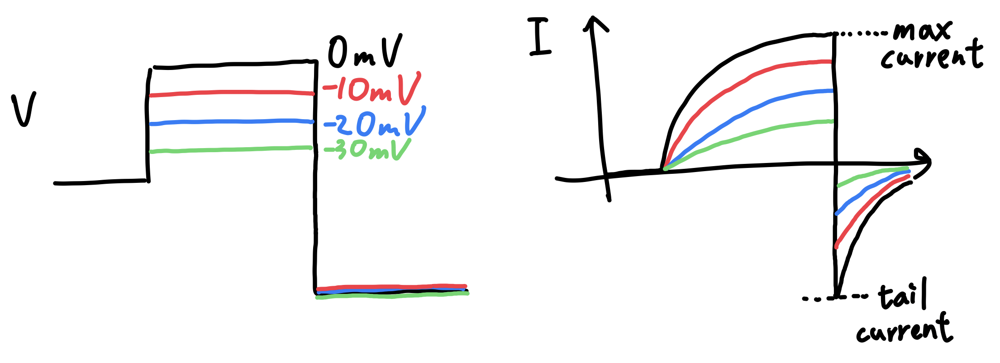

# 如何測量 P(Open)？ ⇒ Tail current

## 內文
在 Boltzmann distribution 的模型中，最重要的就是知道不同電位下的 P(Open)，但是如何知道？

第一招：
Max current
1. 對於不同膜電位下的 channel 會產生不同的 max current
2. 但是這個 max current 不可以直接比大小，要把 max current 除以 driving force（即 $V - V_{rev}$ ），才能根據歐姆定律計算出 conductance
3. 侷限
   1. 須知道 driving force
   2. channel 須遵守歐姆定律
   3. channel 不能 inactivate

第二招：
Tail current
1. 在到達 max current 之後，馬上把膜電位統一拉到共同的很負的位置
2. 此時通道還沒關，會有一個反方向的電流，稱為 **<u>尾巴電流 tail current</u>**
3. 優點一：直接比較 Tail current 即可知道 P(Open) 的變化，不必除以 driving force
4. 優點二：如果這個膜上同時混合 Na channel & K channel，透過直接拉到 $E_K$ 的方式可以去除 K current ，只留下 Na current
5. 侷限：被測量的 channel 不能 inactivate
