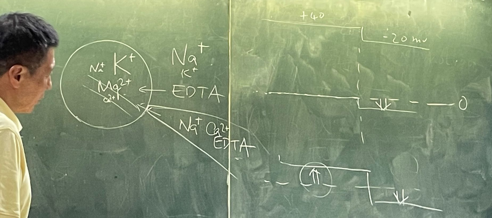
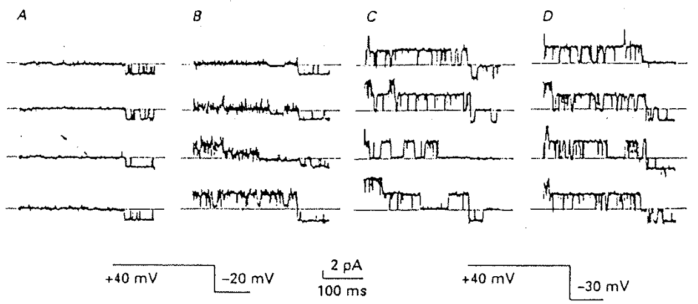

# 定性實驗：Ca 離子會阻止 Na 離子通過 Ca channel

## 內文
1. 實驗裝置：如下圖，透過 Patch clamp 來研究 L-type Ca channel 的 selectivity。一開始胞內鈣很少（正常細胞）、胞外無鈣（因為有 EDTA）
   
2. 實驗結果：
   
   1. 如上圖 A ，此時鈉可以進細胞（-20mV 時有 inward current）但不能出細胞（+40mV 時沒有 outward current）
   2. 如果用 patch clamp 的頭摩擦細胞，讓細胞膜破洞使 EDTA 進去與 Ca、Mg 結合
      ⇒ EDTA 進去以後，胞內沒有 Ca 了，所以在 +40mV 時鈉就可以出細胞了（如上圖 BCD，+40mV 時出現 outward current 了）
   3. 推論：Ca 離子會阻止 Na 離子通過 Ca channel
