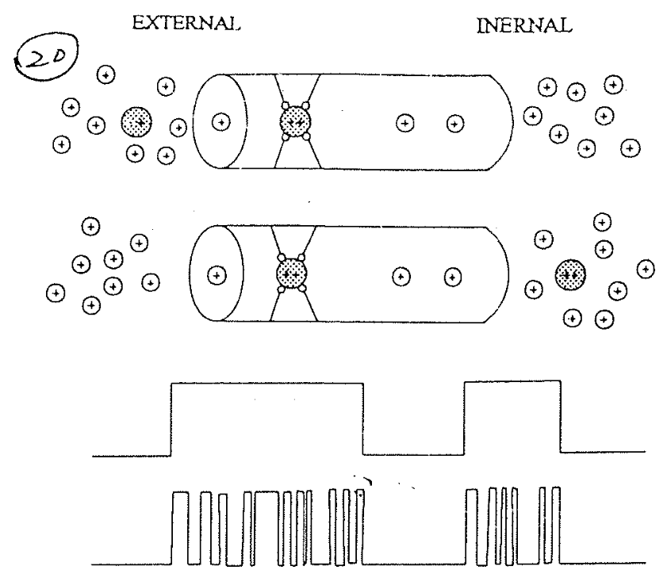
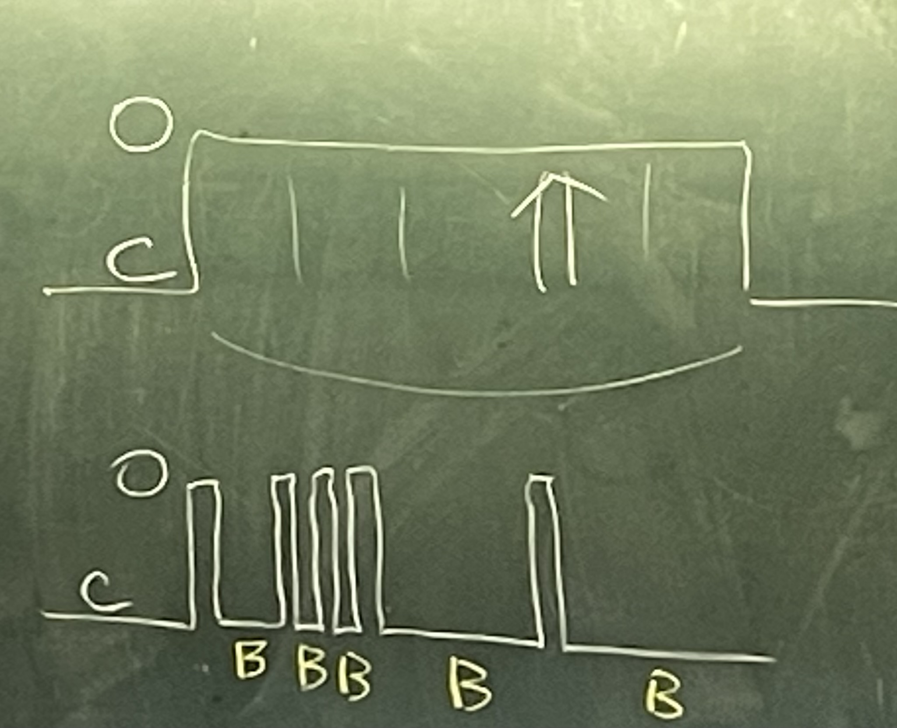
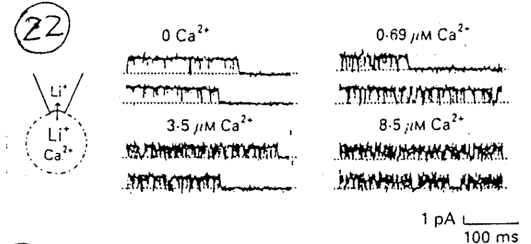
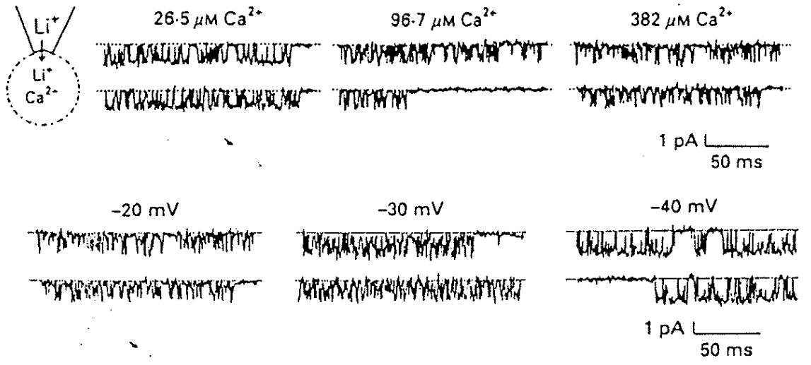
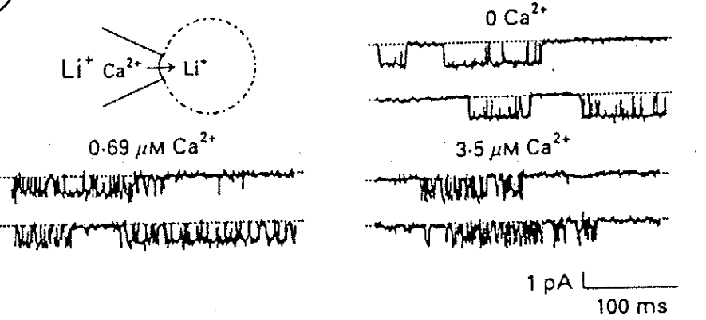
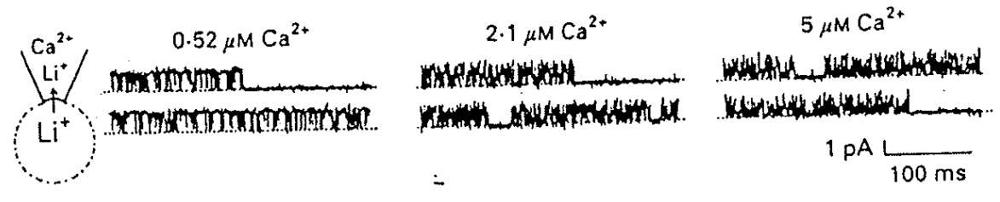

# 定性實驗：透過 Biophysic 性質猜測 Binding site 位置

## 內文
如左下圖，給一點點 $\ce{Ca^2+}$ 之後，原本很順暢的 Na / Li current 變成斷斷續續

⇒ 顯然中間斷斷續續的部分不是因為 channel close，而是被 block 住了（如右下圖，像梳子）

這次改用 Li 而不是 Na 來當照妖鏡進行實驗，分成四種情形：

1. Ca 離子在胞內， Li 離子也在胞內想往外跑 ⇒ Ca 一多， Li 就被堵住跑不出去
   
2. Ca 離子在胞內，Li 離子在胞外想往內跑 ⇒ Li 不太容易被堵住（注意濃度）
   
3. Ca 離子在胞外，Li 離子在胞外想往內跑 ⇒ Li 很容易就被堵住跑不出去
   
4. Ca 離子在胞內，Li 離子在胞外想往內跑 ⇒ Li 還是很容易就被堵住跑不出去
   

其中第四點特別奇怪，為什麼鈣在外面，但是 Li 還是很容易被堵住呢？

1. 如果 Ca channel 總共只有一個 binding site，那不可能有流向的差別（不管從哪邊來，都是 bind 到同個位置），與實驗不合
   ⇒ Ca channel 是 multi-binding site
2. 如果 Ca 與 Li 是 bind 在不同的 site，那兩者應該完全 independent，與實驗不合
   ⇒ Ca 與 Li 應該會 share 相同的 binding site，即兩個人過河的時候是踩同樣的石頭路徑過去
3. 最終結論：在眾多的 binding site 之中，關鍵的 selectivity site （即 Ca 的 blocking site，親和力最大的那個 site）比較靠近膜的外面
   1. 如果 Ca 在裡面，則與大量的 Li 逆向的話，Ca 就很難抵達 Blocking site（因為出去的路上必須經過每個 site 每顆石頭，同時 site 上石頭上還必須沒有 Li）。
   2. 如果 Ca 在外面，可以直接抵達 selectivity site（即 selectivity site 外面沒有其他 binding site），因此就跟 Li 的流向無關。
