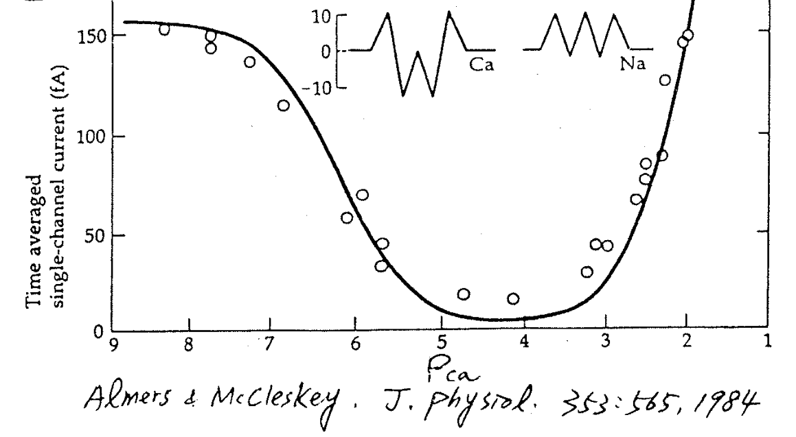

# 定量實驗： ⇒ Ca channel 可以裝至少兩個 Ca 離子

## 內文

1. 橫軸為 $P_{Ca} = -\log[\ce{Ca^2+}]$ （類似於 pH），縱軸為通過此 channel 的電流
2. $[\ce{Ca^2+}]$ 很稀薄 （即 $P_{Ca}$ 很大 ）時，Na current 很強（沒有被 Ca 離子擋住）
3. $[\ce{Ca^2+}]$ 越來越濃時，$\ce{Na+}$ 被 Block 住了，因此 Na current 在 $P_{Ca} = 6$ 時剩一半
4. $[\ce{Ca^2+}]$ 更濃的時候， Na current 不見了，變成 Ca current 並隨 Ca 濃度上升而上升

   [[定量實驗： ⇒ Ca channel 可以裝至少兩個 Ca 離子/ceCa2+ 濃度持續提高後的圖會長得像下圖，見 Conductance|摘要]]
5. 在 $P_{Ca} = 6$ 時，Na current 剩一半，代表 Ca 離子已經與一半的 Channel 結合了，即 Ca 的 $IC_{50} = 10^{-6} M$。
   但是在 $P_{Ca} < 2$ 時，也有某個濃度 $[\ce{Ca^2+}]$ 使 Ca current 為飽和電流的一半，即 Ca 的 $EC_{50} > 10^{-2} M$
   **<u>問題：這兩個濃度的意義是什麼？哪個可以代表 Ca 離子與通道蛋白的親和力？</u>**
6. 解答：
   1. 要注意到環境不一樣。$IC_{50}$ 時 Ca 很稀薄，周圍都是 Na；$EC_{50}$ 時 Ca 很濃，周圍都是 Ca
   2. 顯然的，在 $[\ce{Ca^2+}] > 10^{-5} M$ 時 Ca channel 已經全部被填滿了（不然 Na 就可以趁勢通過）
   3. 既然已經全部被填滿了，那為什麼濃度增加時 Conductance 還會繼續增加？
      ⇒ **那代表這個多出來的濃度是有用的**
      ⇒ **<u>代表 Ca channel 可以裝很多個 Ca 離子（至少兩個）</u>**
      此現象稱為 **<u>Anomalous mole-fraction behaviour</u>**
   4. 可以看出<u>結合第一個 Ca 離子的 Kd</u>（即 $IC_{50}$）& <u>結合第二個 Ca 離子的 Kd</u>（即 $EC_{50}$）不相等，而且<u>結合第二個 Ca 離子的 Kd</u> 很大（需要高濃度才能結合）
      ⇒ 代表這兩個 binding site 靠的很近，因此 bind 住第一個之後，第二個 site 就變得很不容易結合（需要高濃度）
   5. 延伸：所以 inward rectifier K channel 之所以可以 inward rectify，是因為他是 multi-ion channel，才能夠有一顆大的塞住所有人，進而限制流向
