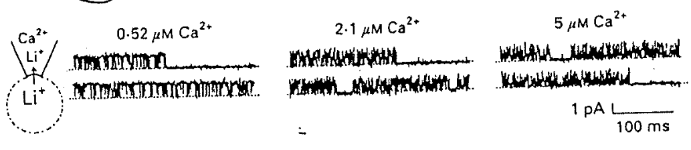
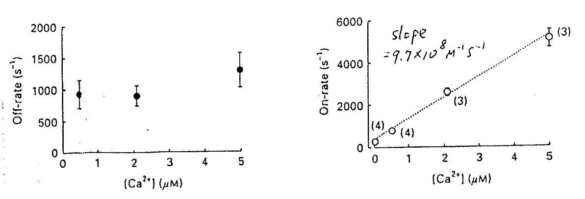
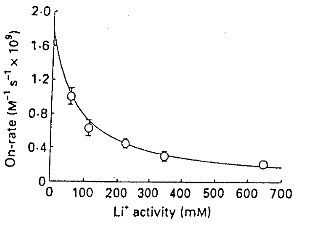
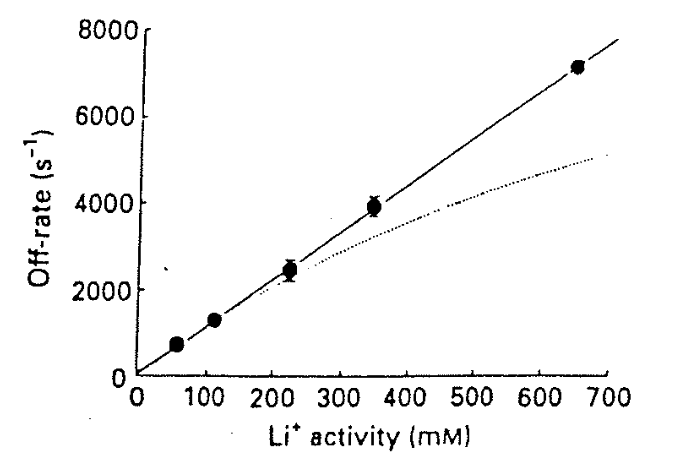

# 定量實驗：On rate & Off rate（$\ce{Ca^2+}$ as blocker）

## 內文
1. 根據下圖上方的電流訊號，可以計算出 Ca 離子在此 Ca channel 上的 On rate & Off rate
   
   
   1. On rate (即每秒幾顆 Ca 離子會上去)： $v_{on} = \frac{1}{\tau_{open}}$ ，其中 $\tau_{open}$ 是 mean opening time
   2. Off rate (即每秒幾顆 Ca 離子掉下來)： $v_{off} = \frac{1}{\tau_{block}}$，其中 $\tau_{block}$ 是 mean block time
   3. $K_d = \frac{\mathrm{off \ rate}}{\mathrm{ on \ rate}} = \frac{k_{off}}{k_{on}} =\frac{v_{off}}{v_{on}/[\ce{Ca^2+}]} = \frac{\tau_{open}}{\tau_{block}}*[\ce{Ca^2+}]$
   4. 可以看出確實 Ca 離子濃度越高， On rate 越快，而 Off rate 不受離子濃度影響
      - 蠻正常的，不過在 Anomalous mole-fraction behaviour 下 Ca 離子的 off rate 與 Ca 濃度應該要有點關係（因為 bind 住一個 site 之後，另一個 site 的親和力會改變）
   5. 問題一：對於 2mM 的 Ca 離子（生理濃度）而言，$0.5 \mu s$ 就可以 on 上去，但是要 $1 mS$ 才能 off 下來，怎麼差這麼多？ ⇒ 見問題二
   6. 問題二：這裡的 On rate & Off rate 是準的嗎？
      答：不是，因為這裡有 Li ，而 Li 離子濃度也會影響 Ca 離子的 On rate & Off rate
   - 注意：在用某個指標（ex: Li current、螢光蛋白）來間接代表某個數據時，要注意此指標本身如何影響此系統 ⇒ 改變指標、改變指標濃度，看看數據如何變化
2. Li 離子濃度如何影響 Ca 離子在此 Ca channel 上的 On rate & Off rate？
   

   
   1. 左圖為 $k_{on}$：$k_{on} =1.8 \times 10^9 \times \frac{1}{1+({[\ce{Li+}]} / 75mM)}\ \mathrm{M^{-1}s^{-1}}$
      1. 這裡的 On rate 是 $k_{on}$ 而不是 $v_{on}$，所以單位是 $\mathrm{M^{-1}s^{-1}}$ （ $v_{on} = k_{on}[\ce{Ca^2+}]$ ）
      2. 可以發現其中 $\frac{1}{1+({[\ce{Li+}]} / 75mM)}$ 就是 $\mathrm{P(Without\ Li^+ )}$
         - 見 <u>親和力 Affinity & 解離常數</u> $K_D$）
      3. Li 離子 & Ca channel 之間的 $K_D = 75mM$
      4. 雖然這些量到的 On rate 不是 Ca 真正的 On rate（因為都有 Li），但是透過這個公式可以直接算出沒有 Li 的時候的 $k_{on} =1.8 \times 10^9$
   2. 右圖為 Off rate (即每秒幾顆 Ca 離子掉下來)：$v_{off} = k_{off} = k[\ce{Li+}]$ ，接近斜直線
      ⇒ 沒有 Li 的時候， Ca 根本不會 Off，即 Ca 是被 Li 推下來的
      ⇒ 會被推下來，代表至少兩個 Binding site，而且兩個 site 很近，所以 Li 才能在有鈣的時候 bind 上去，並且把 前面那顆 Ca 推下去
      1. 為什麼是直線？其實整個曲線應該要與 $\mathrm{P(Binded\ with\ Li^+ )} = \frac{1}{1+ {K_D}/{[Li]}}$成正比 ，但是因為 $K_D$ 太大，以至於看起來像是直線，就像是下圖只取靠近原點的一小段
         - 這裡的 $K_D$ 是在已經 Bind 住一顆 Ca 的條件下，加碼 Bind 住一顆 Li 的比例，所以不是 75mM ，而是好幾 M
      2. Li 在有鈣的時候親和力很小（$K_D$ =好幾 M），沒鈣的時候親和力很大（$K_D$ = 75mM）
      3. 因為 Li 跟 Ca channel 的親和力很小，所以很難推動 Ca，但是當 Ca 的濃度夠高，變成 Ca 推 Ca 的時候，推的速度一定超快，因此不會有 off rate 比 on rate 慢很多的問題
